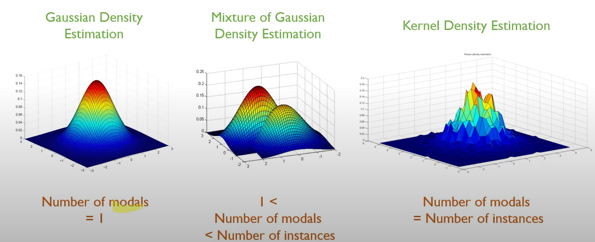
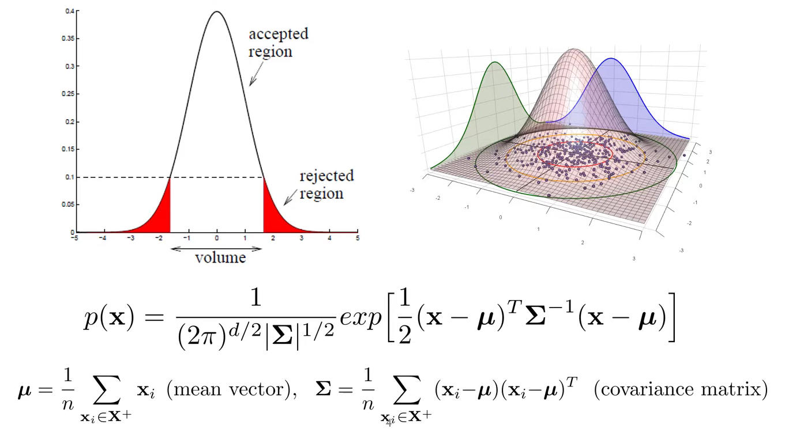
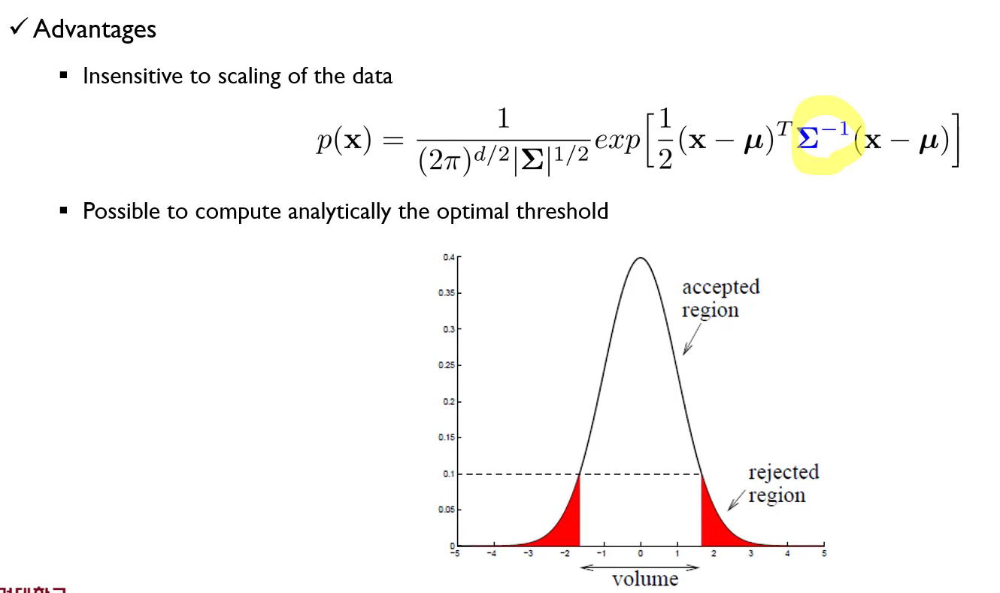
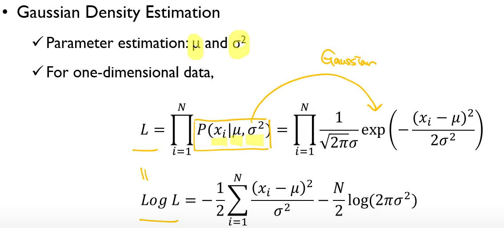
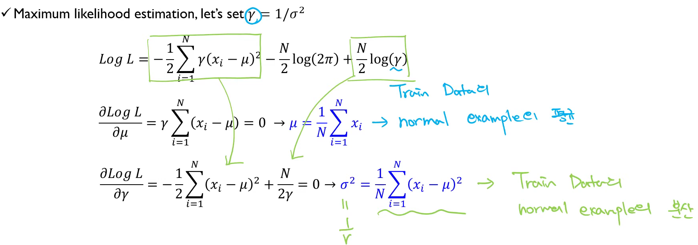

# Density-based Novely Detection
## Purpose
* Estmiate the data-driven density function
* If a new instance has a low probability according the trained density function, it will be identified as novel  

## Gaussian Density Estimation
* **Assume** that the observed data are drawn from a Gaussian distribution 
* 우리가 찾아야하는 미지수는 결국 무엇이 되냐면, 굉장히 많은 $\mathbf{x}$들이 주어지는 것이다. $\boldsymbol{\mu}$와 covariance matrix $\sum^-1$를 찾아야한다. 이때, $\mathbf{X^+}$가 의미하는 것은 정상 데이터, 즉 normal data에 대한 것만 사용하겠다는 것이다.
* 
* 그러면, 이게 가질 수 있는 장점 중 하나는 데이터의 변수의 범위에 민감하지 않다. (Robust하다) 
* 어차피 $\sum^-1$에서 게산을 해주므로 정규화를 따로 해줄 필요가 없다.
* 또한, Possible to compute analytically the optimal threshold.
  * 결국 나중에 정의를 함에 있어서, 우리가 학습된, 추정된 학습데이터로부터 rejection에 대한 1종 오류를 처음부터 정의를 하고 들어갈 수 있다.

