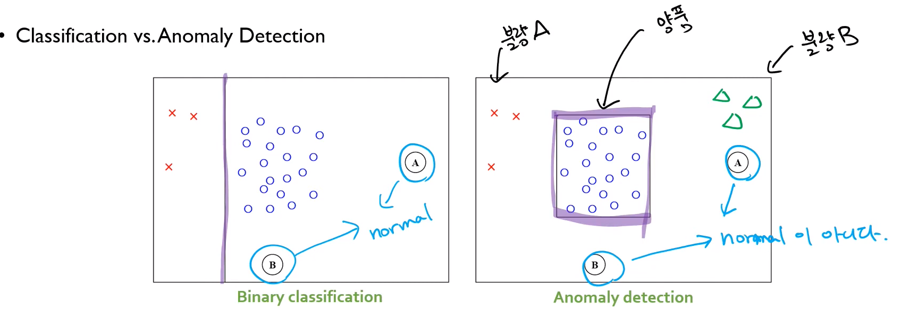
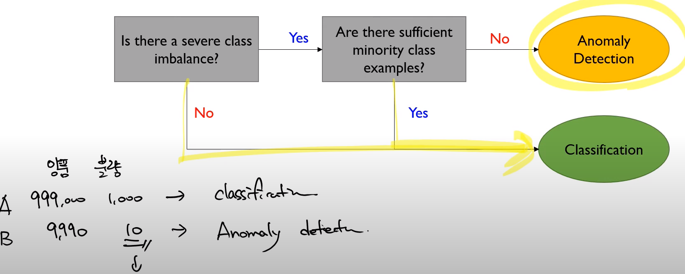
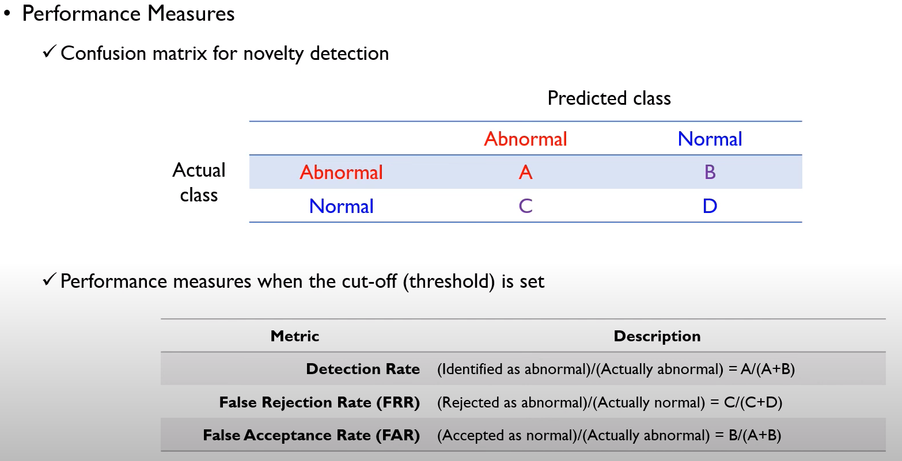
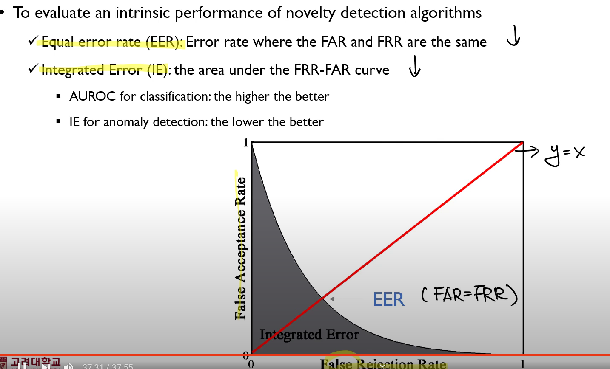

# Machine learning
* 컴퓨터 프로그램이 학습이 가능하다는 것은, 명확히 정의된 태스크(T)가 정의되어 있어야하고, 그 태스크에 대해서 얼마나 잘하는지 못하는지 측정할 수 있는 measure P가 있어야 하고, 충분한 데이터를 제공해준다면 성능이 향상될 수 있는 프로그램을 머신러닝(ML)이라고 한다. 
* Supervised Learning은 $x$와 $Y$ 사이의 관계식을 찾아내는 것이 목표라면, Unsupervised Learning이란 $x$만을 가지고 데이터가 가지고 있는 데이터의 내재적 특징이라든지, 분포를 추정한다든지, 비슷한 집단 찾는 등의 목적을 가지고 있음.

## Anomaly Detection (Novelty, Outlier)
* Outlier는 단변량 데이터에서 주로 사용되고 Anomaly나 Novelty는 다변량..? 
* Novelty는 긍정적인 뉘앙스, Anomaly는 부정적인 뉘앙스에 사용되긴 한다.
* What is abnormal/novel data (outliers?)
> Observations that deviate so much from other observations as to arouse suspicions that they were generated by a different mechanism (Hawkins, 1980) - 데이터 생성 관점
>
>
>Instances that their true probability density is very low (Harmeling et al., 2006) - 밀도 관점
* 첫 번째 : 일반적으로 다른 메커니즘에 의해 발생한 데이터, 기본 메커니즘은 정해져있다.
* 두 번째 : 데이터가 메커니즘이 동일할 필요는 없다.
* Outliers are different from noise data
  * Noise is random error or variance in a measured variable 
  * 노이즈는 제거될 필요는 없다. (노이즈는 세금 같은 개념?)
* Outliers are interesting 
  * It violates the mechanism that generates the normal data. (Outlier를 찾는 것이 도움이 될 때가 많다. Domain 지식을 준다든지.)

* Anomaly Detection에 대한 개념을 다시 짚어보자. 사실 목적 자체는 Supervised Learning이다. 왜냐면 이상치인지 아닌지 판단해야하니까. 그러나 수행하는 방식은 Unsupervised Learning과 같다. 
* 빨간색이 Abnormal이라고 해보자. 그러면 전형적인 지도학습 관점에서의 이진분류 과정에서는, 잘 분류하는 경계면을 찾는 것이 목적이기 때문에 보라색의 경계면을 찾으려고 노력할텐데, A나 B는 모두 normal로 예측될 것이다.
* 그러나 Anomaly detection 같은 경우에는 Abnormal 데이터의 수량 자체가 적기 때문에, 그 범주의 클래스를 댚성이 떨어진다고 할 수 없어서, 파란색만을 가지고 어떤 영역이 정상인지를 추정한다. ![] 이때 A,B는 abnormal이라고 표현하지 않고, normal이 아니다. 라고 말한다. 말장난 같지만 의미가 다르다. 왜냐면 Anomaly detection같은 경우에는, normal class가 아니라고만 할 수 있다. 왜냐면 불량A, 불량B 로 실제로 존재할 수 있으니까.
* Generalization vs Specialization 사이에는 반드시 Trade-Off 가 존재한다.

## Anomaly Detection Approach
* Assumption
  * There are considerably more "normal" observations than "abnormal" observations in the data
  * Which one to use? (교수님 개인적 의견)
    * 불균형이 존재하는가? 존재하지 않으면 Classification
    * 불균형한데, 소수 클래스의 데이터가 충분하면 다시 Classification
    * 불균형한데, 소수 클래스의 데이터가 충분하지도 않으면 Anomaly Detection 

## Type of Abnormal Data (Outliers)
* Global Outlier
* Contextual Outlier (local outlier)
  * 상황에 따라 아웃라이어가 되기도 하고, 아니기도 한 경우
  * Alaska에서 30도랑, 사하라에서 30도랑?
* Collective Outlier
  * 집단으로 Outlier로 나타나는 것이다.

## Challenges
* Modeling normal objects and outliers properly
  * The border between normal and outlier objects is often a gray area
* Application-specific outlier detection
  * Choice of distance measure among objects and the model of relationship among objects are often application-dependent
  * E.g., clinic data: a small deviation could be an outlier; while in marketing analysis, larger fluctua tions
* Understandability
  * Understand why these are outliers : Justification and detection
  * Specify the degree of an outlier : the unlikelihood of the object being generated by a normal mechanism.

## Performance Measures

학습은 Normal Data로만 진행하지만, Test는 소수이지만 Abnormal도 포함시켜야한다. 
* Detection Rate = $\dfrac{A}{A+B}$
* False Rejection Rate (FRR) = $\dfrac{C}{C+D}$
* False Acceptance Rate (FAR) = $\dfrac{B}{A+B}$
* To evaluate an intrinsic performance of novely detection algorithms
  * Equal error rate (EER) : Error rate where the FAR and FRR are the same 
  * Integrated Error (IE) : the area under the FRR-FAR curve
    * AUROC for classifcation : the higher the better
    * IE for anomaly detection : the lower the better
