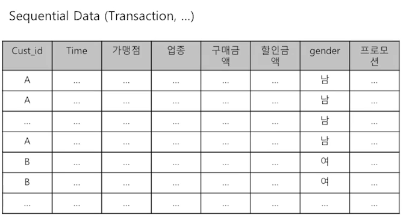
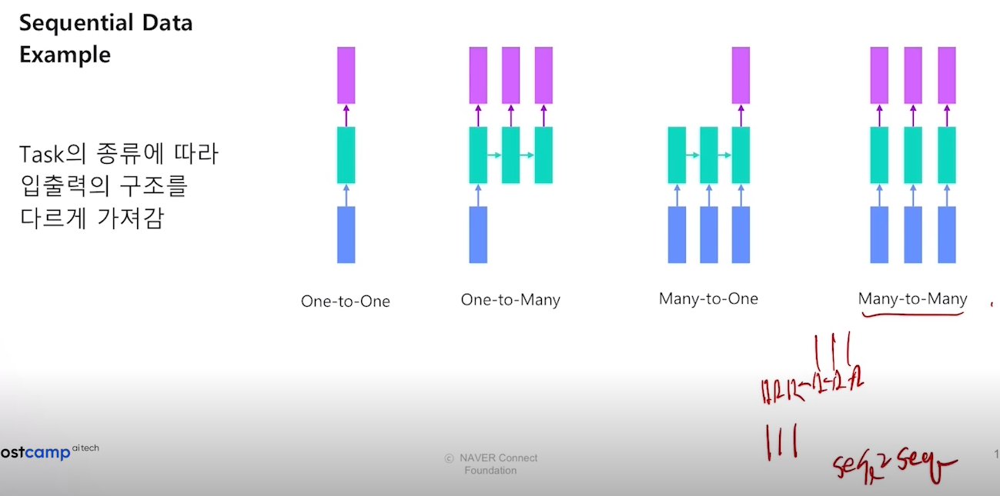

# Sequence Modeling

그러나 시퀀셜 데이터는 시간별로 쌓여있는 데이터이기 때문에 애초에 데이터셋 자체가 ML에 넣을만한 상태가 아닙니다.

## Tabular Approach
정형 데이터로 가정하고 모델 적용
* Feature Engineering
  * 문제를 푼 시점에서의 사용자의 적중률 
  * 문제 및 시험 별 난이도 = (전체 정답 수) / (전체 풀이 수) 
* Train/Test Split
  * 사용자 단위로 Split
  * 단순 이벤트의 행 단위로 개수를 세는 것이 아닌, 사용자 별로 묶어서 Split을 해야 유저의 실력이 보존 
* Model : LGBM
* 하이퍼 파라미터 및 Feature들을 조절해가며 최고의 모델을 확인
* HyperParameter를 조절하는 데에 있어서는 너무 힘을 들이지 말아라.

## Seqeuntial Approach
### Sequential Data Example

* Input Transformation
* Models : LSTM, LSTM + Attention, BERT

## FE and Model
1. Make ground baseline with no fe
2. Make a small FE and see I you can understand data you have
3. Find good CV strategy (K-Fold, Stratified-K-fold, Timesplit)
   * CV 점수와 Leader Board 점수랑 일치하는 지 확인
4. Feature selection
   * Target 안 쓰고 Feature만 가지고 할 수 있다. 
   * Model을 이용해서 할 수 있다. RFE나, Tree형
   * Feature를 하나씩 넣고 빼가면서 확인해보는 것이 베스트이긴 하다.
   * 그래서 파이프라인을 잘 설계해야한다. 
5. Make deeper FE
6. Tune Model (crude tuning)
7. Try other Models (never forget about NN)
8. Try Blending / Stackin / Ensembling 
   * Blending에는 voting, average, 평균에서도 $\sqrt$, squared, seed ensemble... 
9.  Final tuning 