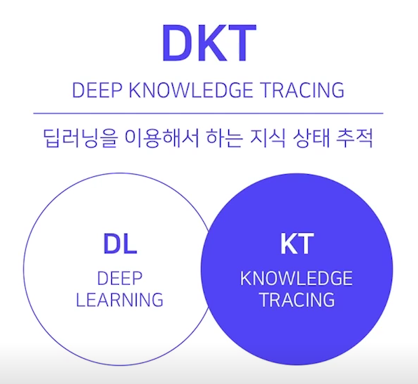
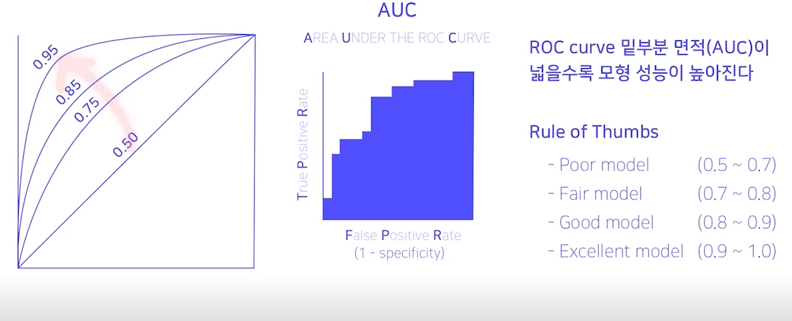
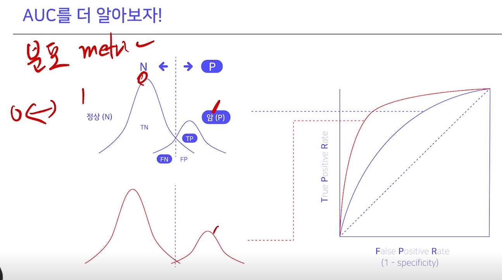
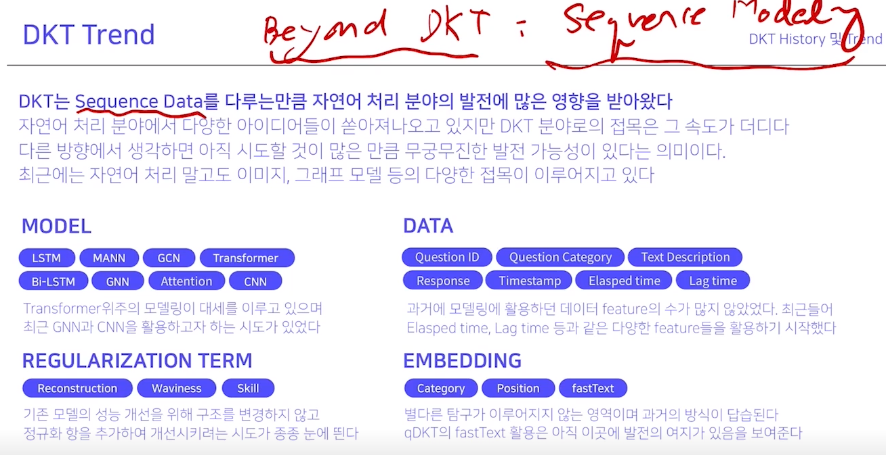
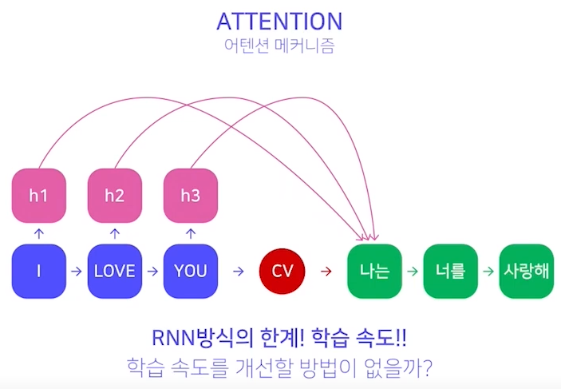
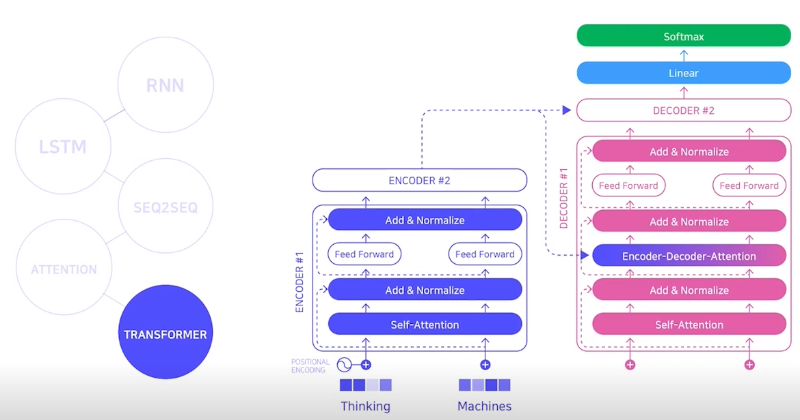

# DKT Task 이해

 
* 데이터가 적을수록 오버피팅이 쉽게 일어난다.
  * Data Size를 키우는 것이 좋긴 하다.
  * Kaggle은 주어진 테스트셋에서 최적화를 하는 거지만 현업에서는 성농을 올리기 위해 Data를 늘리면 된다. 문제 정의부터 시작하기 때문에, 문제를 다시 정의한다든지, Data를 더 늘릴 수 있다.
* IQ테스트를 통해 IQ를 알 듯, DKT를 통해 학생의 학습상태를 알 수 있다. (문제 추천, 학업도 파악에 사용 가능)
* DKT 대회는, 지식상태보다는 주어진 문제를 맞췄는지 틀렸는지에 집중한다! $0$이냐 $1$이냐를 푸는 문제이기에 classification이다.

# Metric 이해
* DKT는 무엇을 평가지표로 사용할 것인가?
  * AUC (Area Under the roc Curve) / ACC (Accuracy)

## Confusion Matrix (혼동행렬)

* Precision 과 Recall은 Trade-off 관계이므로, F1-score는 동시에 고려하는 Metric이다.
* 이 혼동행렬의 단점은, 모델의 예측값은 실수인데, threshold를 정해두고 그 값을 0,1로 변경을 해줘야한다. 그렇기에 threshold의 설정에 영향을 받는다.
* 그런 영향을 받지 않는 Metric이 AUC이다. ROC curve 밑부분 면적이 넓을수록 모형 성능이 높아진다. 
* $FPR=\dfrac{TN}{FP+TN}$, $TPR=\dfrac{TP}{TP+FN}$

* AUC의 값의 범위는 0에서 1 사이이다.
* AUC는 이상적인 2가지 이유
  * **척도 불변**, 절댓값이 아니라, 예측이 얼마나 잘 평가되는지 측정
  * **분류임계값 불변**, 어떤 분류 임계값이 선택되었는지와 상관없이 모델의 예측 품질을 측정 
  * **하지만 이러한 두 이유는 특정 사례에서 AUC의 유용성을 제한할 수도 있음**
    * 예를 들어 잘 보정된 확률 결과가 필요한 경구가 있는데 AUC로는 이 정보를 알 수 없다.
    * 분류 임계값 불변이 항상 이상적이진 않다.
    * 허위 음성(FN) 비용과 허위 양성(FP) 비용에 큰 차이가 있는 경우 한 가지 유형의 분류오류를 최소화하는 것은 위험할 수 있다. 예를 들어 이메일 스팸감지를 실행할 때 허위양성의 최소화로 인해 허위 음성이 크게 증가한다고 해도, 허위 양성 최소화를 우선시하고 싶을 수 있다. AUC는 이런 유형의 최적화에 유용한 측정항목이 아니다.
  * 일반적으로 imbalanced data에서 accuracy정도는 아니지만, AUC는 비교적 높게 측정되는 경향이 있다. (1이 별로 없으면 True가 하나 등장할 때 올라가는 정도가 더 높다.)
  * imbalance data여도 Test data를 동일하게 유지한다는 가정 하에, binary classification 모델의 상대적인 성능 비교 가능

# DKT History 및 Trend

# Sequence Data
Sequence 모델은 RNN - LSTM - SEQ2SEQ - ATTENTION - TRANSFORMER
* **RNN**은 장문장에서 학습이 어렵다. 장문장에서 거리가 먼 단어와의 관계 정보가 소멸된다. **기억할 것은 기억, 잊을 것은 잊자!** 장문장에서 거리가 먼 단어와의 관계 정보가 소멸된다.
* 그래서 **LSTM**이 나왔다. (**기억할 것은 기억, 잊을 것은 잊자!**)
* 기계 번역 등 언어모델? 문장을 입력받아, 문장을 생성하는 모델을 연구해보자! = **SEQ2SEQ**
* SEQ2SEQ는 CV, Context Vector가 핵심
  * 그러나 긴 문장을 한 개의 Context Vector로 표현하는데에 있어 한계가 있음!    
* 그래서 ATTENTION이 도입된다. 그 이전의 h를 활용하자.  병렬처리가 어렵다. 
* 그래서 병렬처리가 나왔다.  Sequence에 대한 정보를 끊었지만, Positional Encoding으로 해결한다. 