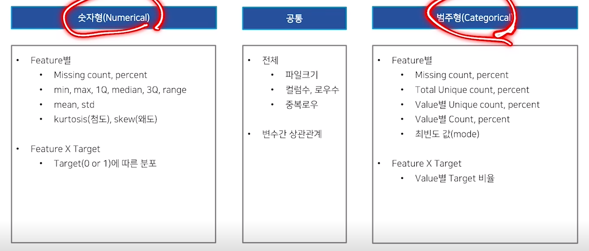
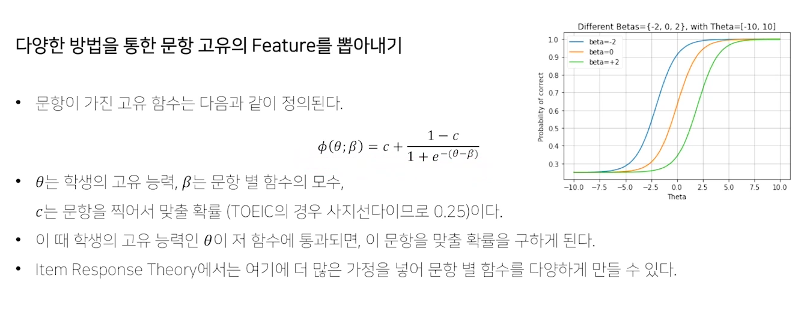

# Feature Engineering
* FE : Top-Down vs Bottom-up
  * Bottom-up 
    * Search EDA for things that look weird 
    * Create new features to capture what you see 
    * Add to model and tune your model hyperparameters
    * Confirm CV increases and submit
      * CV는 어떻게 짜느냐...?
      * Cross Validation (K-Fold, Group-K-Fold 등등...) - 틀렸다는 게 확인되기 전까지는 맞는 전략
  * Top-Down
    * 가설 기반 (Hypothesis-driven)
      * 컨설팅 방법론 (Logical thinking)
    * 가설-구현-검증
      * 데이터에 대한 질문 & 가설
      * 데이터를 시각화하고, 변환하고, 모델링하여 가설에 대한 답을 탐색 (구현-성능 탐색)
      * 찾는 과정에서 배운 것들을 토대로, 다시 가설을 다듬고 또 다른 가설을 만들기.
  

* 실제 Riid 대회 상위권 Solution에서 사용한 여러 기법들로, 하나씩 살펴보도록 하자.
  
## 사용자별 문항을 푸는 패턴
* 사용자별로 문항을 푸는 패턴이 다를 수 있다. 예를 들어
  * 문항 정답을 하나로 찍는다거나
    * 현재 10문제 이상 같은 문항으로 찍은 경우에 대한 정답률이 23.78%로 평균 정답률 65.71%에 비교해서 상당히 적은 것을 알 수 있음.
    * 아쉽게도 i-Scream에서는 사용자의 선택지 정보는 없이, 정답 여부만 있기 때문에 사용하기 어려움 
  * 사용자가 문항을 푸는 평균 시간보다 해당 문항을 더 오래 혹은 빨리 푼다든가
    * 사용자별로 같은 문항을 풀었어도, 실력이나 다른 요인에 의하여 문제 푸는 데 걸리는 시간이 달라질 수 있음.
      * TOEIC이라는 시험의 특성 상, 듣기 평가의 경우 푸는 시간이 길어질수록 해당 Dialogue를 못 들었기 때문에 틀릴 확률이 올라갔을 것으로 추측할 수 있음.
    * 더 나아가, 해당 문항을 맞춘 학생의 평균 시간과 틀린 학생의 평균 시간 2가지를 Feature로 주어 활용할 수 있다.
      * 이 2가지는 여러 조합의 정보를 포함할 수 있는데, 예를 들어, 쉬운 문항의 경우 대다수의 이 문항을 맞춘 학생들이 문항을 빨리 풀었다고 하면, 해당 문항을 빨리 푼 학생은 이 문항을 맞출 확률이 높을 것으로 기대할 수 있다.
    * 사용자의 정답률 추이
      * EDA에서 살펴보았던 정답률 추이를 활용할 수 있다.
      * 예를 들어, 누적 정답률과 최근 정답률 두 가지를 모델에게 줄 수 있다.
        * 최근 정답률은 누적 정답률과 다르게 전체를 보는 것이 아닌, 해당 문항으로부터 앞의 N개 문항들의 정답률을 의미한다.
        * 이 정보들과 다음 문항의 정답 여부 사이의 관계를 모델이 찾아낼 것을 기대.
  * 이전에 풀었던 문항이 다시 등장하면 맞출 확률이 올라간다든지
    * 한 번 풀었던 문항은, 해당 문항을 풀었던 경험이 있기 때문에 더 높은 확률로 답을 맞출 것이라 기대할 수 있음.
    * 다른 문제더라도, 같은 시험지 혹은 같은 태그를 가지는 문항이 나왔고 이 문항을 맞췄던 정보를 포함한다면, 이 또한 활용될 수 있음. 
  * 사용자가 문항을 연속으로 맞추고 있는지 등 
* 이러한 특성들이 학습에 반영되면, 점수가 오를 거라 기대할 수 있다.

## 문항별 특징
정답을 예측하는 데 있어, 사용자가 푸는 문제에 대한 정보가 많으면, 이것이 활용될 수 있다. 예를 들어 직접적인 정보인
* 문항의 정답률
* 문항이 가진 태그의 정답률
 을 활용하거나 혹은 문항의 간접적인 특징인
 * 문항-태그 정보로 context2vec
 * 사용자-문항 정보로 SVD, LDA, item2vec
 * 문항을 특징화하는 IRT, ELO
와 같은 implicit한 정보를 활용할 수 있겠다.

### 문항, 시험지, 태그의 평균 정답률
* 어떤 문항을 풀 때, 이 문항이 쉬운 문항이라면 우리는 이 문항을 확률이 높다고 생각할 것이다.
* 쉬운 문항이라는 지표를 만들기는 힘들지만, 이것을 간접적으로 표현할 수 있는 문항 별 정답률을 활용할 수 있다.
* 문항 별로 train data에서 정답률을 뽑아서 이를 또 다른 Feature로 넣어주면 모델이 활용할 것으로 기대
* 시험지, 태그의 경우도 같은 작업을 해줄 수 있겠다.  

### 문항, 시험지, 태그의 빈도
* 앞서 i-Scream EDA에서도 살펴보았듯, 문항과 태그가 등장한 횟수가 정답률과 어느 정도 상관 관계가 있음을 살펴보았다. Riid에서도 이런 빈도수 데이터를 활용한 유저들이 있었다. 

### Data Leakage
* 위에서 사용한 대다수의 Feature는 넣었을 때 성능을 보인다면 괜찮지만, 많은 경우에 모델에 대한 의심을 부를 수 있는 단점이 있다.
* 우리가 활용하는 '평균' 정답률은 train dataset에서만 계산한 것이고 infer하는 과정에서 추가되는 test-dataset의 정답률의 포함하지 못한 것과, train만 활용했을 때와 train-test가 모두 활용되었을 때 전체 평균 정답률은 알 수 없기 때문이다.
  * 문제 없이 사용하려면, test dataset이 반영한 전과 후가 큰 차이가 없다는 것이 보장될 정도로 많은 양의 데이터가 있어야 한다.
* 당시, 데이터가 Interaction이 1억줄이 넘어가기 때문에, 문항의 정답률이 크게 바뀌지 않을 것이라는 여론이 강하여 이 feature는 사용해도 좋을 것이라는 의견이 많았고 실제로 많이 활용하였다.
  * time series api가 row 한 줄씩 Inference하기 때문에 매번 update하여 사용하면 문제가 없다.

### 다양한 방법을 통한 문항 고유의 Feature를 뽑아내기
* 추천 시스템에서 많이 사용되는 Matrix Factorization (FM)이라는 기법을 활용하여, 사용자의 벡터와 문항의 벡터를 각각 만들 수 있다.
* Riid, i-Scream 데이터의 경우 문제를 푼 사용자와 사용자가 푼 문항을 통해 user-item 행렬을 만들어 진행할 수 있다.
* 혹은 유사한 방법으로 선형대수학에서 SVD를 활용할 수도 있음.
* 또는 문제의 난이도에 대한 이론인 ELO, IRT를 활용할 수 있다.
* 두 이론을 간단하게 설명하면, 학생과 문항 별로 고유한 특성이 있다는 가정을 한다.
  * 학생은 말로 정의할 수 없는 잠재 능력이 있다 가정하며
  * 문항은 이 학생의 잠재 능력을 입력으로 받아 이 학생이 문항을 맞출 확률을 반환하는 어떤 함수가 있다고 가정한다. 
* 만약, 학생의 잠재 능력을 알고, 문항 별로 모수를 안다면, 전체 학생의 모든 문제를 맞출 확률을 모두 알 수 있다. 
  
## 시간 데이터 임베딩
* 범주형 데이터의 경우 임베딩 행렬의 한 열을 사용하는 형태인데, 연속형 데이터는 그렇게 사용할 수 없음
* 한 유저가 시간과 같은 연속형 데이터를 새로운 방법으로 임베딩 했는데
  * 임베딩 행렬을 사용하는 대신
  * 주어진 연속형 데이터 값에 가중을 더 두고 그 주변 값들에 더 작은 가중을 주어 이 임베딩 행렬의 특정 열들을 가중합한 벡터를 임베딩으로 사용한다.

# Last Query Transformer RNN
## Resolving deficits
## Small number of Features 
## Advantages of Lasty Query ONLY 
## Adding LSTM