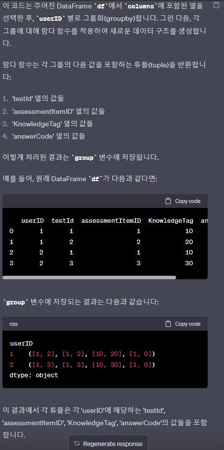
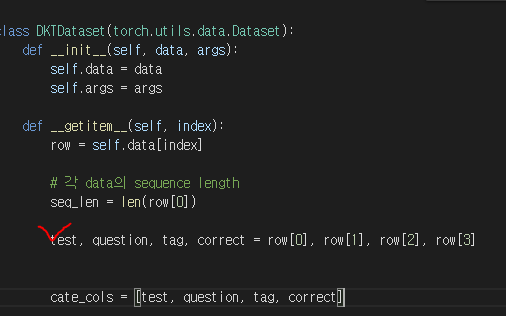
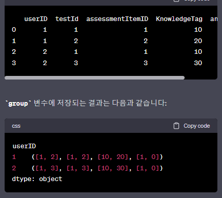

# Preprocessing 부분 

1. 이 부분은 뭘 하는걸까?

```python
group = df[columns].groupby('userID').apply(
                lambda r: (
                    r['testId'].values, 
                    r['assessmentItemID'].values,
                    r['KnowledgeTag'].values,
                    r['answerCode'].values
                )
            )
```



2. Preprocess.__preprocessing 부분에서 카테고리 변수들에 대해 그냥 라벨 인코딩을 해버린다. 이 단계에서는 아직 padding을 수행하지 않는다.
3. 
   1. 위에서 row[0], row[1]로 진행하는 경우는 1에서도 설명했지만, 데이터가 다음과 같은 방식으로 나오기 때문  
4. 알겠습니다. 이번에는 `mask` 배열의 길이를 조절해야 하는 상황을 설명하기 위해 토이 데이터셋을 변경하겠습니다.

변경된 토이 데이터셋:

```python
batch = [
    # 첫 번째 데이터 포인트
    [
        torch.tensor([1, 2, 3, 7]),    # data
        torch.tensor([1, 0, 1, 1]),    # mask
    ],
    # 두 번째 데이터 포인트
    [
        torch.tensor([4, 5]),          # data
        torch.tensor([1, 1]),          # mask
    ]
]
```

이 배치를 `collate` 함수에 전달하면 다음과 같이 처리됩니다.

1. `col_list` 초기화: `col_list = [[], []]`
2. 배치의 값들을 각 column끼리 그룹화: `col_list = [[[1, 2, 3, 7], [4, 5]], [[1, 0, 1, 1], [1, 1]]]`
3. 각 column의 값들을 대상으로 패딩 진행:
   - `pad_sequence([[1, 2, 3, 7], [4, 5]])` -> `[[1, 2, 3, 7], [4, 5, 0, 0]]`
   - `pad_sequence([[1, 0, 1, 1], [1, 1]])` -> `[[1, 0, 1, 1, 1, 0, 0], [1, 1, 0, 0, 0, 0, 0]]`
   - `col_list` 업데이트: `col_list = [[[1, 2, 3, 7], [4, 5, 0, 0]], [[1, 0, 1, 1, 1, 0, 0], [1, 1, 0, 0, 0, 0, 0]]]`
4. 마지막 부분에서 `mask` 배열의 길이를 확인하고 필요한 경우 길이를 조절합니다. 이 예제에서 첫 번째 열(column)의 시퀀스 길이는 4이지만, 마지막 `mask` 열(column)의 시퀀스 길이는 7입니다. 따라서 `mask` 배열의 길이를 조절해야 합니다.
   - `col_list[-1] = col_list[-1][:, :col_seq_len]`
   - `col_list` 업데이트: `col_list = [[[1, 2, 3, 7], [4, 5, 0, 0]], [[1, 0, 1, 1], [1, 1, 0, 0]]]`

이 예제에서는 마지막 부분에서 `mask` 배열의 길이를 첫 번째 열(column)의 시퀀스 길이와 일치하도록 조절했습니다. 이렇게 하면 각 열(column)의 시퀀스 길이가 일치하게 되어, 다음으로, 이 데이터를 모델에 입력으로 사용할 수 있게 됩니다. 이렇게 각 열(column)의 시퀀스 길이가 일치하게 되면, 모델이 처리하기 쉬운 형태의 입력 데이터를 얻을 수 있습니다. 패딩(padding)과 마스킹(masking)은 시퀀스 길이가 다른 데이터를 동일한 길이로 맞춰주는 역할을 하며, 이 과정을 거친 데이터는 모델에 입력으로 사용될 수 있습니다.

이 두 함수는 데이터 증강을 위한 목적으로 사용됩니다. 데이터 증강(augmentation)은 기존 데이터를 변형하여 더 많은 데이터를 생성하는 과정입니다. 이를 통해 모델이 더 다양한 데이터를 학습하게 하여 일반화 성능을 향상시킬 수 있습니다.

`sliding_window` 함수는 주어진 데이터에 슬라이딩 윈도우(sliding window)를 적용하여 데이터를 증강하는 역할을 합니다. 슬라이딩 윈도우는 일정한 길이의 구간(window_size)을 데이터에 순차적으로 적용하여 그 구간의 데이터를 추출합니다. 이때, 구간이 이동하는 간격은 stride로 지정됩니다.

`sliding_window` 함수는 다음과 같은 과정을 거칩니다:
1. 데이터의 각 행(row)에 대해 슬라이딩 윈도우를 적용합니다.
2. 만약 데이터의 시퀀스 길이(seq_len)가 윈도우 크기(window_size)보다 작거나 같다면, 데이터를 그대로 사용합니다.
3. 시퀀스 길이가 윈도우 크기보다 큰 경우, 슬라이딩 윈도우를 적용하여 증강된 데이터를 생성합니다.
   - 마지막 윈도우 이전에 있는 경우, `shuffle` 함수를 사용하여 해당 윈도우를 섞습니다.
   - 마지막 윈도우에 대해서는 섞지 않습니다.
4. 슬라이딩 윈도우 적용 후 뒷부분이 누락되었다면, 누락된 부분을 추가로 증강된 데이터에 포함시킵니다.

`shuffle` 함수는 주어진 데이터를 섞어주는 역할을 합니다. 이 함수는 주어진 데이터를 주어진 횟수(shuffle_n)만큼 섞어서 새로운 데이터를 생성합니다. 이렇게 생성된 데이터는 `sliding_window` 함수에서 사용되어 데이터를 더 다양하게 만들어 줍니다.

이러한 데이터 증강 기법들은 모델이 더 다양한 데이터를 학습하게 하여 일반화 성능을 향상시킬 수 있습니다. 이를 통해 과적합(overfitting)을 줄이고, 모델이 더욱 견고한 예측을 수행할 수 있게 됩니다.

알겠습니다. 아래 토이 데이터셋을 사용하여 `sliding_window`와 `shuffle` 함수를 설명하겠습니다.

토이 데이터셋:
```python
data = [
    # 첫 번째 데이터 포인트
    [
        np.array([1, 2, 3, 4, 5, 6, 7, 8]),    # data
    ],
    # 두 번째 데이터 포인트
    [
        np.array([9, 10, 11, 12, 13, 14]),    # data
    ]
]

args = {
    'max_seq_len': 4,
    'stride': 2,
    'shuffle': True,
    'shuffle_n': 2
}
```

`sliding_window` 함수를 호출하면 다음과 같은 과정을 거칩니다.

1. 첫 번째 데이터 포인트:
   - seq_len = 8, window_size = 4
   - total_window = ((8 - 4) // 2) + 1 = 3
   - 슬라이딩 윈도우를 적용:
     - window_i = 0: [1, 2, 3, 4] (셔플 사용)
     - window_i = 1: [3, 4, 5, 6] (셔플 사용)
     - window_i = 2: [5, 6, 7, 8] (셔플 사용 안 함)
   - `shuffle` 함수를 호출하여 각 윈도우를 섞습니다. 여기서는 첫 번째와 두 번째 윈도우를 섞습니다.
     - [1, 2, 3, 4] -> [4, 1, 2, 3], [2, 4, 1, 3] (셔플 결과)
     - [3, 4, 5, 6] -> [5, 3, 6, 4], [3, 6, 5, 4] (셔플 결과)
   - 증강된 데이터: [1, 2, 3, 4], [3, 4, 5, 6], [5, 6, 7, 8], [4, 1, 2, 3], [2, 4, 1, 3], [5, 3, 6, 4], [3, 6, 5, 4]

2. 두 번째 데이터 포인트:
   - seq_len = 6, window_size = 4
   - total_window = ((6 - 4) // 2) + 1 = 2
   - 슬라이딩 윈도우를 적용:
     - window_i = 0: [9, 10, 11, 12] (셔플 사용)
     - window_i = 1: [11, 12, 13, 14] (셔플 사용 안 함)
   - `shuffle` 함수를 호출하여 첫 번째 윈도우를 섞습니다.
     - [9, 10, 11, 12] -> [10, 12, 11, 9], [12, 11, 9, 10] (셔플 결과) 
   -    - 증강된 데이터: [9, 10, 11, 12], [11, 12, 13, 14], [10, 12, 11, 9], [12, 11, 9, 10]

따라서 `sliding_window` 함수를 적용한 후에는 토이 데이터셋이 다음과 같이 증강됩니다:

```python
augmented_data = [
    [1, 2, 3, 4], [3, 4, 5, 6], [5, 6, 7, 8], [4, 1, 2, 3], [2, 4, 1, 3], [5, 3, 6, 4], [3, 6, 5, 4],
    [9, 10, 11, 12], [11, 12, 13, 14], [10, 12, 11, 9], [12, 11, 9, 10]
]
```

이렇게 생성된 증강된 데이터셋은 원래의 데이터보다 더 많은 데이터 포인트를 가지고 있으며, 이를 통해 모델은 더 다양한 데이터를 학습할 수 있습니다. 이를 통해 모델의 일반화 성능을 향상시키고, 과적합을 줄일 수 있습니다.

---

# Ideation 부분 
```python
# max seq len을 고려하여서 이보다 길면 자르고 아닐 경우 그대로 냅둔다
        if seq_len > self.args.max_seq_len:
            for i, col in enumerate(cate_cols):
                cate_cols[i] = col[-self.args.max_seq_len:]
            mask = np.ones(self.args.max_seq_len, dtype=np.int16)
        else:
            mask = np.zeros(self.args.max_seq_len, dtype=np.int16)
            mask[:seq_len] = 1
```
* 위의 부분에서 max_seq_len을 그냥 자르면 정보의 손실이 일어나기 때문에, 자른 다음에 새로운 데이터로 추가를 시켜서 나머지 부분은 패딩을 시켜주는 것도 괜찮을지도? 
* 이 시점에서, 너무 많이 잘라내면 안되니까, max_seq_len을 최대 길이의 90~95% 정도로 활용하는 건 어떨까?  


```python
def __preprocessing(self, df):
        cate_cols = ['assessmentItemID', 'testId', 'KnowledgeTag']
        for col in cate_cols:

            #For UNKNOWN class
            a = df[col].unique().tolist() + [np.nan]
            
            le = LabelEncoder()
            le.fit(a)
            df[col] = le.transform(df[col])
            self.__save_labels(le, col)

        def convert_time(s):
            timestamp = time.mktime(datetime.strptime(s, '%Y-%m-%d %H:%M:%S').timetuple())
            return int(timestamp)

        df['Timestamp'] = df['Timestamp'].apply(convert_time)
        
        return df
```
위에서 `le = LabelEncoder()`를 사용해서 카테고리 변수들을 라벨 인코딩을 해주는 데, 이와 같은 방식이 아니라 다른 방식으로 변경해주는 것은 어떨까?  

```python
def load_data_from_file(self, file_name):
        csv_file_path = os.path.join(self.args.data_dir, file_name)
        df = pd.read_csv(csv_file_path)
        df = self.__preprocessing(df)

        # 추후 feature를 embedding할 시에 embedding_layer의 input 크기를 결정할때 사용
        self.args.n_questions = df['assessmentItemID'].nunique()
        self.args.n_test = df['testId'].nunique()
        self.args.n_tag = df['KnowledgeTag'].nunique()

        df = df.sort_values(by=['userID','Timestamp'], axis=0)
        columns = ['userID', 'assessmentItemID', 'testId', 'answerCode', 'KnowledgeTag']
        group = df[columns].groupby('userID').apply(
                lambda r: (
                    r['testId'].values, 
                    r['assessmentItemID'].values,
                    r['KnowledgeTag'].values,
                    r['answerCode'].values
                )
            )
```
    
위의 부분에서, user, Timestamp에 따라  나눴으니 sequence 알고리즘을 써야겠지만, testID별로 나누면 session별로도 가능하지 않을까?


```python
# Shuffle
                # 마지막 데이터의 경우 shuffle을 하지 않는다
                if args.shuffle and window_i + 1 != total_window:
                    shuffle_datas = shuffle(window_data, window_size, args)
                    augmented_datas += shuffle_datas
                else:
                    augmented_datas.append(tuple(window_data))

            # slidding window에서 뒷부분이 누락될 경우 추가
            total_len = window_size + (stride * (total_window - 1))
            if seq_len != total_len:
                window_data = []
                for col in row:
                    window_data.append(col[-window_size:])
                augmented_datas.append(tuple(window_data))
```
위의 경우를 보면, '뒷부분이 누락되는 경우' - 마지막 데이터는 셔플이 들어가지 않고, 마지막 window_i도 셔플이 들어가지 않는다.