# Linear Discriminant Analysis (LDA)
* Find a line to which two classes are well separated after project
* 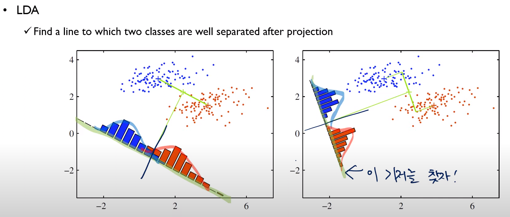n
* 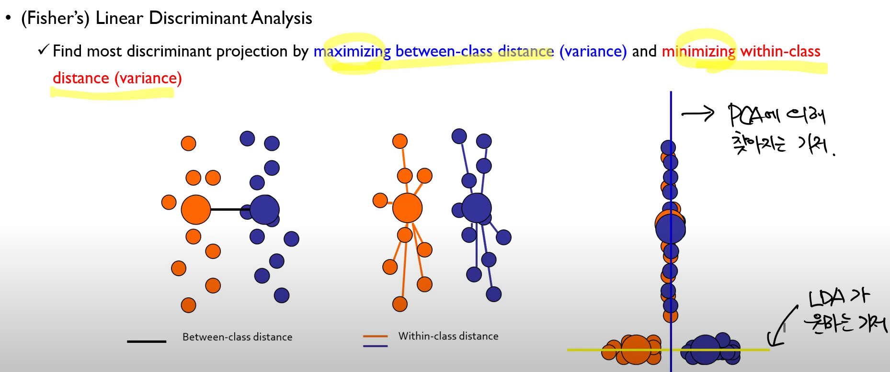
* 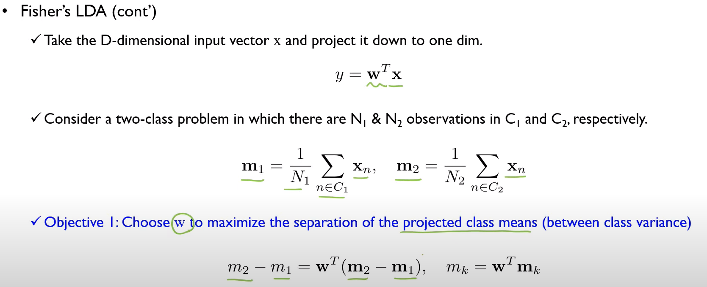
* 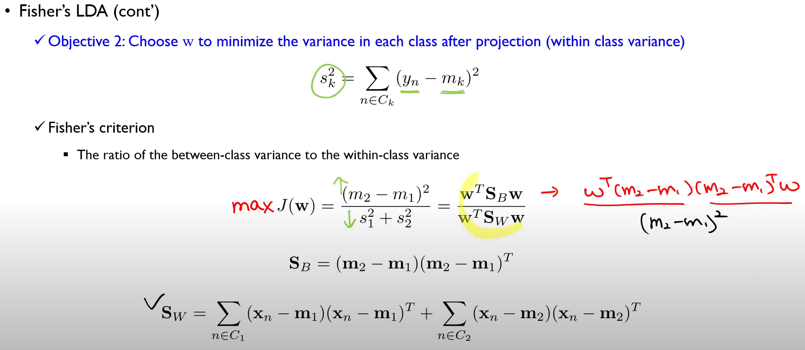
* 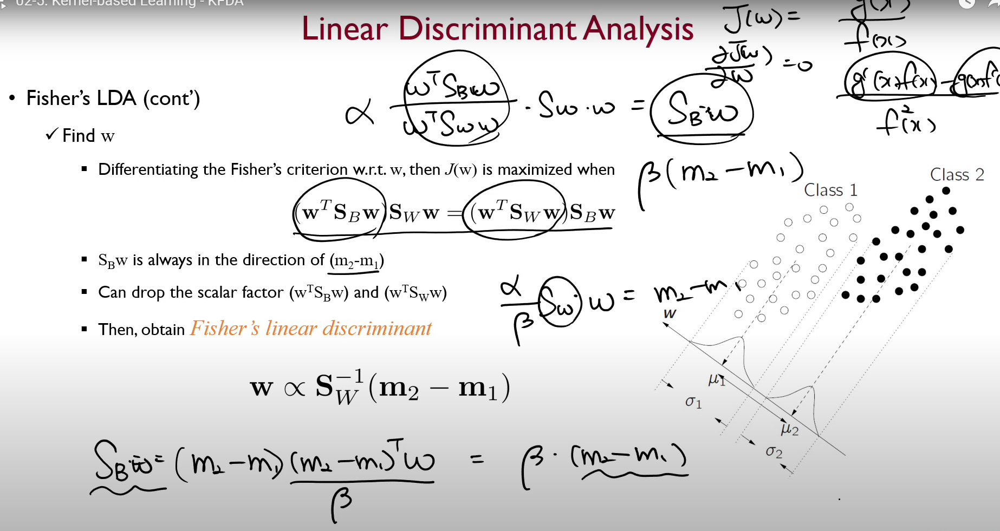

# Kernel Fisher Discriminant (KFD) 
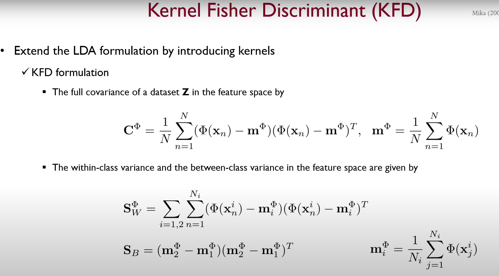
$\mathbf{C}^{\Phi}$ 는 Covariance Matrix.
$S_{W}^\Phi$관련된 부분에서 $i=1,2$인 이유는, $x_1,x_2$라는 차원이 있어서 그렇다.
* 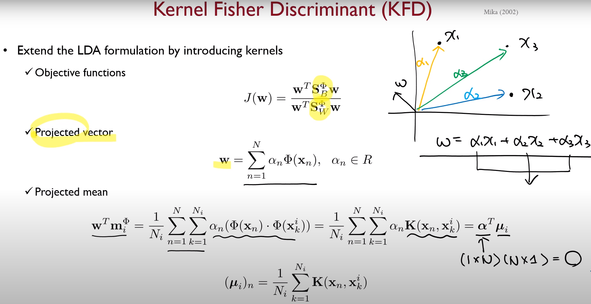
* 
* 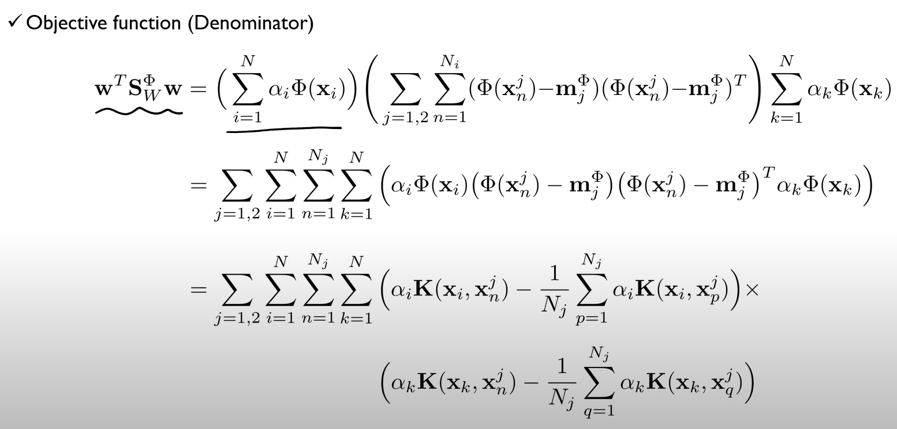
* 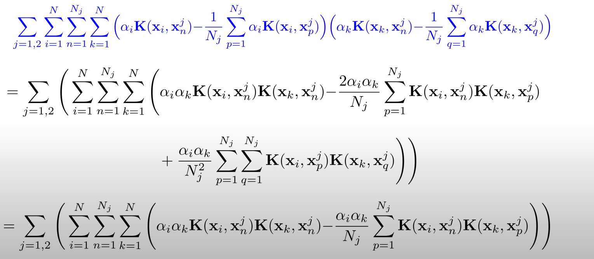
* 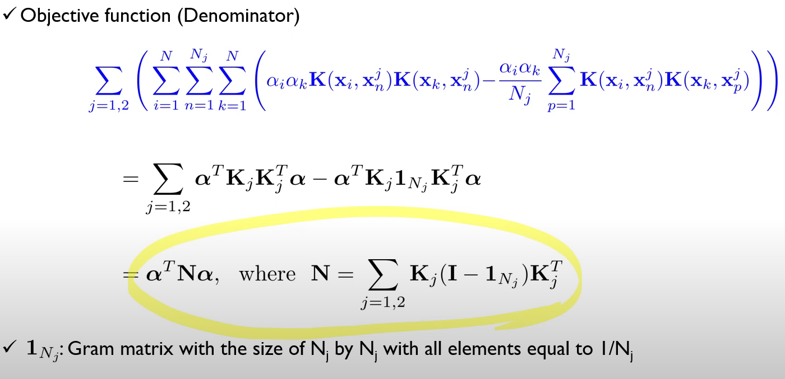
* 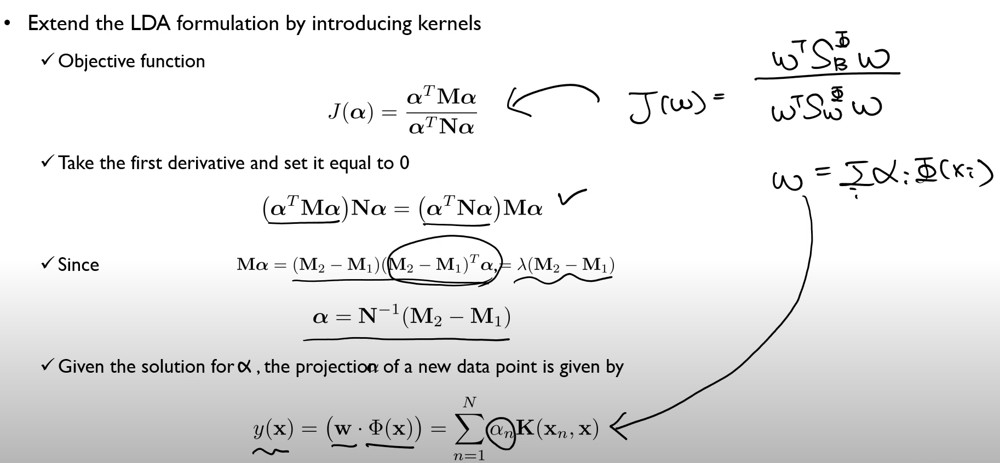