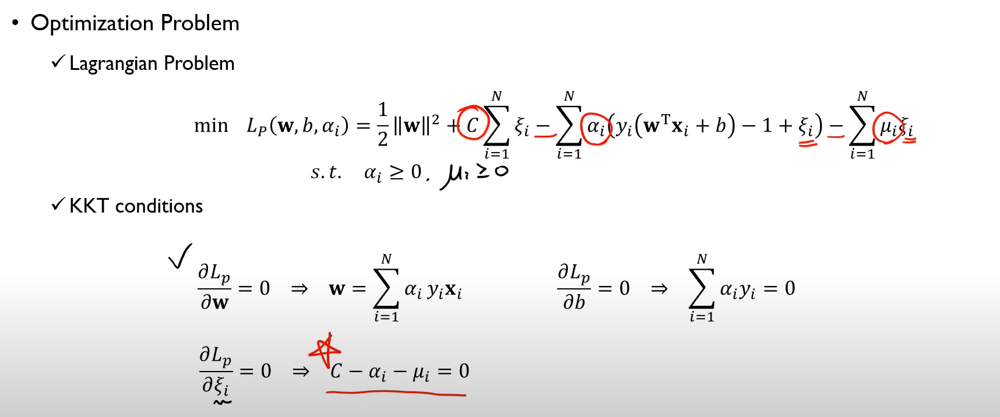
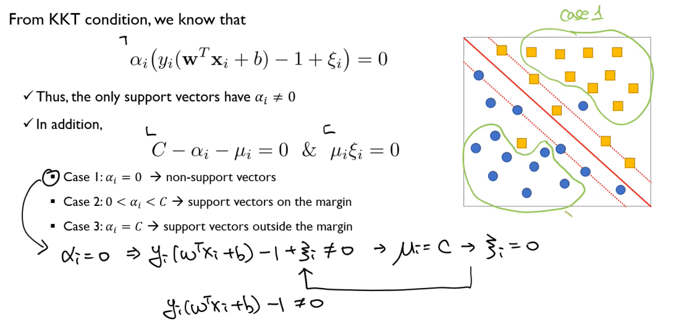
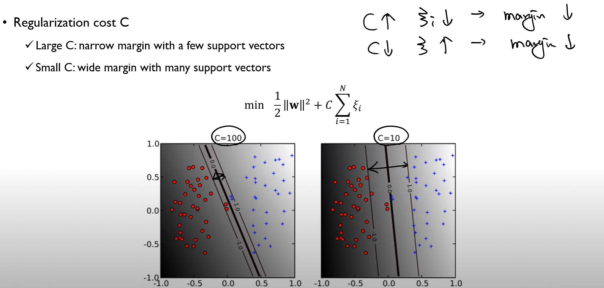
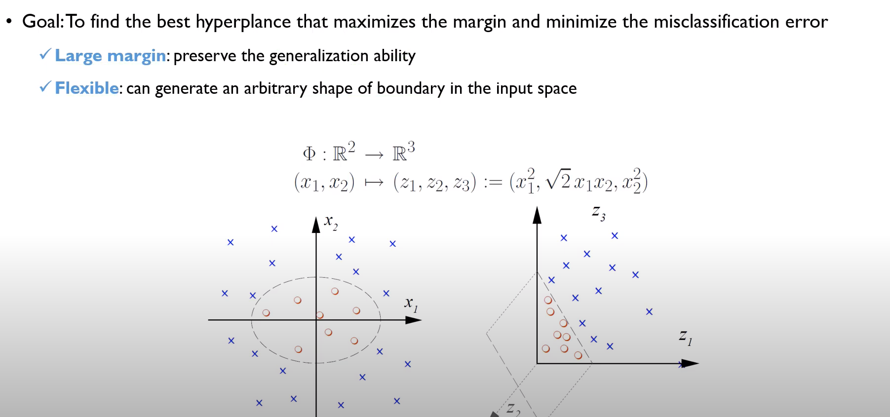
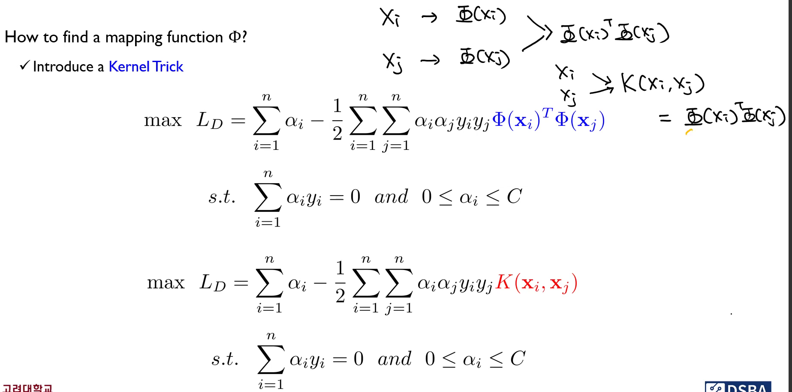
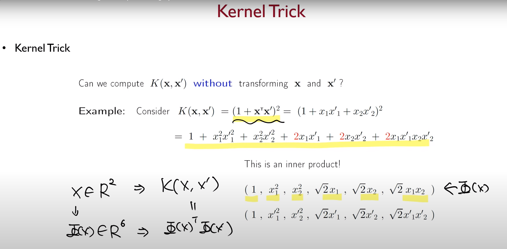
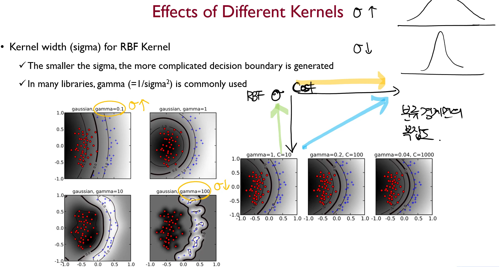

* Optimization Problem (C-SVM)
  * Objective function
  $$
  min \dfrac{1}{2}\left \Vert \mathbf{w}^2\right \Vert +C\sum_{i=1}^{N}\xi_i, \: s.t \:\:\: y_i\left( \mathbf{w^T x_i} +b \right) \geq 1-\xi_i, \xi_i \geq 0, \forall i
  $$
  * 정 안되면 약간의 허용을 해주도록 하겠다. 무조건 예외를 허용  할 것이 아니다.
  * 페널티는 '마진'을 기준으로 표현되는 것이다.
  * A는 학습과정에서 penalty가 부여 되는가? Yes
  * A는 Inference 과정에서 오분류가 되는가? No 
  * 페널티를 어떻게 부여하느냐에 따라 (Trade-off를 어떻게 처리하느냐에 따라) C-SVM과 Nu-SVM이라는 것이 나온다. 
  * given : $x, y$
  * parameter : $w, b, \xi_i$
  * hyperparameter : $C$

* From KKT Condition, we know that $\alpha_i\left( y_i\left( \mathbf{w}^T\mathbf{x}_i+b \right) -1+\xi_i \right) =0$
* Thus, the only support vectors have $\alpha_i\ne0$
* In addition, 
$$C-\alpha_i-\mu_i=0, \mu_i\xi_i=0$$
이때, $\mu_i$와 $\xi_i$는 둘 중 하나만 $0$이어야한다.
* Case 1 : $\alpha_i=0$ -> non-support vectors
* Case 2 : $0<\alpha_i<C$ -> support vectors on the margin
* Case 3 : $\alpha_i=C$ -> support vectors outside the margin
*  
* 

## Non-linear Case & Softmargin

> 저차원에서 선형분류가 어렵다면, $\Phi$라는 mapping function을 만들어서 고차원으로 이동시킨 뒤에 SVM을 적용시키자.

커널 트릭의 핵심은, 기존의 $d$차원에서는 선형분류가 안되니까 $D$차원으로 이동시켜주는 $\Phi$를 구한 뒤, 그것들을 가지고 $\Phi(x_i)^T \Phi(x_j)$를 계산하는 등의 행동을 해줌으로써 Dual problem을 푸는 것인데, 그러지 말고 $x_i, x_j$를 받아서 바로 $\Phi(x_i)^T \Phi(x_j)$와 동일한 결과를 내는 
$K\left( x_i, x_j \right)$라는 $K$들을 찾으면 되는 것 아니겠느냐? 

