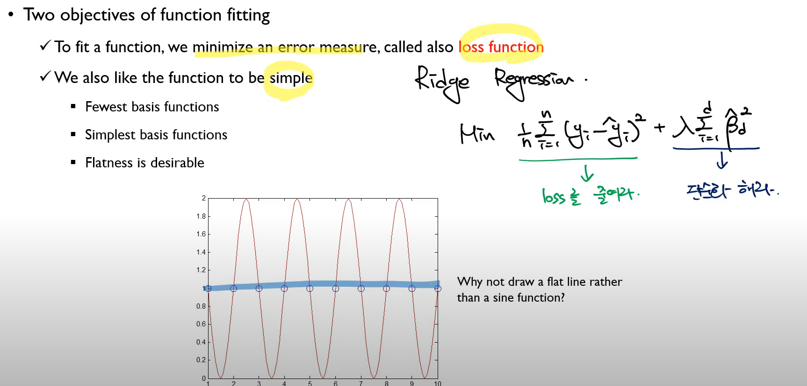
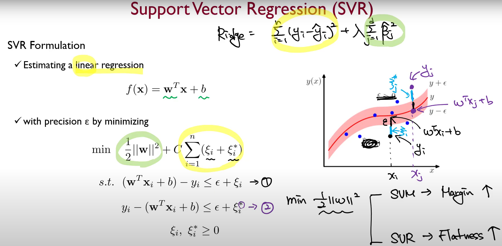
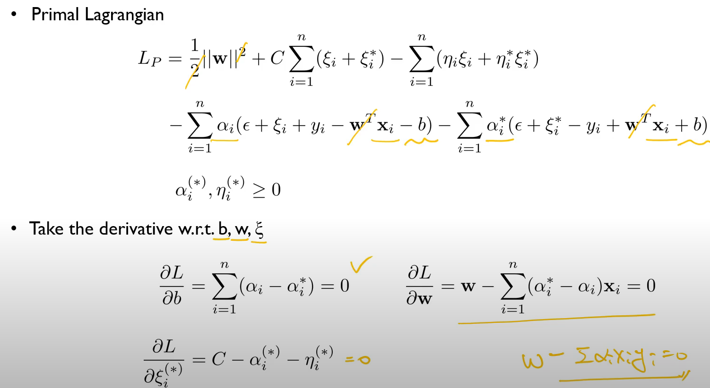
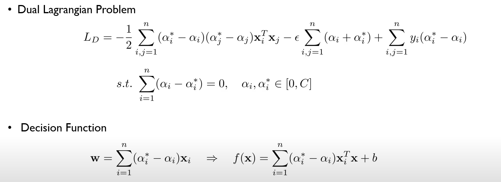

# Support Vector Regression
* 지난 시간 SVM 들은 분류, 특히 binary분류와 관련된 문제였다.
* * Two objectives of function fitting
  * To fit a function, we minimize an error measure, called also loss function
  * We also like the function to be simple
    * Fewest basis functions
    * Simplest basis functions
    * Flatness is desirable!
* 
* $\pm \epsilon$정도는 loss를 0을 받고, 그 이상이면 $\xi$만큼만 받자.
* 선형회귀분석에서는 squared loss를 받는다. 
* 그에 비해서 hinge loss는 조금 더 outlier에 둔감하게 반응하고, (왜냐면 제곱이 아니니까) 노이즈에도 강건하게 대응할 수 있다. 그림에서는 $\hat{\xi}$로 되어 있었는데, $\xi^*$이다.  
* 
* 