# Discriminant Function 
* 우리가 하고자 하는 것은, binary classification입니다.
* 이러한 classification을 만드는 데 있어서, 우리가 보면 각각의 알고리즘마다 분류 경계면을 만들어가는 로직이 있기 때문에 분류 결과물이 다르다. 첫 번째 예제는 Nearest Neighbor 이고, Decision Tree는 설명력을 확보하기 위해서 선으로 표현되고, Linear Functions도 있다. 혹은 Neural Network같은 경우 Nonlinear Functions에 속한다.
* 놀랍게도, **Original SVM은 선형 모형**이다. 
* 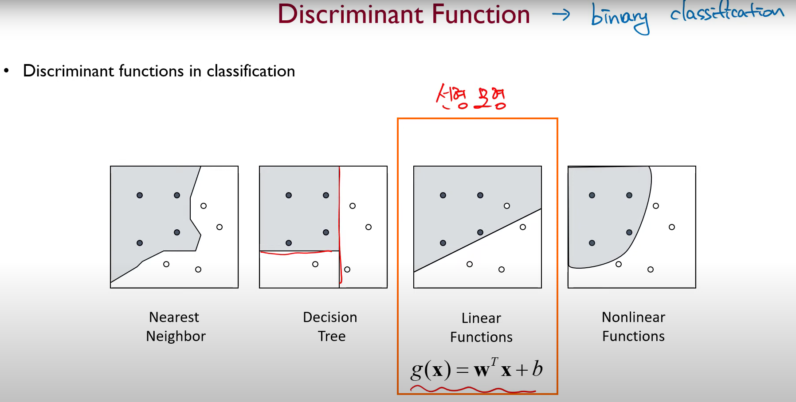

--- 

# Linear Classification 
* Binary Classification Problem 이진분류 데이터셋에 대한 노테이션을 맞춰놓고 가보겠습니다.
  * Training dataset : sample drawn iid from set $X\in R^d$ according to some distribution D 
    $$
    S = ((x_1,y_1), \cdots (x_n,y_n)) \in X \times{\{-1,1\}}
    $$
  * SVM 같은 경우는 SVM을 $\pm1$로 지정을 해두었는데 뒤의 formulation을 편하게 하기 위해서!
  * Problem : find hypothesis $h:X \longrightarrow\{-1,1\}$ in $H$(classifier) with small generalization error $R_D(h)$
  * Linear classifier ($d$-dimension에서 두 범주를 잘 구분하는 $d-1$차원의 hyperplane을 찾겠다.)
    * Hypothesis based on hyperplanes
    * Linear separation in high-dimensional data  
    * 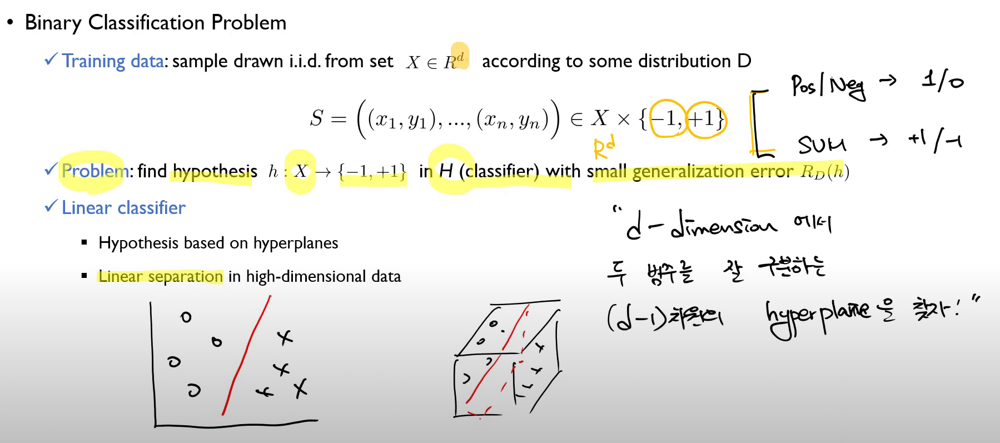  
    * 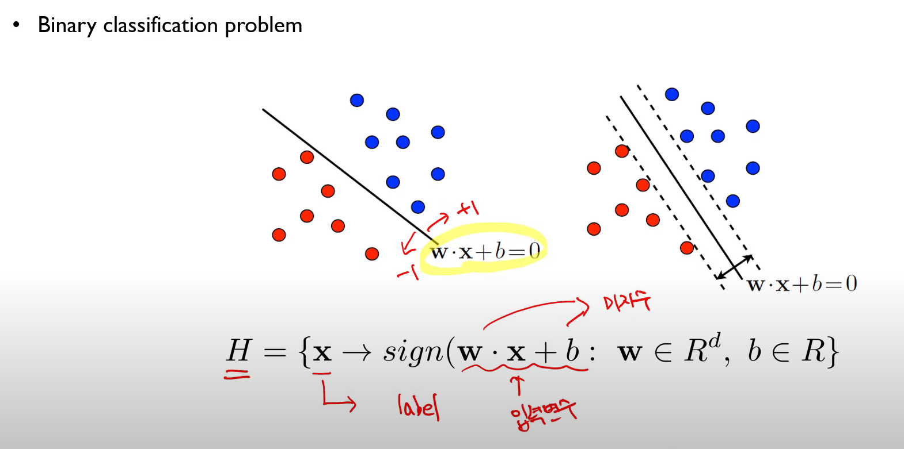
* How do you define better?
  * 전체 모형의 리스크는 $R = R _{emp}+Capacity Term$
  * SVM은 margin이 넓은 것을 더 좋은 모델로 평가하긴 한다. 두 모델 A, B 모두 $R_{emp}=0$이지만. 등간격으로 margin을 넓히면서 margin을 탐색한다. margin이 크다는 이야기는, Capacity term이 더 줄어들게 된다는 것을 의미한다.  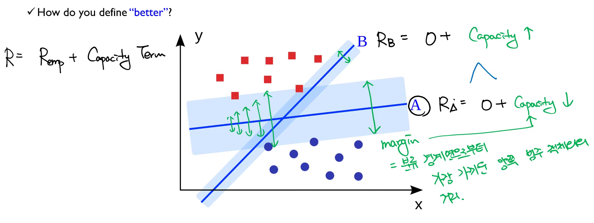
  * Neural Network가 공격받았던 지점은 뉴럴 네트워크는 Empirical Error만 보기 때문에, A와 B라는 경계면이 다르지 않다고 봐서, Local Optimum이 너무 많다. Global Optimum을 찾아야지!! 
  * 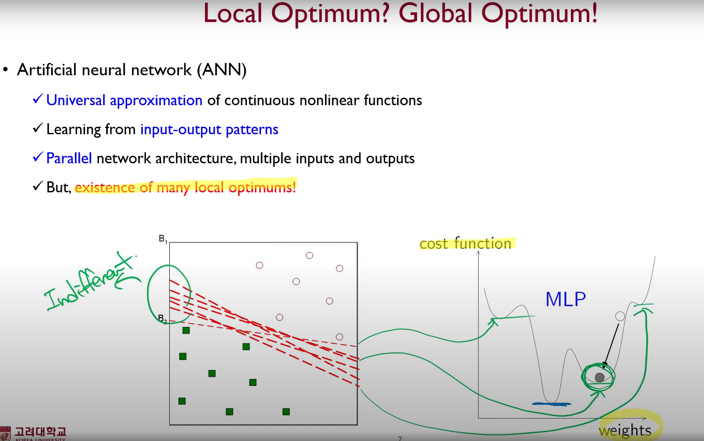
  * 그러나! ANN이 공격받았지만...  
  * 실험적으로는 고차원에서 모든 방향으로 그래디언트가 $0$인 경우가 거의 없고, 여러 학습을 시키면 결국 global optima로 가는 것 같더라? 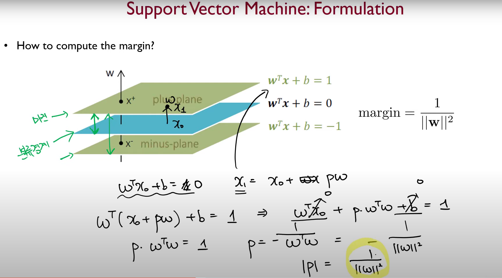

## Margin and VC Dimension 
* Recall the relationship between margin and VC dimension
  * The VC dimension of a separating hyperplane with a margin $\Delta$ is bounded as follows  where $D$ is the dimensionality of the input space, and $R$ is the radius of the smallest sphere containing all the input vectors
  $$
  h\leq \min([\dfrac{R^2}{\Delta^2}],D)+1 
  $$
  * Maximizing the margin $\longrightarrow$ Minimizing the VC dimension $\longrightarrow$ Minimizing the Expected Risk 
  $$
  R[f]\leq R_{emp}[f]+\sqrt{\dfrac{h\left( ln\dfrac{2n}{h}+1 \right) -ln\dfrac{\delta}{4}}{n}}
  $$
  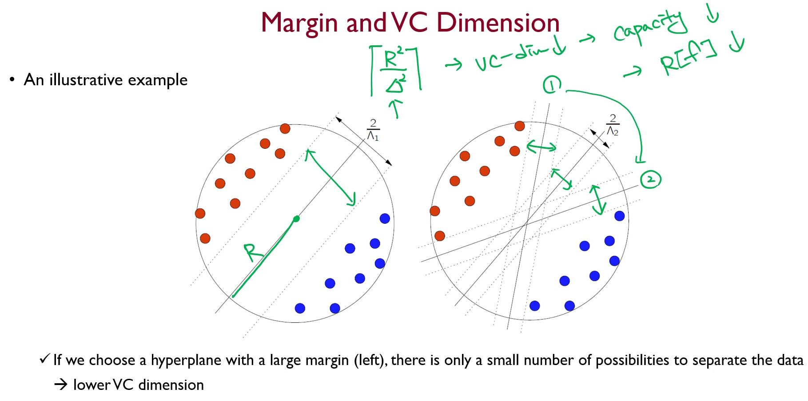

## Support Vector Machine : Cases
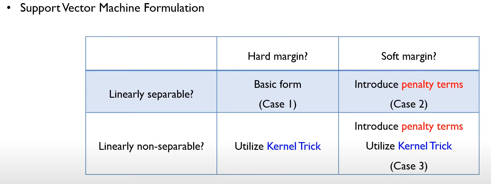

### Linear Separable & Hard Margin
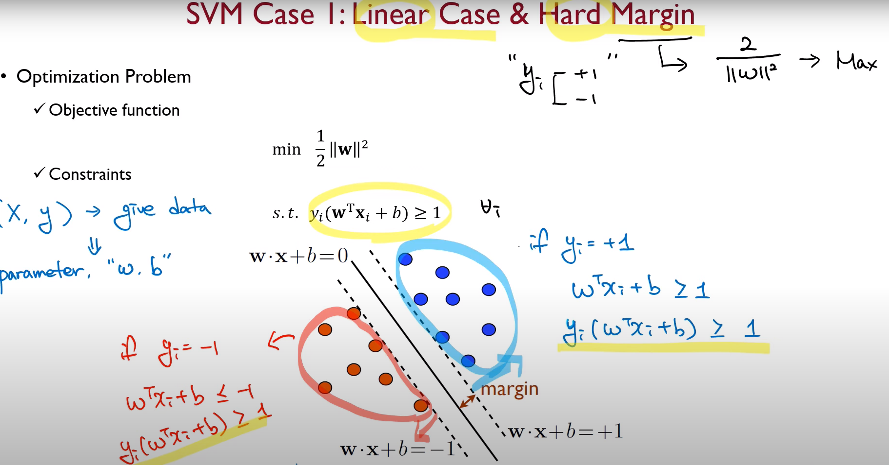

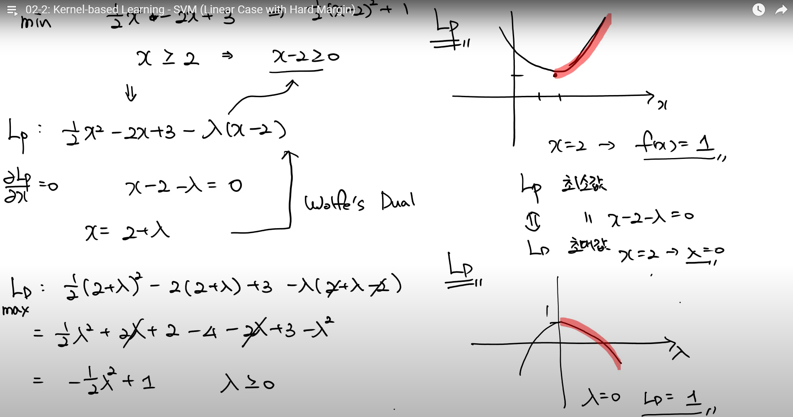

어떤 $L_p$를 최소화하는 문제는 라그랑지안 기법을 이용해서 어떤 $L_D$를 최대화하는 문제로 변형해서 풀 수 있다. 위의 그림에서는 $L_p$를 구하는 것이 그리 어렵지 않지만, 다른 경우들에선 $L_D$를 푸는 것이 훨씬 쉬운 경우가 많고 SVM이 그러한 케이스이다.
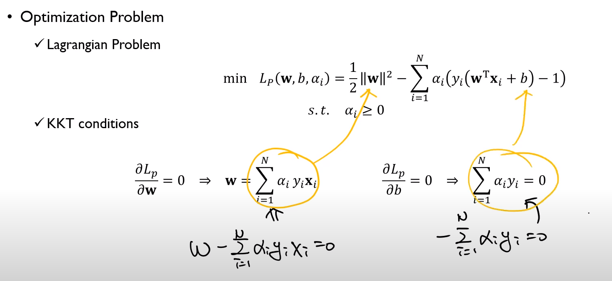
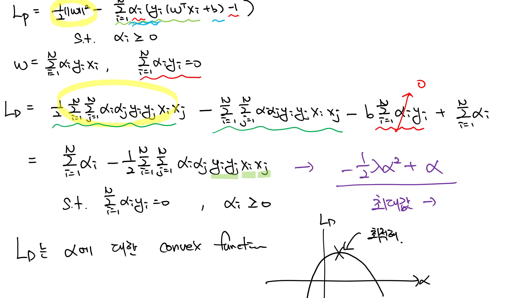

* From KKT condition, we know that 
$$
\alpha_i\left( y_i\left( \mathbf{w}^T\mathbf{x}_i+b \right) -1 \right) =0
$$
* Thus, the only support vectors have $\alpha_i \neq 0$
* The solution has the form 
$$
\mathbf{w}=\sum_{i=1}^{N}\alpha_i y_i \mathbf{x}_i = \sum_{i\in SV}^{N}\alpha_i y_i \mathbf{x}_i
$$
* b can be computed by $y_i\left( \mathbf{w}^T\mathbf{x}_i+b \right) -1 =0$ with a support vector $\mathbf{x}_i$

* $y_i\left( \mathbf{w}^T\mathbf{x}_i+b \right) -1$ 이 값이 $0$이라는 것은 Margin 위에 있는 데이터라는 뜻이다. 그래서 얘들을 Support Vector라고 부른다. 이런 서포트 벡터들은 $\alpha_i$들은 $0$이 아니다. $\alpha_i=0$인 것들은, 이것들을 곱해봤자 거기에 대응하는 $y_i,\mathbf{x}_i$들이 $\mathbf{w}$를 결정하는데에 아무런 영향을 미치지 못한다. 그것은 $\alpha_i\neq0$만 가지고 계산해도 충분하다는 것이다.

### Compute Margin
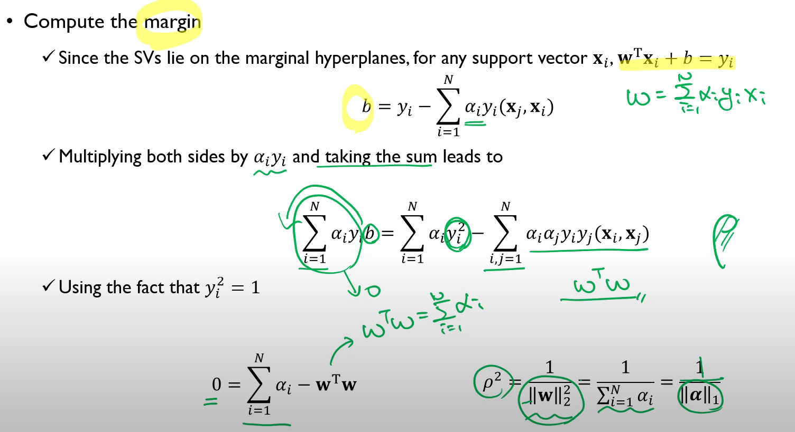
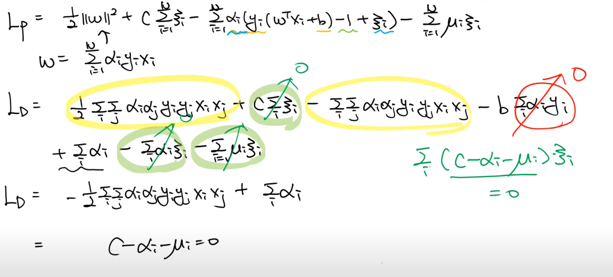
* 즉, Hard Margin의 경우나 Soft Margin인 경우나 듀얼 상태의 목적함수 $L_D$는 동일하다. 다만 제약조건만 $0\leq\alpha_i\leq C$가 추가되었을 뿐이다.