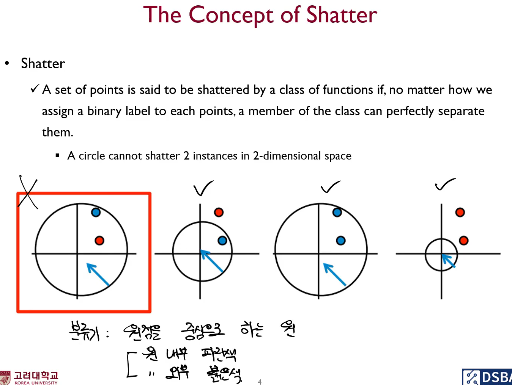
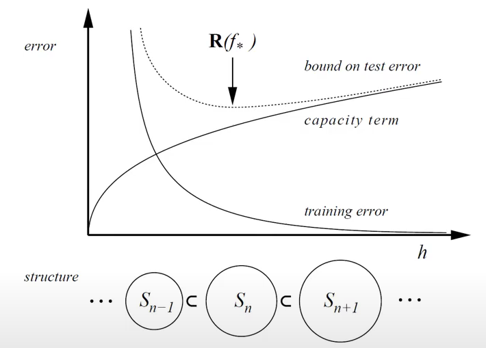
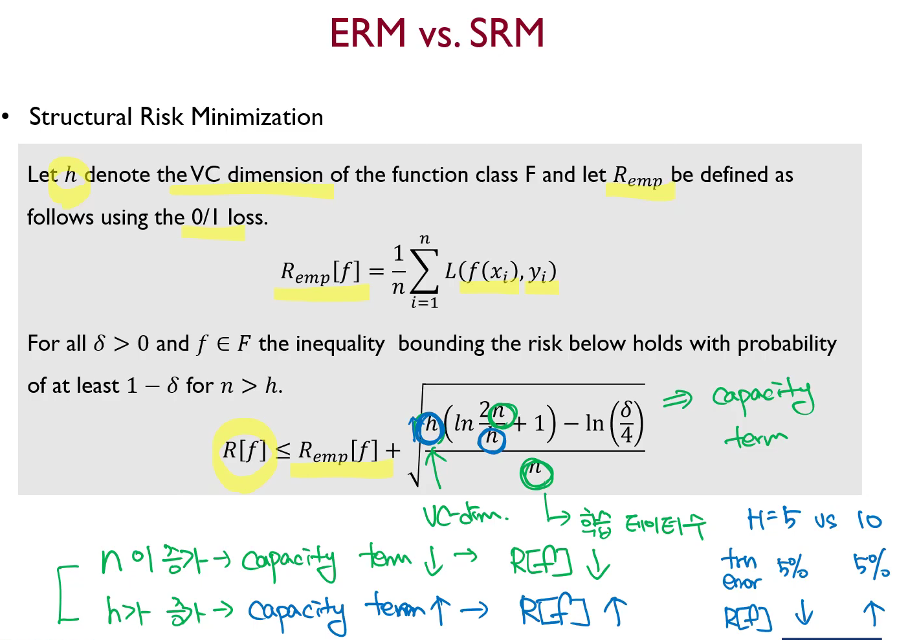
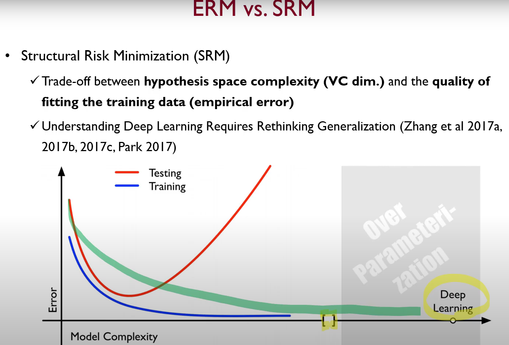

# Shatter
-   A set of points is said to be shattered by a class of functions if, no matter how we assign a binary label to each point, a member of the class can perfectly separate them.
    -   A linear classifier can shatter $(n+1)$ instances in n-dimensional space
-   함수 $F$는 $n$개의 points를 Shatter할 수 있다. -> 함수 $F$에 의해 $n$개의 point는 임의의 $+1$ 또는 $-1$을 Target value로 하는 분류 경계면의 생성이 가능하다.  *""*
-  그러나 $2$차원 상에서 점 $4$개를 shatter할 수 있는가? 불가능하다. $2^4=16$가지인데, $14$가지는 shatter 가능하나, $2$가지 케이스를 구분할 수 없다. (XOR 문제)
-  분류기를, 원점을 중심으로 하는 원이라고 정의해서, 원 내부를 파란색, 원 외부를 붉은 색으로 분류를 한다고 가정한다면 $2$차원에서 점 $2$개도 분류하지 못하는 경우도 있을 수 있다.
-  
# Vapnik-Chervonekis (VC) Dimension
* VC dimension
  * Measures the capacitry of a hypothesis space 
  * VC dimension은 분류기의 복잡도(역량)을 측정하는 지표이다.
  * Capacity is a measure of complexity and measures the expressive power, richness or flexibility of a set of functions by assessing how wiggly its members can be
  * The maximum number of points that can be shattered by H is called VC dimension
  * Input, Output 고정되어 있고 Hidden Layer 1개 짜리일 때, Hidden node의 개수가 많을수록 complexity, capacity가 높다, VC dimension이 높다고 이해하고 있으면 된다.
    * 2차원 상에서 직선 분류기는 $1,2,3$개의 점을 Shatter 가능하다. 즉 $n$차원에서의 직선 분류기의 VC dimension은 $n+1$인 것이다.

# ERM vs. SRM
## Structural Risk Minimization (SRM) - 구조적 위험 최소화 모형 

* **Empricial Risk Minimization (ERM) - 경험적 위험 최소화 모형**
* 구조적 위험이라는 것은, 내가 가지고 있는 학습용 데이터를 얼마나 잘 맞추느냐에 반비례하지만, 내가 가지고 있는 방법론의 Capacity에는 비례할 것이다. 다시 말하면, Flexibility가 높을수록 임의의 경계면, 노이즈를 외워버릴 수 있는 능력이 생김으로써 일반화 성능이 떨어질 수 있다. 따라서 $\mathbf{R}(f_*)$ 정도의 복잡도를 가지는 모델이 가장 좋은 모델이 아니겠느냐.
* h가 VC-dim을 의미한다. 
* An inductive principle for model selection used for learning from finite training data 
* Describe a general model of capacity control and provieds a trade-off between hypothesis space complexity (VC dim.) and the quality of fitting the training data (empirical error) 
* 이렇게 금과옥조처럼 믿고 공부를 해왔는데, 여러분이 잘 알고 있는 GPT3도 나오는데 이것들은 SRM의 관점에서는 Model Complexity가 아주 높은 모델입니다. 데이터의 수보다도 모델의 파라미터 수가 높으면, 앞선 그림에 의하면 Test Error는 굉장히 높아져야 하는데 의외로 현실 상황에 맞춰보면 적당히 Overfftting을 컨트롤 해주는 작업을 해주면 현실세계에서 일도 잘 해주더라. 여러 이슈와 태스크에 대해 best practice가 나오고 SVM 또는 Kernel Machine 등의 수준들을 뛰어 넘게 되었다. 
* 딥러닝이 모든 상황에서 만능은 아니다. 여전히 전통적인 방식의 머신러닝 방식이 잘 맞는 분야가 있습니다. 
* 통계학에서 금과옥조처럼 여기는 것은 최소 데이터의 개수가 특성의 개수보다는 커야된다. 그래야 singularity가 발생하지 않는다.
* 그러나 최근의 ChatGPT 같은 것들은 Test Error가 더 적더라.
* 설명력을 증명하는 것이 또 과제이다. (2021년 기준)