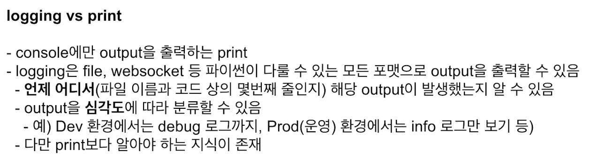

## 데이터의 종류
* 데이터베이스 데이터 (서비스 로그, Database에 저장)
  * 서비스가 운영되기 위해 필요한 데이터
  * 예) 고객이 언제 가입했는지, 어떤 물건을 구입했는지 등
* 사용자 행동 데이터 (유저 행동 로그, 주로 Object Storage, 데이터 웨어하우스에 저장)
  * 유저 로그라고 지칭하면 사용자 행동 데이터를 의미
  * 서비스에 반드시 필요한 내용은 아니고, 더 좋은 제품을 만들기 위해 또는 데이터 분석시 필요한 데이터
  * 앱이나 웹에서 유저가 어떤 행동을 하는지를 나타내는 데이터
  * UX와 관련해서, 인터랙션이 이루어지는 관점에서 발생하는 데이터
    * 예) Click, View, 스와이프 등
* 인프라 데이터 (Metric)
  * 백엔드 웹 서버가 제대로 동작하고 있는지 확인하는 데이터
  * Request 수, Response 수
  * DB 부하 등 

--- 
### 데이터의 종류 (조금 더 자세히)
* Metric
  * 값을 측정할 때 사용
  * CPU, Memory 등
* Log
  * 운영 관점에서 알아야 하는 데이터를 남길 때 사용
  * 함수가 호출되었다. 예외 처리가 되었다 등
* Trace
  * 개발 관점에서 알아야 하는 것
  * 예외 Trace
---
## 저장된 데이터 활용 방식
데이터가 저장되어 있지 않다면
* 과거에 어떤 예측을 했는지 알 수 없음
* print 문의 로그를 저장한 곳을 찾아서 확인해야 함 (Linux 서버에 접속하거나)
* 모델이 더 발전하기 위한 개선점을 찾기 어려움
* 현재 시스템이 잘 동작하고 있는지 알기 어려움

---
## 데이터 적재 방식
* Database(RDB)에 저장하는 방식
  * 다시 웹, 앱서비에서 사용되는 경우 활용
  * 실제 서비스용 Database
* Database (NoSQL)에 저장하는 방식
  * Elasticsearch, Logstash or Fluent, Kibana에서 활용하려는 경우
* Object Storage에 저장하는 방식
  * S3, Cloud Storage에 파일 형태로 저장
  * csv, parquet, json 등
  * 별도로 Database나 DataWarehouse로 옮기는 작업이 필요
* Data Warehouse에 저장하는 방식
  * 데이터 분석히 활용하는 데이터 웨어하우스로 바로 저장

---
### 데이터 적재 방식 - RDBMS
* 관계형 데이터베이스 (Relational Database)
* 행과 열로 구성
* 데이터의 관계를 정의하고, 데이터 모델링 진행
* 비즈니스와 연관된 중요한 정보
  * 예: 고객정보, 주문요청
* 영구적으로 저장해야 하는 것은 데이터베이스에 저장
* 데이터추출시 SQL 사용
* MySQL, PostgreSQL 등

### 데이터 적재 방식 - NoSQL
* 스키마가 Strict한 RDBMS와 다르게 스키마가 없거나 느슨한 스키마만 적용
* Not Onl SQL
* 데이터가 많아지며 RDBMS로 트래픽을 감당하기 어려워서 개발됨
* 일반적으로 RDBMS로 트래픽을 감당하기 어려워서 개발됨
* 일반적으로 RDBMS에 비해 쓰기와 읽기 성능이 빠름
* Key Value Store, Document, Column Family, Graph 등
* JSON 형태와 비슷하며 XML 등도 활용됨 
* MongoDB

### 데이터 적재 방식 - Object Storage
* 어떤 형태의 파일이여도 저장할 수 있는 저장소
* AWS S3, GCP Cloud Storage 등
* 특정 시스템에서 발생하는 로그를 xxx.log에 저장한 후, Object Storage에 저장하는 형태
* 비즈니스에서 사용되지 않는 분석을 위한 데이터
* 이미지, 음성 등을 저장

### 데이터 적재 방식 - Data Warehouse
* 여러 공간에 저장된 데이터를 한 곳에 저장
* 데이터 창고
* RDBMS, NoSQL, Object Storage 등에 저장된 데이터를 한 곳으로 옮겨서 처리
* RDBMS와 같은 SQL을 사용하지만 성능이 더 좋은 편
* AWS Redshift, GcP BgQuery, SNowflake 등

# Logging in Python 
* 파이썬 기본 모듈 : logging 
*  

## Python Logging Component
* Loggers
  * 로그를 생성하는 메소드를 제공 (`logger.info()` 등)
  * 로그 레벨과 Logger에 적용된 Filter를 기반으로 처리해야 하는 로그인지 판단
  * Handler에게 LogRecord 인스턴스 전달
* logging.getLogger(name)으로 Logger Object 사용
  * name이 주어지면 해당 name의 logger 사용, 없으면 root logger 사용
  * 마침표로 구분되는 계층 구조
    * logging.getLogger('foo.bar') -> logging.getLogger('foo')의 자식 Logger 반환
  * logging.setLevel(): Logger에서 사용할 Level 지정
* Handlers
  * Logger에서 만들어진 로그를 적절한 위치로 전송 (파일 저장 또는 Console 출력 등)
  * Level과 Formatter를 각각 설정해서 필터링 할 수 있음
  * StreamHandler, FileHandler, HTTPHandler 등 
* Filters
* Formatters
  * 최종적으로 Log에 출력될 Formatting 설정
  * 시간, Logger 이름, 심각도, Output, 함수 이름, Line 정보, 메세지 등 다양한 정보 제공