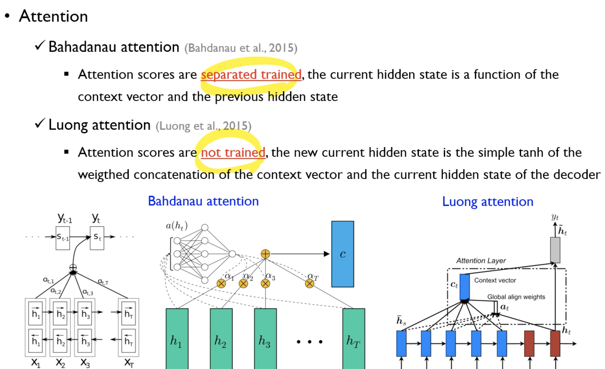
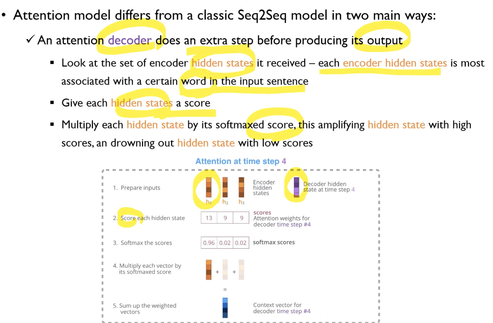

# Attention 등장 배경
* Seq2Seq는 결국은 RNN(LSTM)의 마지막 셀의 hidden state를 context로 받기 때문에 해당 context가 모든 정보를 적절히 담고 있지 않다면 성능이 좋지 않다.
* 그런 맥락에서 input data의 어순을 뒤집는 것이 도움이 됐을 수도 있던 것이다.
* 그래서 Attention이라는 개념이 등장했다.

## Attention의 종류 

## Attention 동작 방법
* 마지막 Cell의 h_last만 디코더로 넘겨주는 것이 아니라 시퀀스 전체의 h_t 를 넘겨준다.
* input의 sequence가 20개라면 $h_0, \cdots h_{20}$ 중에서 기존에는 $h_{20}$만 사용했겠지만, 이제는 $h_1, h_2, \cdots h_{20}$ 각각과, 디코더에서 나온 $h_1$을 내적해서, 해당 내적값을 가중치로 이용하여 encoder 부분의 $h_1,h_2,\cdots h_{20}$을 곱해서 더해서 하나의 벡터로 만들고, 이 벡터와 디코더에서 나온 $h_1$을 concat해서 fc layer에 태워서 최종 output 단어를 만들고, 이 단어를  다음 input으로 사용한다. 학습시킬때는 그럴 필요가 없을지도?
* 
* 

# 질문
1. 인코더와 디코더의 가중치가 별개였던 것 같은데?

# Reference
https://www.youtube.com/watch?v=4DzKM0vgG1Y&t=3287s