# Bert (Bidirectional Encoder Representations from Transformer)
* Bert
  * Designed to pre-train deep bidirectional representations from unlabeled text by jointly conditioning on both left and right context in all layers 
    * Masked Language Model (MLM) : bidirectional pre-training for language presentations 
      * Elmo같은 경우는 Forward와 backward를 따로 학습해서 해당하는 representation을 결합했었고, 반면 GPT 같은 경우는 transformer의 decoder부분, 다시 말하면 앞쪽에서부터 나오면서 뒤쪽에 해당하는 단어들, 우리가 보고자 하는 단어들의 후반부에 있는 단어들을 마스킹해놓고 학습을 하는 반면에 BERT는 특정한 단어의 representation 학습하기 위해서 해당하는 단어의 좌측과 우측을 전부 다 사용을 하겠다. 단, 여기에 대해서 일정 부분에 대해서 masking을 해놓고 사용하겠다.
    * Next Sentence Prediction (NSP)
      * 특정한 두 쌍의 문장이 들어왔을 때 해당하는 다음 문장이 바로 실질적으로 등장하는 문장인지 아닌지 학습하는 부분.
  * Bert는 순차적으로 Language Model을 사용하는 게 아니라, 마스킹을 해놓고 그것들을 예측하는 모델을 만드는 것이다. 
  * pre-train을 한 다음에 그 다음 단계에서, pre-trained model을 가져다가 bert의 윗단에 하나의 단순한 layer를 쌓아서 bert가 처음 소개되었던 시점의 SOTA 모델들을 앞지를 수 있는 만큼의 우수한 성능을 나타냈다.
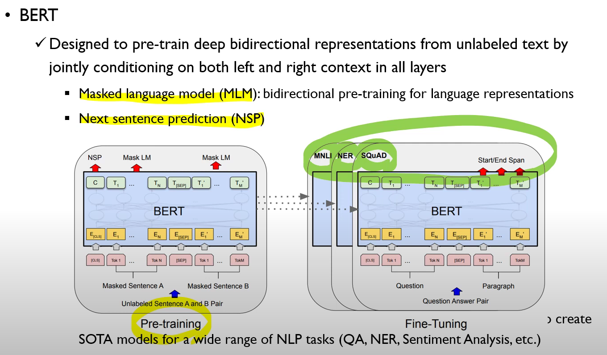

## BERT : Model Architecture 
* Multi-layer bidirectional Transformer econder
  * L : Number of Layers (transformer block)
  * H : hidden size 
  * A : number of self attention heads 
* $BERT_{BASE}$
  * $L=12, H=768, A=12$
  * Total parameters : 110M
  * Same model size as OpenAI GPT 
* $BERT_{LARGE}$
  * $L=24, H=1024, A=16$
  * Total parameters : 340M

## BERT : Input/Output Representations
* To Make BERT handle a variety of down-stream tasks, the input representation is able to unambiguously represent both a single sentence and a apair of sentences (ex:Question-Answer)
  * Sentence : an arbitrary span of contiguous text, rather than an actual linguistic sentence
  * Sequence : the input token sequences to BERT, which may be **a single sentence** or **two sentences packed together**
  * BERT가 여러 가지 다양한 down-stream의 task를 handling 하기 위해서, representation이 유연하게 구성될 필요가 있다. 예를 들어 하나의 sentence만을 받을 수 있고, 질문과 대답의 쌍을 받을 수도 있다.
  * BERT에서 사용되는 sentence와 sequence는, 언어학적으로 가지고 있는 개념과 다르다.
  * 우리가 알고 있는 언어학적 문장은, 주어부터 시작해서 동사 어쩌고 저쩌고 해서 완벽한 의미를 가지는 문장으로 끝나야 하는데, BERT에서 정의하는 문장은 어떤 연속적인 text의 span이라고 보는 것이다.
  * Sequence는 BERT에 들어가는 시퀀스를 의미하는데, 앞서 정의한 single sentence일 수도 있고, 두 개의 sentence가 결합된 것일 수도 있다. 
  * 우리는 두 개의 문장을 입력으로 받는데, Masked sentence를 입력으로 받는다.
    * 문장이 가지고 있는 각각의 Token이 있다. 일정 비율로 실제 토큰이 아니라, 마스킹이 된 것을 입력으로 집어 넣겠다는 의미이다.
    * Unlabeled sentence란 얘기는 무슨 얘기냐면, 문장에 대한 지도 학습이 아니라는 뜻이다. 우리가 가지고 있는 corpus에 의해서 연속적인 두 개의 문장을 sequence로 넣겠다.
  * 몇 가지 special token이 있는데요, CLS라는 The first token of everㅛ sequence이다.
  * SEP : Special token separating two sentences 
  * The final hidden vector of special [CLS] token - 나중에는 단순한 어떤 문장 또는 시퀀스의 감성분류라든지, next sentence prediction 혹은 similarity 같은 단순한 binary classifcation을 할 때는 CLS의 hidden vector만 사용하게 될 가능성이 높다.
  * 두 개의 sentence가 실제로 corpus에서 바로 다음 문장인지 아닌지를 판별을 하는 0/1의 binary classfication task를 수행하는 NSP가 있고, 앞에서 마스킹 된 토큰을 실제로 예측하는 Mask LM을 동시에 학습시키는 것이 BERT의 목적이 되겠습니다.
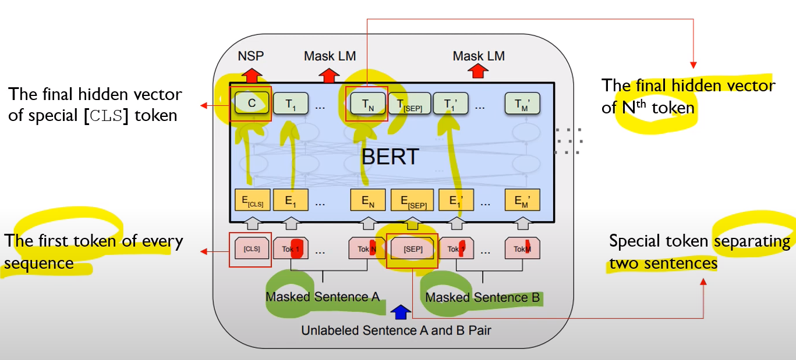

### Input Representation은 세 개의 벡터의 합
* Input representation is the sum of
  * (1) Token embedding : WordPiece embeddings with a 30,000 token vocabulary
  * (2) Segment embedding : my dog is cute [SEP] he likes play ##ing 이라는 문장을 봤을 때, 앞단과 뒷단을 구분해주는 것 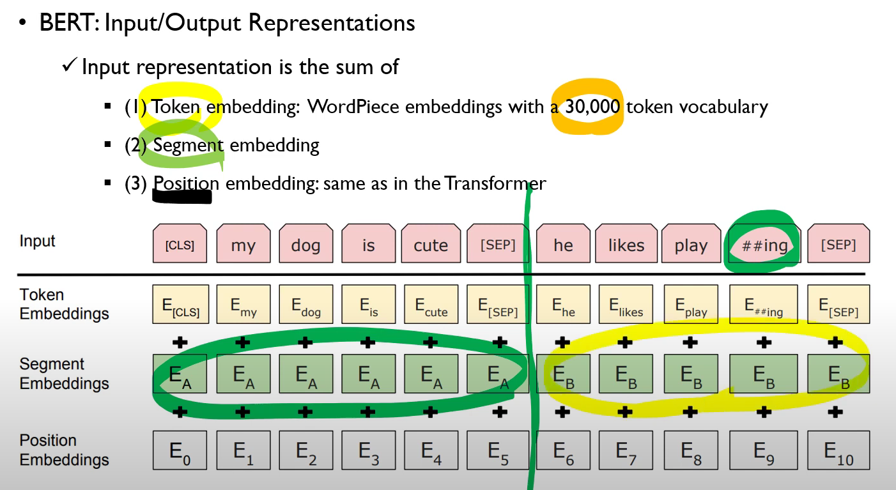 sequence가 두 개 들어갔을 때, 첫 번째 시퀀스에 해당하는 것이냐, 두 번쨰 시퀀스에 들어가는 것이냐를 구분해주는 embeddings
  * (3) Position embedding : same as in the Transformer

# Pre-training BERT 
* Task1 : Masked Language Model (MLM)
  * 15% of each sequence are replaced with a [MASK] token 
  * Predict the masked words rather than reconstructing the entire input in denoising encoder 
  * MASK를 걸어준 다음, encoder를 거친 다음에, $O_4$를 FC Layer에 넣어준 뒤 $w'_4=w_4$가 되도록 하는 것..?
  * ELMO같은 경우에는 언어 모델을 쓰긴 쓰지만 bidirection을 썼기 때문에, 정방향의 모델과 역방향의 모델을 따로따로 학습을 해서 특정한 토큰이 있으면 해당하는 토큰의 representation을 선형결합하려고 했었다.
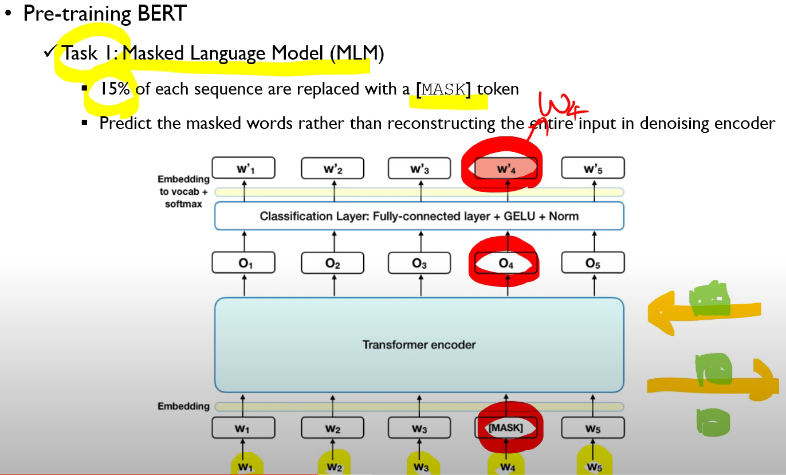
* 그러나 BERT의 Original 논문에서 언급하고 있는, MLM의 문제가 있다.
  * (Caution!) A mismatch occurs between pre-training and fine-tuning, since the [MASK] token does not appear during fine-tuning 
  * (Solution) If the i-th token is chosen to be masked, it is replaced by the [MASK] token 80% of the time, a random token 10% of the time, and unchanged 10% of the time
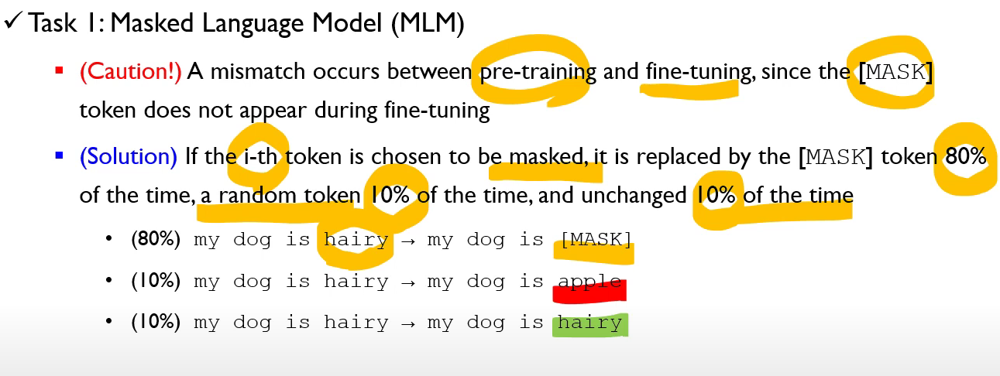
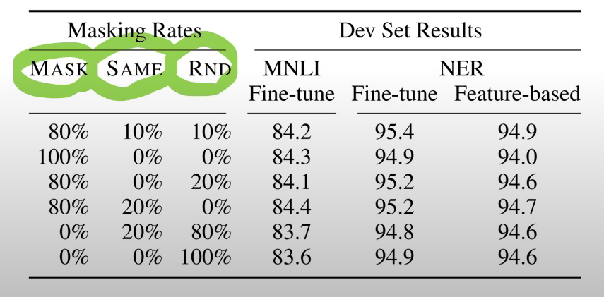
* Task2 : Next Sentence Prediction (NSP)
  * Many important downstream tasks such as QA(Question Answering) and NLI (Natural Language Inference) 같은 경우는 기본적으로 두 개 이상의 문장들에 대한 관계를 이해 해야지만이 풀어낼 수 있는 것인데, 문장 단위의 언어 모델링 같은 경우는, 이 관계를 잘 이해할 수 없다는 것이 저자들의 지적이다.
  * GPT-2 혹은 ELMO들은 문장 단위로 했지, pair를 시켜서 한 적은 없었다.
  * 두 개 이상의 문장을 결헙해야 하는 TASK를 만족시키기 위해서 binarized next sentence 모델을 제시한다. 
    * 50%는 실제로 다음에 오는 문장 (IsNext)를 사용하고
    * 50%는 랜덤한 문장 (NonNext)를 학습한다.
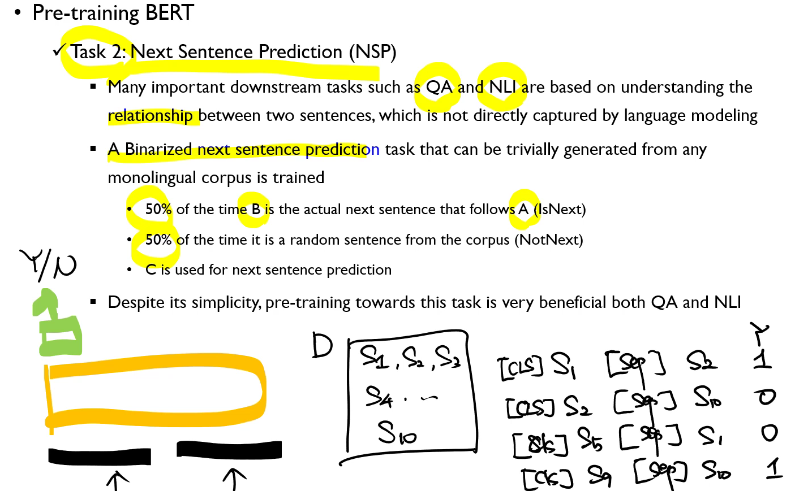
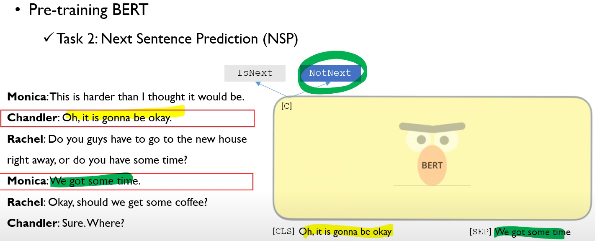
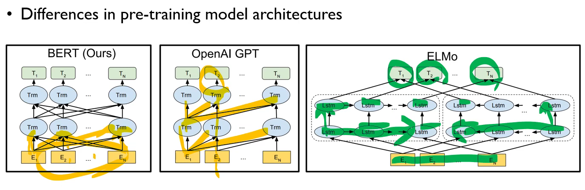 

## Fine-tuning BERT
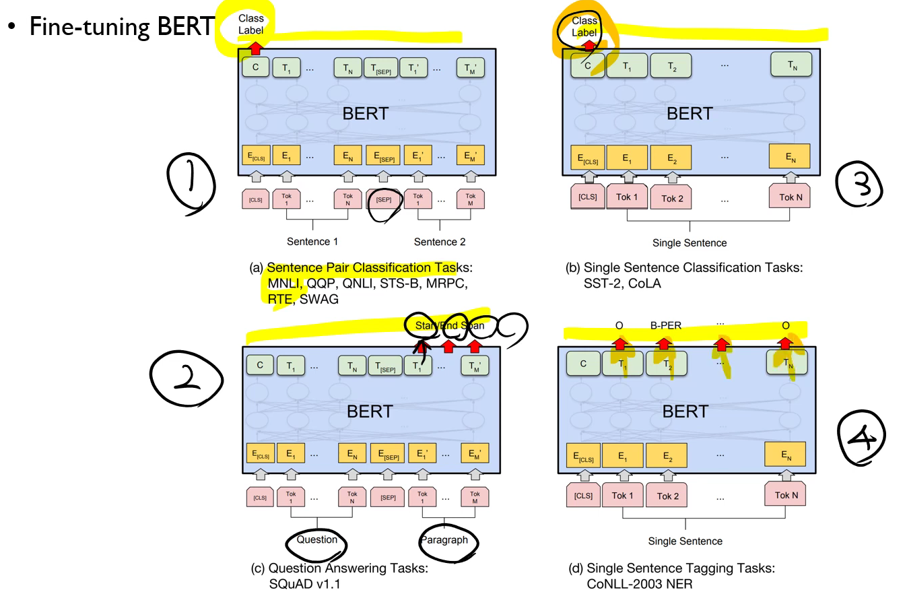
* 다양한 구조에 대해서 Pre-trained를 시킨 다음에 Fine-tuning을 시킬 수 있다. 하나의 Layer만 쌓는 것만으로도 충분히 구현 가능하다.

## Post BERT
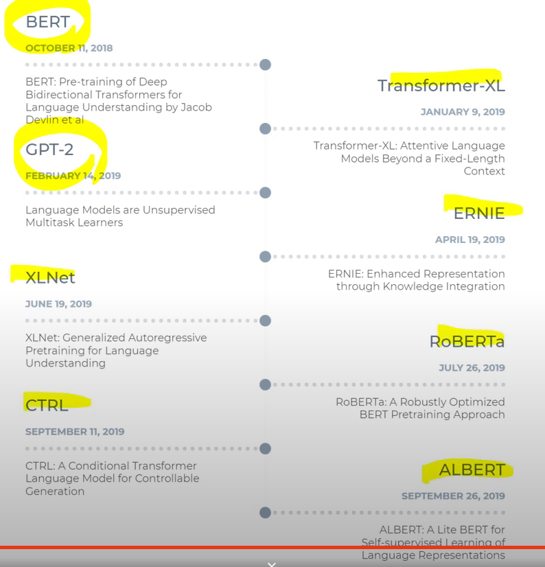