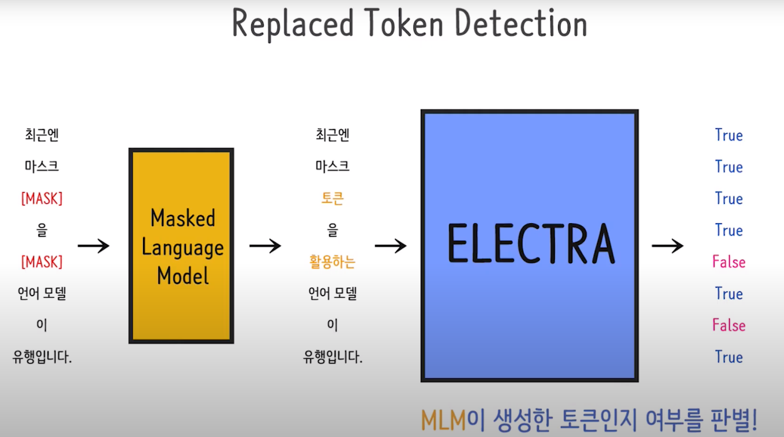
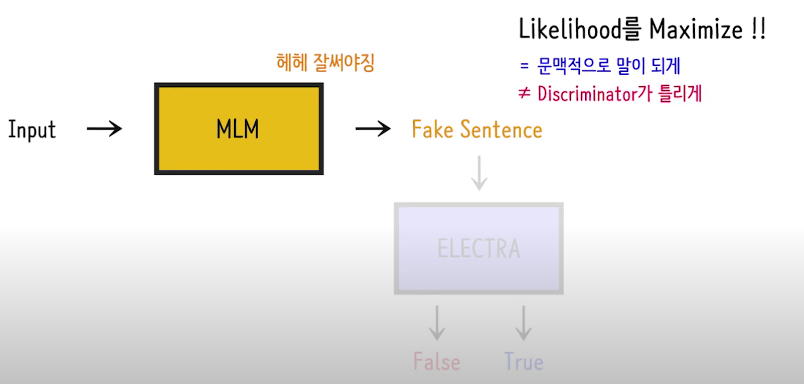
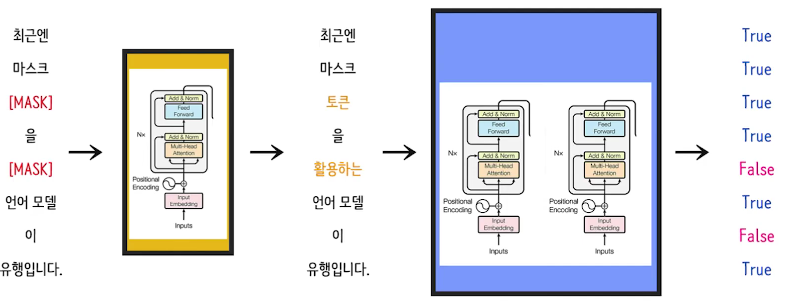
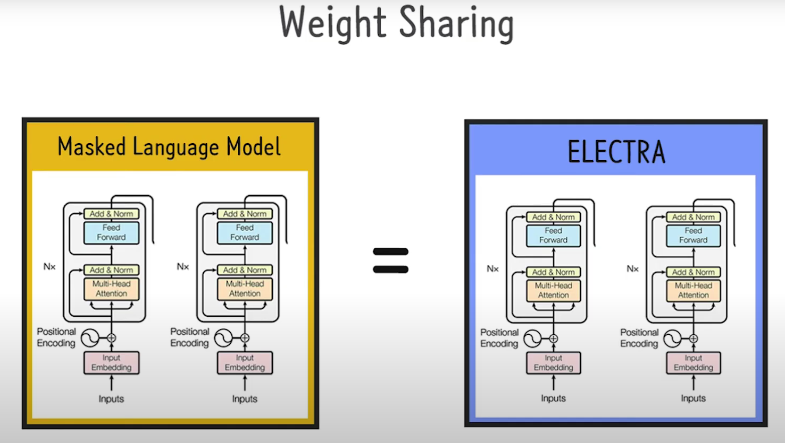
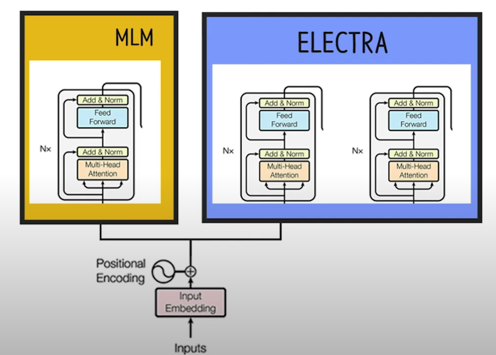

## BERT 모델의 단점
* 일반적으로 하나의 문장에서 학습은 15%만 이루어진다.
* 즉, 100 중에서 15를 MASKING한 뒤 15%에 대한 loss를 구하면서 학습을 진행하기 때문에 학습이 15%만 이뤄지고 그렇기 때문에 방대한 학습 데이터셋이 필요한 것이 아니냐? 그래서 나온 모델 중 하나가 ELECTRA 모델이다. 
* MLM (Masked Language Model)이 만들어 낸 문장의 각 토큰들이 원본 문장에 있는 단어(토큰)인지, 만들어낸 단어인지 아닌지 파악해야한다. 모든 토큰을 다 살펴야하고, 각 토큰을 볼때마다 주변 문맥을 봐야하기 때문에, MLM이 학습하듯이 문맥을 학습하게 되고, 이진분류가 별거 아닌 것처럼 보여도, 모든 토큰에 대해서 이진분류를 해야 하기 때문에 모든 토큰에 대해 loss를 다 구해야해서 모든 토큰을 학습하는 효과가 있다.

## ELECTRA는 GAN과 유사한 점이 있을까?
* 적대적 학습을 유발하니까?
* 하지만 동일한 개념으로 볼 수는 없다. 
* ELECTRA가 Fake를 보고 True라고 했을 때, MLM이 받는 Reward가 있어야하는데, 훈련 방식을 보면 문맥적으로 말이 되도록 만들고만 싶어하기 때문에 (Likelihood를 Maximize 할 뿐), GAN이랑 같은 개념이라고 볼 수는 없다. 

## ELECTRA 구조

* Generator가 ELECTRA보다 작았을 때 좋은 성능을 내더라
* 
* ELECTRA에선 Weight Sharing이 의미가 별로 없더라. 
* 