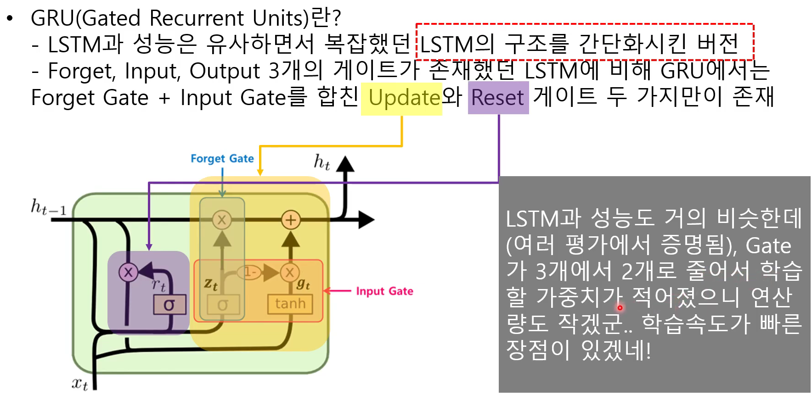
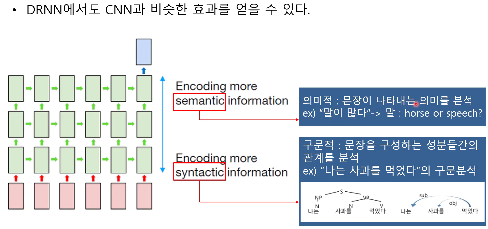
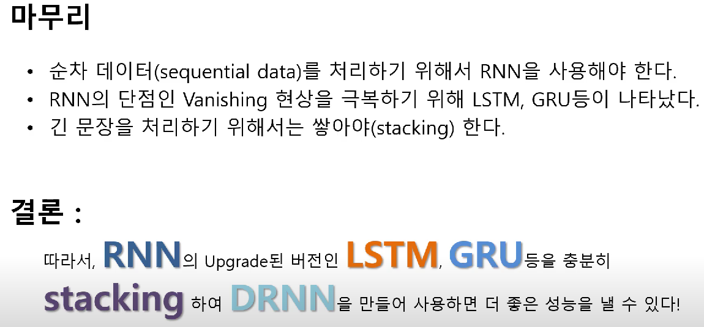

# GRU (Gated Recurrent Units)
* LSTM과 성능은 유사하면서 복잡했던 LSTM의 구조를 간단화시킨 버전
* Forget, Input, Output 3개의 게이트가 존재했던 LSTM에 비해 GRU에서는 Forget Gate + Input Gate를 합친 Update와 Reset 게이트 두 가지만이 존재한다.

# DRNN (Deep Recurrent Neural Networks)
* Stacked RNN
* Multi layered RNN 
* DRNN이 해결하고자 하는 문제는, Really long sentence?
* 충분히 wide하거나 deep하지 않는다면 긴 문장을 제대로 예측하지 못함.
* 여러 레이어를 쌓는게 왜 좋은거지?
* 

