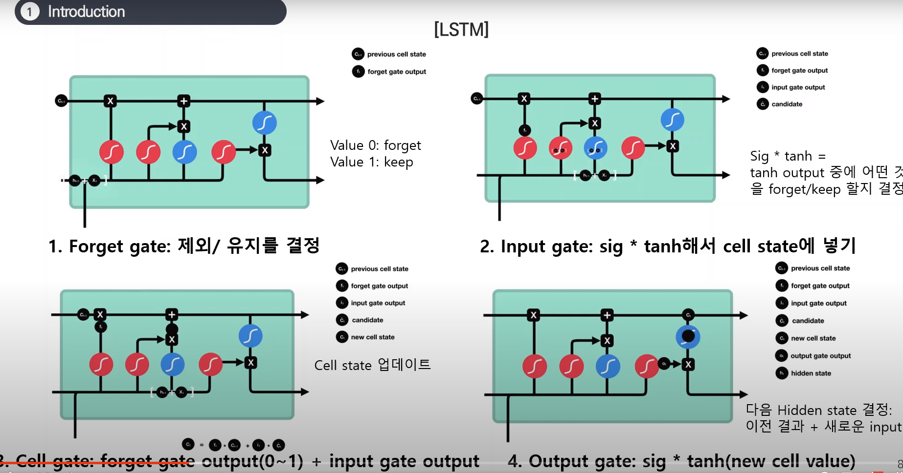
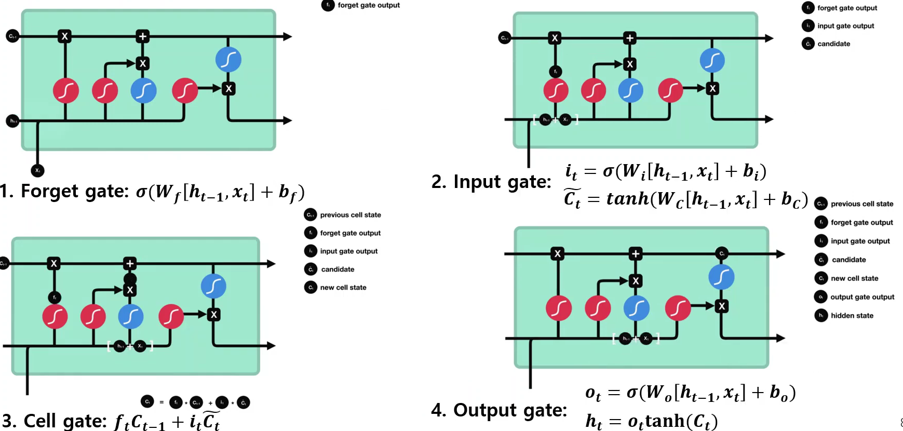
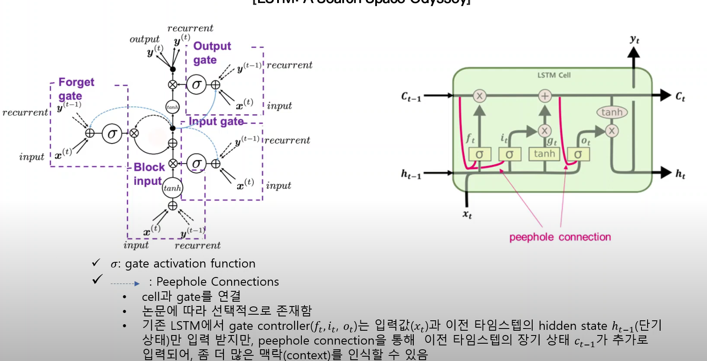
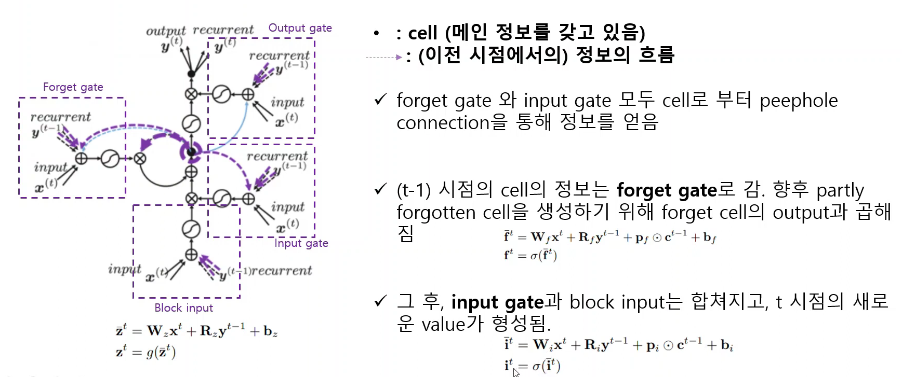
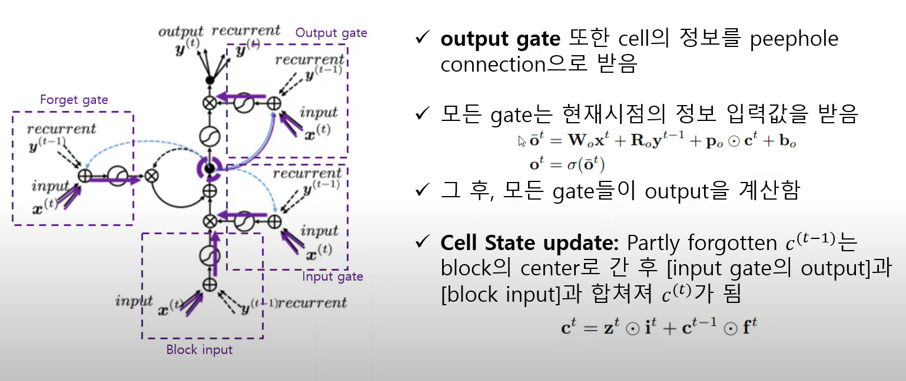
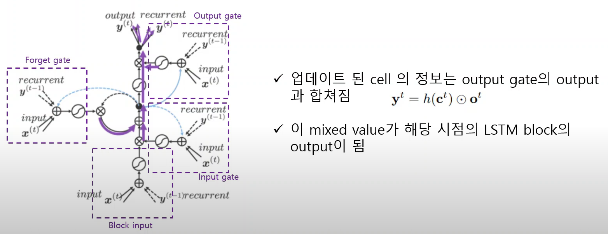

## 시계열 데이터를 다루는 다양한 방법들
* Data Approach
  * DTW (Dynamic Time Warping)
  * FFT
  * Time-Lag Feature 
* 요즘에는 Data Approach가 잘 안쓰인다.
* Model Approach
  * Stochastic : HMM (Hidden Markov Model)
  * Statistics : ARIMA 
  * ** Deep Learning**
    * **Vanilla RNN, LSTM, GRU, 1D-CNN, Transformer, TCN, Neural ODE, LTFS-Linear**

## Vanila RNN

### RNN 구조의 단점
* 문제의 현상 : 긴 time step에 대해서 학습이 이루어지지 않음 (보통 time-step이 10 이상이면 성능 저하)
* 문제의 원인 : Vanishing Gradient and Exploding Gradient -> BPTT 활용으로 인해 나타남 
* 

### 해결방법 Long Short-Term-Memory 
* 하나의 유닛에서 계산된 정보를 길게 전파하는 Memory 구조를 제안
* 기존의 RNN Unit보다 Vanishing/Exploding Gradient를 막으며, 긴 Time Step을 학습 가능하게 함

1. 장기기억 Cell 구조 도입
   1. 장기기억 Cell인 CEC (Constant Error Carousel)을 도입하여 Vanishing Gradient를 막음
   2. Identity Mapping으로 어떠한 Matrix의 변환 없이 정보를 다음 Time Step으로 전달함 (**+연산만 존재하여 Backprop시 정보 손실 없음**)
   3. BPTT로 인한 Vanishing Gradient 현상이 없어지고, 더 깊은 Network 학습이 가능해짐. -> 더 긴 Time 학습 가능
   
2. Gate 구조의 도입
   1. Gate를 사용하여 학습 기반으로, 자동으로 Input, Output 값에 대한 제어 (Original LSTM에는 Forget Gate가 없음)
   2. 
   3. **InputGate**
      1. $i_t=\sigma\left( W_i \cdot [h_{t-1},x_t]+b_i \right)$
      2. $S_t=squash\left( W_c \cdot [h_{t-1},x_t] +b_S \right)$
      3. $squash=\dfrac{4}{1+e^{-z}}-2=2\tanh\left( \dfrac{z}{2} \right)$, $\sigma=\dfrac{1}{1+e^{-s}}$
   4. Cell State에서 다음 외부 Output이 될 h_t를 결정함. 현재 정보와 바로 직전 정보로 sigmoid 사용해 비율 자동 결정함
   5. **OutputGate**
      1. $O_t=\sigma\left( W_o \cdot [h_{t-1}, x_t]+b \right)$
      2. $h_t = O_t \times squash\left( C_t \right)$
      3. 

3. Training Method 개선
   1. BPTT (Back Propagation Through Time)과 RTRL (Real-Time Recurrent Learning)의 Variation을 동시에 학습에 사용함.
      1. **BPTT** : 속도가 빠르며 $O\left( n^2 \right)$, 일반적으로 많이 사용하지만 Backward 연산이 따로 필요하며, Vanishing Gradient가 잘 나타남 
      2. RTRL : 속도는 느리나 ($O\left( n^4 \right)$), BPTT보다는 좀 더 Vanishing Gradient에 강하고, Forward 연산시 미분하여 Weight를 업데이트하므로 따로 Training Phase가 필요 없음. 메모리 사용량이 적고 실시간학습에 적합 
      3. 

## Methodology
* 장기기억 Cell 구조 도입
  * Influenced : ResNet에서의 Identity Mapping에서 해당 아이디어를 참조함. (Highway Network 한 번 거쳐서) 
  * Gate 구조의 도입 (1/3)
    * Influenced : Highway Network(2015)의 Transform Gate (T)와 Carry Gate(C) 구조로 데이터를 얼마나 변환해서 보내줄 지 결정함
  * Gate 구조의 도입 (2/3)
    * 단점 존재 : Cell state가 1.0 Weight(Identity)만 주다 보니, Depth가 깊어질수록 오히려 Exploding Gradient 가 된다.
    * 해결책으로 저자들은 후속논문으로 Forget Gate를 추가하였다. (입력값 $h_{t-1}$과 $x_t$에 따라 $C_{t-1}$의 값의 양을 조절함)
    * Forget gate 
      * $f_t = \sigma\left( W_f \cdot[h_{t-1}, x_t] +b \right)$
  * Gate 구조의 도입 (3/3)
    * Original LSTM은 squash 함수를 $2\tanh\left( \dfrac{x}{2} \right)$와 같이 선택했는데, 왜 그런 선택을 했을까?
    * 시그모이드는 미분했을 때 최대 0.25이므로 vanishing이 더 심해짐
    * tanh는 미분 최대값이 1.0이기에 gradient vanishing에 더 안정적임
    * Original LSTM은 tanh을 미분했을 때 더 wide하여, 상대적으로 tanh보다 안정적이라 예상
    * 그러나 그냥 tanh이 아니라 $2\tanh\left( \dfrac{x}{2} \right)$ forward prop시 Cell을 더 Exploding하게 만들 것이라 예상
    * relu는 특별한 조치를 취하지 않는 한, 너무 큰 값으로 exploding됨.

# Conclusion
* RNN 구조에 Cell State (CEC)라는 Identity Mapping으로 긴 Step의 Time-Series Data에서 Gradient를 더 안정적으로 학습할 수 있는 구조를 제안하였고, 후에 연구된 Deep Learning 구조들에 많은 영향을 미침
* Gate 구조를 추가하여 데이터의 입출력에 대한 Percentage를 학습기반으로 자동으로 조절할 수 있도록 함 
* 실험을 통해 Short Time Step 및 Long Time Step 데이터에 모두 이전 연구보다 더 좋은 성능을 나타냄을 보여줌
* Original LSTM에 향후 연구들을 통하여 Forget Gate를 추가하고 Fully BPTT로 학습하는 기법으로 변경하여 현재의 LSTM 모델 구조를 만들어냄
* RTRL + BPTT 로 학습한 방법에 대한 Justification은 부족함.

---
# LSTM : A Search Space Odyssey

## Peephole connection을 활용한다.
* Peephole Connections는 논문에 따라 선택적으로 존재한다.
* 
* 
* Peephole connection을 활용하면, 이전 타임스텝의 장기상태 $c_{t-1}$가 추가로 입력되어, 좀 더 많은 맥락을 인식할 수 있다.
* 
* 

## 실험 설계
* 실험 목적
  * LSTM의 변동 (input gate의 유무, output gate의 유무, input activation function의 변화) 등 8개의 변화가 LSTM의 성능을 향상시키는가
  * LSTM을 이루는 각 하이퍼파라미터의 중요성 탐색

---

LSTM(Long Short-Term Memory)은 RNN(Recurrent Neural Network)의 일종으로, 장기적인 종속성 문제를 해결하기 위해 설계된 모델입니다. LSTM은 RNN의 변형으로, 내부 게이트 메커니즘을 사용하여 정보의 흐름을 제어합니다. 이로 인해, LSTM은 RNN에 비해 몇 가지 장점과 단점이 있습니다.

장점:
1. 장기 의존성 문제 해결: 기본 RNN은 장기 의존성 문제로 인해 긴 시퀀스를 처리하는 데 어려움이 있습니다. LSTM은 이 문제를 해결하기 위해 설계되었으며, 이로 인해 긴 시퀀스에서도 정보를 더 잘 유지할 수 있습니다.
2. 그래디언트 소실 문제 완화: LSTM은 그래디언트 소실 문제를 줄이기 위해 셀 상태를 통해 정보를 전달합니다. 이로 인해, 모델은 긴 시퀀스에서도 학습이 가능하게 됩니다.
3. 유연한 메모리 사용: 게이트 메커니즘을 통해 어떤 정보를 저장할지와 언제 저장할지를 결정할 수 있습니다. 이는 LSTM이 다양한 시퀀스 길이와 패턴에 적응할 수 있게 해줍니다.

단점:
1. 계산 복잡성: LSTM은 RNN에 비해 더 많은 파라미터를 가지고 있고, 게이트 메커니즘으로 인해 계산이 복잡해집니다. 이로 인해 학습 시간이 길어지고, 더 많은 연산 리소스가 필요합니다.
2. 구현 난이도: 게이트 메커니즘과 셀 상태의 관리로 인해, LSTM의 구현이 복잡해질 수 있습니다. 이로 인해 디버깅이 어려워지고, 구현 오류가 발생할 확률이 높아집니다.
3. 오파라미터 튜닝: LSTM은 다양한 게이트와 파라미터를 가지고 있어 최적의 성능을 얻기 위해 튜닝이 필요합니다. 이 과정은 시간과 노력이 많이 들어가며, 결과적으로 모델의 성능에 큰 영향을 줍니다.

요약하면, LSTM은 장기 의존성 문제를 해결하고 그래디언트 소실 문제를 완화할 수 있지만, 계산 복잡성과 구현 난이도가 높아지는 단점이 있습니다. 이러한 이유로, LSTM은 주로 긴 시퀀스 데이터를 처리하는 데 사용됩니다. 그러나 최근에는 LSTM의 단점을 극복하기 위한 새로운 모델들이 제안되고 있습니다. 이러한 모델 중 하나는 GRU(Gated Recurrent Unit)로, LSTM의 구조를 단순화하면서도 유사한 성능을 제공합니다. 또한, 트랜스포머(Transformer) 모델은 RNN이 아닌 자기 회귀(self-attention) 메커니즘을 사용하여 시퀀스 데이터를 처리하는 방법을 제공하며, 많은 자연어 처리 작업에서 높은 성능을 보여주고 있습니다. 따라서 LSTM 외에도 다양한 대안이 존재하므로, 특정 문제를 해결할 때는 이러한 대안들도 고려해볼 필요가 있습니다.