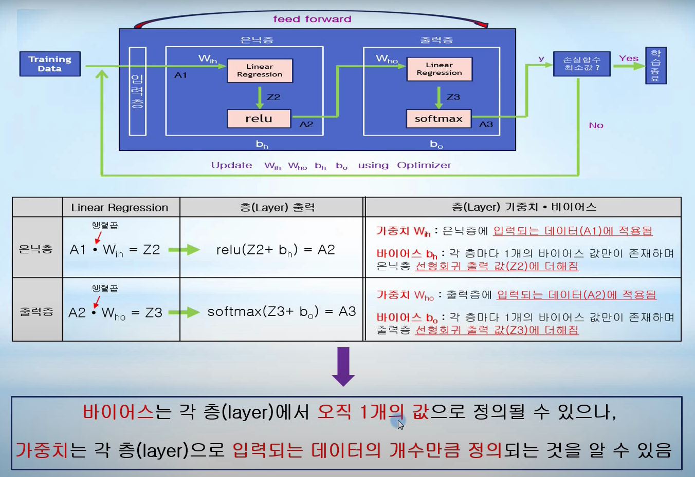
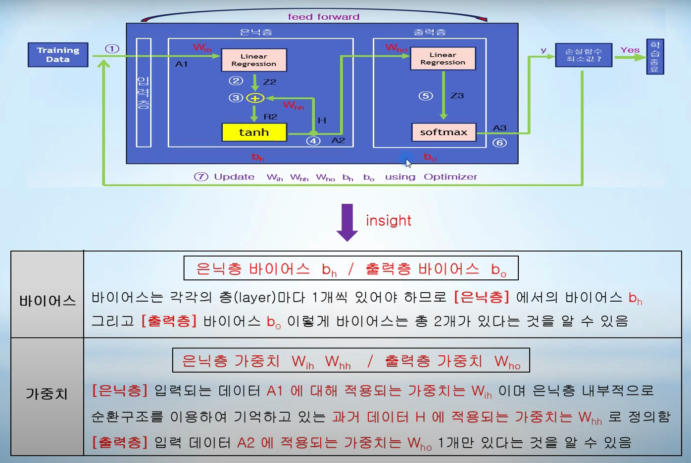
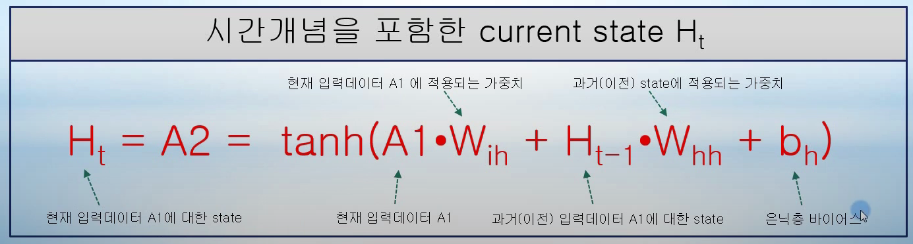
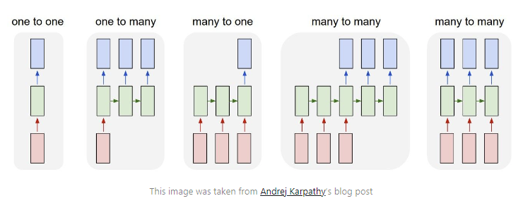
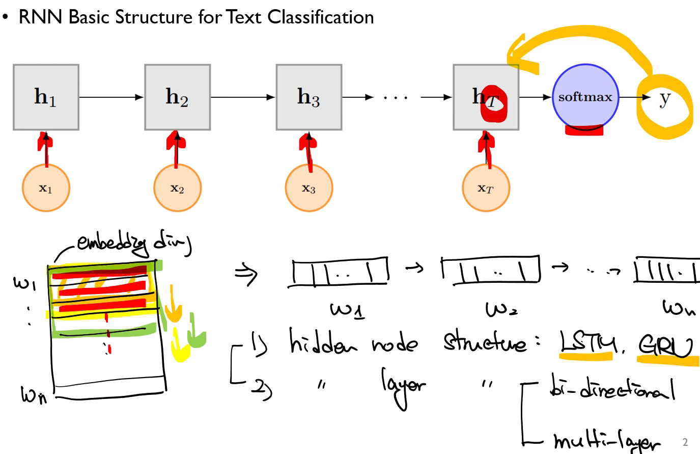
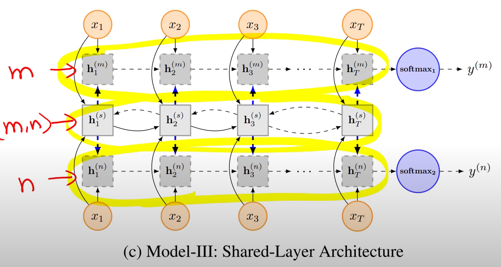

# RNN 

* 일반적인 NN Architecture 
* RNN Architecture 

* RNN의 출력은 다양한 형태가 될 수 있다.
* You might be wondering, which portion of the RNN do I extract my output from? This really depends on what your use case is. For example, if you’re using the RNN for a classification task, you’ll only need one final output after passing in all the input - a vector representing the class probability scores. In another case, if you’re doing text generation based on the previous character/word, you’ll need an output at every single time step. 

* Sequential Data를 처리하는 과정에서, 일찍 input된 데이터와 나중에 input된 데이터를 잘 반영할 수 있을까 고민하는 과정에서 나온 것입니다.
* 구조를 변형하기 + 문서를 잘 분류를 할 수 있을까 고민하는 과정에서 RNN for Multi-Task-Learning (Liu et al.,2016)
## RNN-Uniform-Layer Architecture 

## RNN-Coupled-Layer Architecture 

## RNN-Shared-Layer Architecture 

## RNN : Attention
* Attention mechanism for finding significant words in document classification 

* Two main attnetion mechanisms
  * Bahadanau attention
    * Attention socres are separated trained, the current hidden state is a function of the context vector and the previous hidden state
  * Luong attention
    * Attention scores are not trained, the new current hidden state is the simple tanh of the weighted concatenation of the context vector and the current hidden state of the decoder 

### Luong attention

LSTM은 RNN의 특별한 한 종류로, 긴 의존 기간을 필요로 하는 학습을 수행할 능력을 갖고 있다. LSTM은 Hochreiter & Schmidhuber (1997)에 의해 소개되었고, 그 후에 여러 추후 연구로 계속 발전하고 유명해졌다. LSTM은 여러 분야의 문제를 굉장히 잘 해결했고, 지금도 널리 사용되고 있다.

LSTM은 긴 의존 기간의 문제를 피하기 위해 명시적으로(explicitly) 설계되었다. 긴 시간 동안의 정보를 기억하는 것은 모델의 기본적인 행동이어야지, 모델이 그것을 배우기 위해서 몸부림치지 않도록 한 것이다!

모든 RNN은 neural network 모듈을 반복시키는 체인과 같은 형태를 하고 있다. 기본적인 RNN에서 이렇게 반복되는 모듈은 굉장히 단순한 구조를 가지고 있다. 예를 들어 tanh layer 한 층을 들 수 있다.

# Reference
1. https://dgkim5360.tistory.com/entryunderstanding-long-short-term-memory-lstm-kr
2. https://blog.floydhub.com/a-beginners-guide-on-recurrent-neural-networks-with-pytorch/

