# History

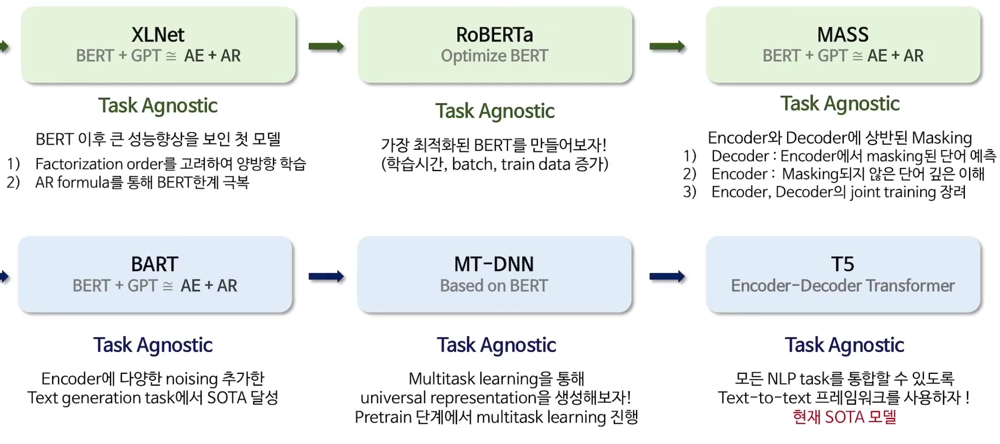
* XLNet
  * Task Agnostic
  * Bert 이후 큰 성능향상을 보인 첫 모델
    * Factorization order를 고려하여 양방향 학습
    * AR formula를 통해 BERT 한계 극복
* RoBERTa
  * Task Agnostic
    * 가장 최적화된 BERT를 만들어보자!
    * 학습시간, 배치크기, train data 증가!
    * BERT가 underfitting 되었다는 가정!
* Mass
  * BERT + GTP 
  * Encoder와 Decoder에 상반된 마스킹을 하는 것이 포인트
  * Decoder : Encoder에서 마스킹 된 단어 예측
  * Encoder : Masking되지 않은 단어 깊은 이해
  * Encoder, Decoder의 joint training 장려
* BART
  * BERT + GPT ~= AE+AR
  * Task AGnostic
  * Encoder에 다양한 noising을 추가하고, Text generation task에서 SOTA 달성
* MT-DNN
  * Based on BERT
  * Multitask learning을 통해 universal representation을 생성해보자!
  * Pretrain 단계에서 Multitask learning 진행
    * 보통 같은 경우는 Pretrained를 거쳐서 Finetuning을 했지만, MT-DNN은 Finetuning을 Pretrain 단계에서 해버린다면 좀 더 Robust한 모델을 만들 수 있지 않을까?
* T5
  * Encoder-Decoder Transformer
    * Task Agnostic
    * 모든 NLP task를 통합할 수 있또록 Text-to-text 프레임워크를 사용하자.

# AE vs AR
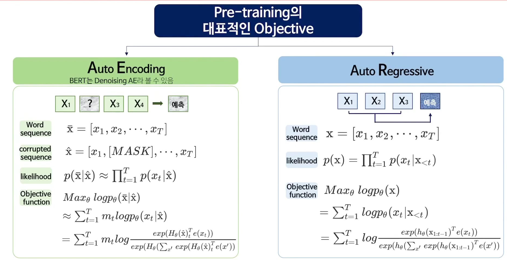
* AE 자체는 어떠한 값 자체를 복원해내는 것이 목적이다.
* 그런데 BERT를 생각해보면, Noise(MASK)를 주고 그것을 복원하는 것?
* 
  * AE의 문제점은 마스킹 된 단어들을 학습할 방법이 없다. token이 독립적으로 예측되기 때문에 토큰 사이의 의존성을 학습할 수 없다.
  * FineTuning 과정에서 Mask 토큰이 등장하지 않기 때문에 pretraining과 finetuning 사이에 discrepancy 발생하다.
* AR의 문제는 uni-direction하다는 문제가 있다. (단일 방향 정보만 사용함)

## XLNet Point
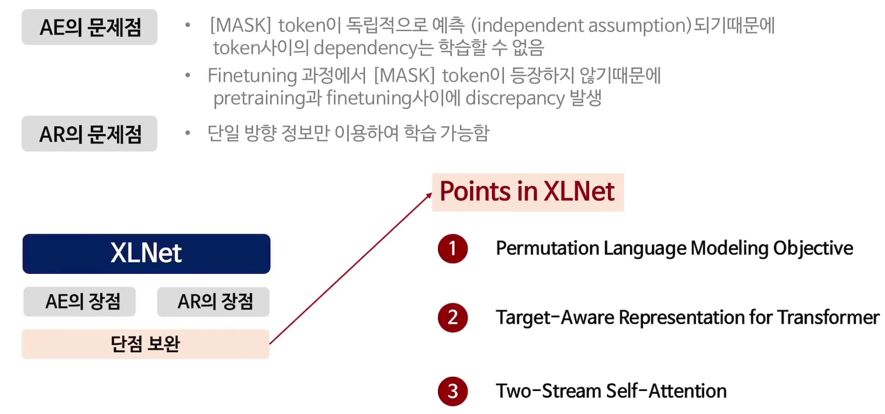

### Permutation Language Modeling Objective 
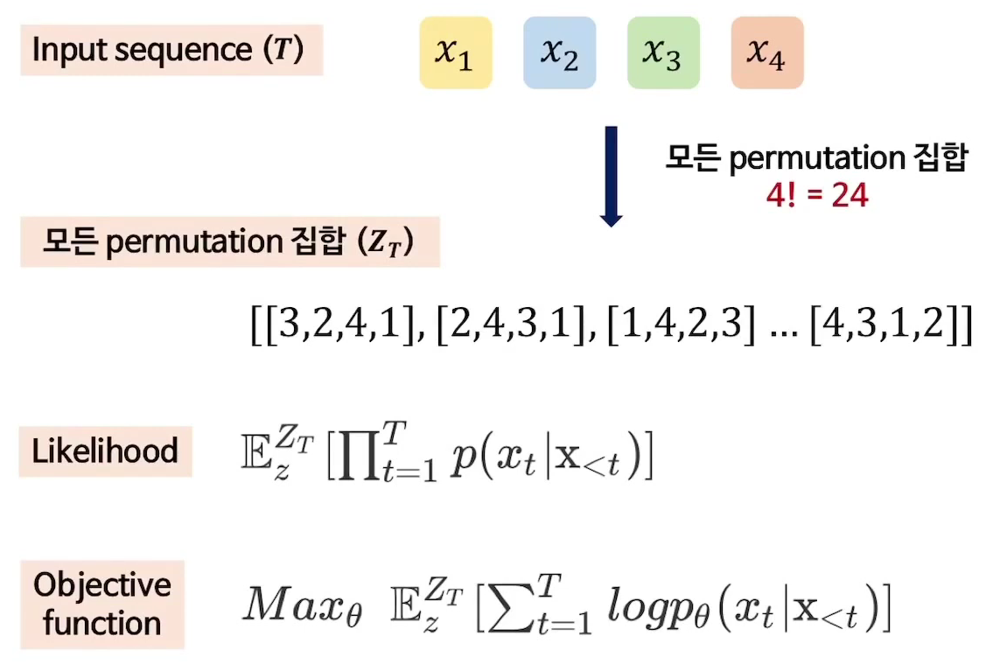
* 우리가 진행하는 것은 AR Formula가 맞지만, 모든 permutation 집합에 대해서 수행을 해버리자.
* 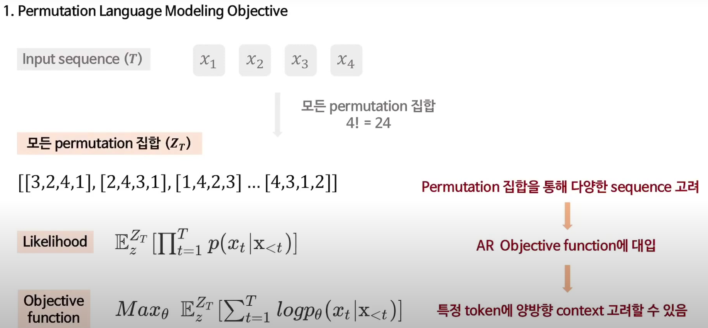
* 

### Target-Aware Representation for Transformer
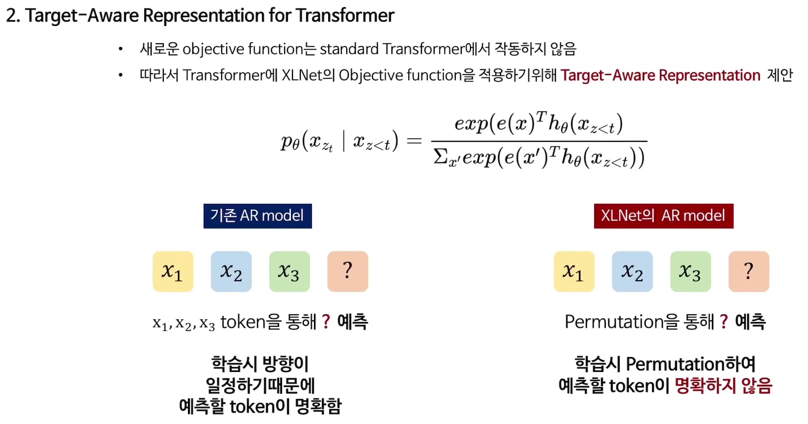
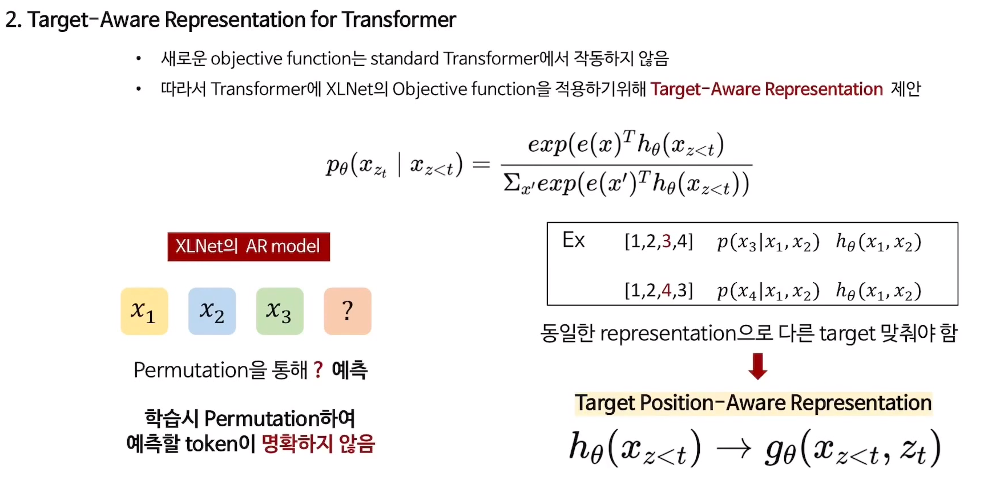
* 학습시 Permutation을 해버렸기 때문에, 예측할 token이 명확하지 않다. $x_1, x_2, x_3, x_4$라는 시퀀스에 대해서 섞어버렸기 때문에, 동일한 representation으로 다른 타겟을 맞춰야 하는 문제가 생긴다.
* 학습할 때 뭉개지는 현상이 발생할 수 있다.
* 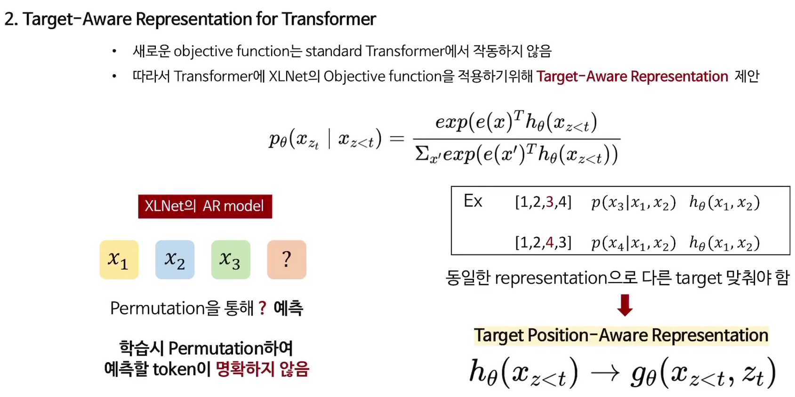

## Two-Stream Self-Attention
* $t$시점에서 타겟 토큰 자체를 예측하기 위해서, $g$라는 함수는 T 시점 이전에 컨텍스트를 고려해야하고, 타겟 포지션 자체를 이용해서 학습해야 합니다.
* 두 번째로, t 시점 이후에 토큰을 예측하기 위해서 t 시점에 컨텍스트도 가지고 있어야 하는 것이 우리의 목적이 될 것이고, 이 1번과 2번 모두 고려하도록 두 가지 hidden representation을 사용해야한다.
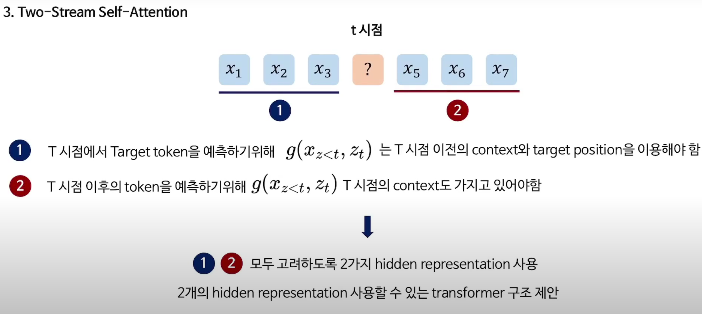

### Query representation 
* $t$시점 이전의 정보, 토큰 정보를 잘 활용하고, $t$시점의 위치정보도 같이 활용하는 것에 목적을 두고 있다.
* 
* 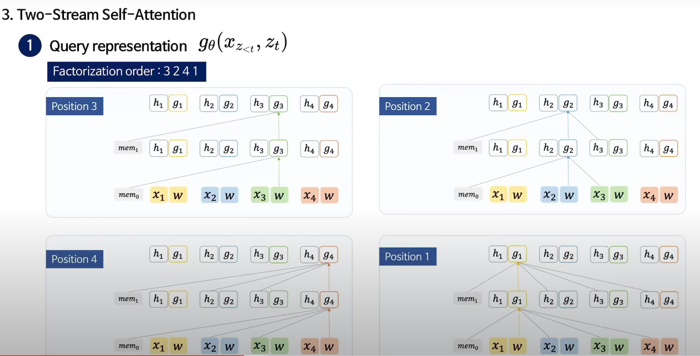

### Context Representation 
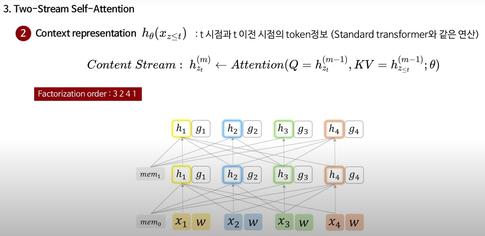 
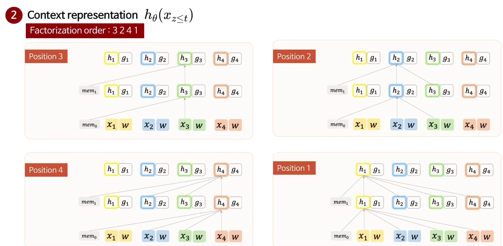

### Transformer-XL 
* For long seq more than 2 segment
* XLNet은 Transformer-XL 로부터 발전한 것이다. 
  * Relative positional encoding
  * Segment Recurrence Mechanism
* Transformer-XL은 모든 Permutation을 진행하지만, XL-Net은 Permutation 집합에서 하나의 token을 예측할 때, 마지막 K개의 예측만 사용한다. (pretraining K=6)
  * XL-Net-large는 NSP objective를 사용하지 않는다. 

# RoBERTa
* Model 구조를 거의 변화시키지 않고, Bert 모델을 거의 그대로 사용한다.
* 아직 BERT는 Underfit 모델이라고 가정한다. 포인트는 네 개!
  * 모델의 학습시간을 증가, 배치 사이즈를 늘리고, 학습 데이터를 증가한다. Pretrain에서 데이터 양을 늘릴수록 Downstream task의 성능이 증가함.
  * Next Sentence Prediction을 제거한다.
  * Longer sequence를 추가함
  * Masking pattern을 Dynamic하게 해줌
    * BERT는 pretrain 전에 미리 masking을 진행하는데, 학습이 진행될 때 똑같은 token이 masking된다는 문제가 있다. (Bias)
      * 똑같은 데이터에 대해 마스킹을 10번 다르게 적용하여 학습한다.
      * Input이 들어갈 때마다 Masking 진행
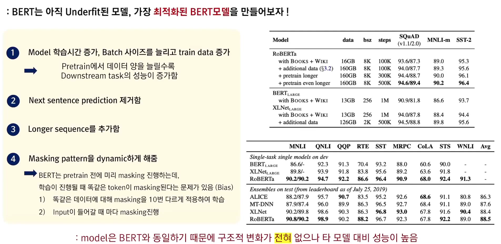

# BART
## Noise 방법론
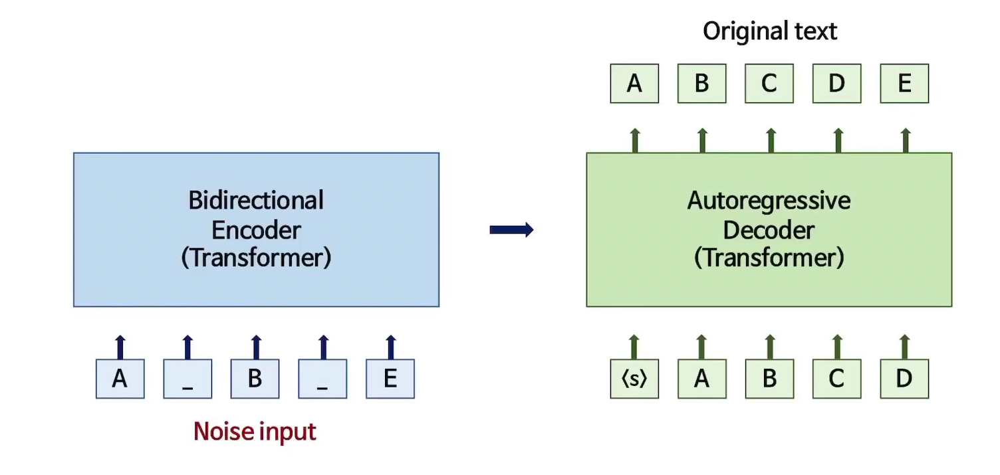
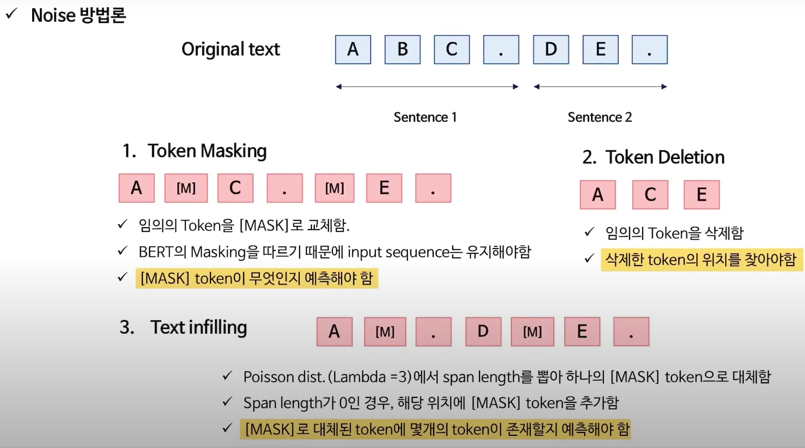
* Text infilling (BART의 방법론 중 가장 좋은 성능을 보임)
  * Poisson dist. (Lambda=3)에서 span length를 뽑아 하나의 MASK token으로 대체함
  * Span length가 0인 경우, 해당 위치에 Mask token 추가함
  * Mask로 대체된 토큰에 몇 개의 토큰이 존재할 지 예측해야함.
* Sentence Permutation
* Document Rotation
  * 하나의 토큰을 uniformly하게 뽑은 후, 그 토큰을 시작점으로 회전함
  * 모델이 문서의 start point를 찾도록 학습시킴.

# MT-DNN (Multi-Task Deep Neural networks for Natural Language Understanding)
* BERT에 Multi-task-learning을 적용한 논문 
* 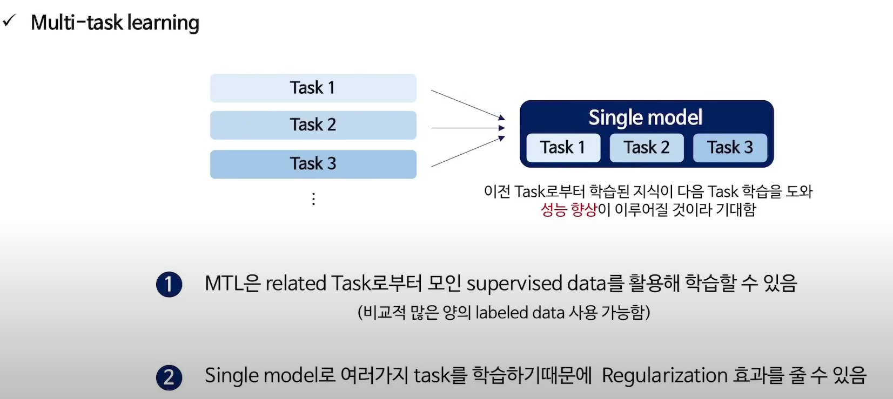
* 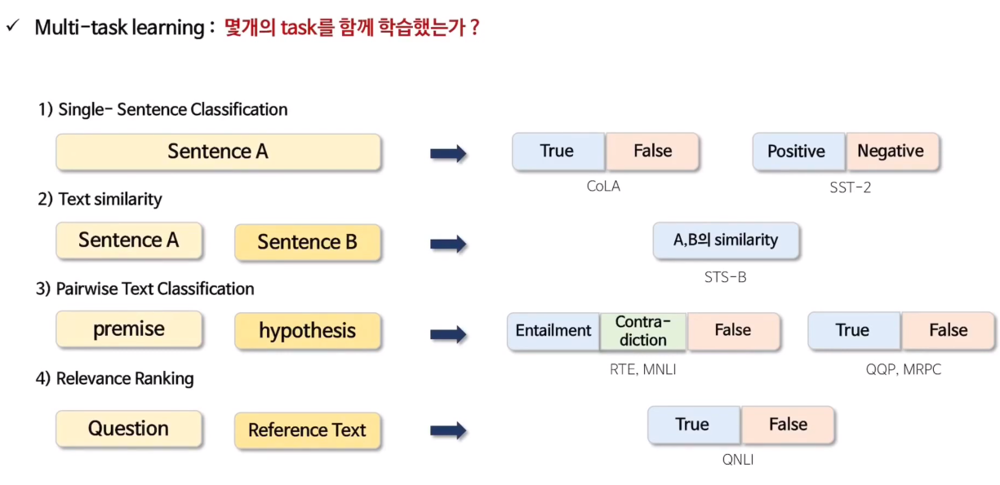

# T5 
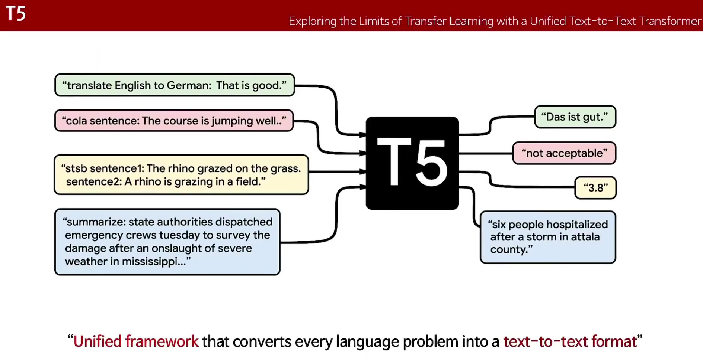
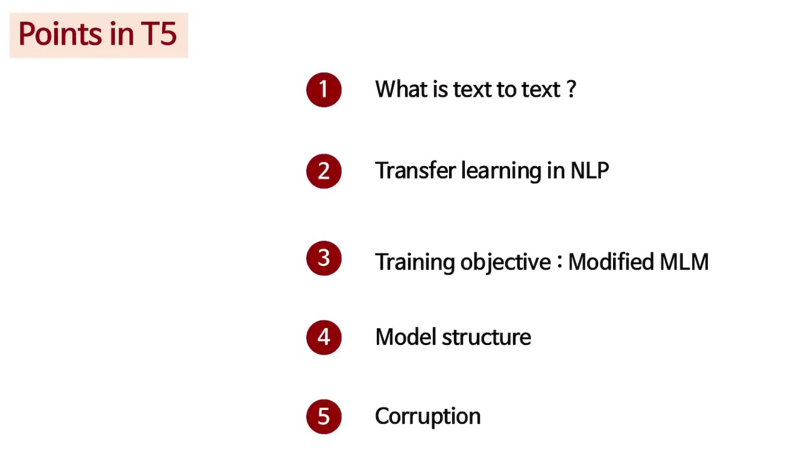
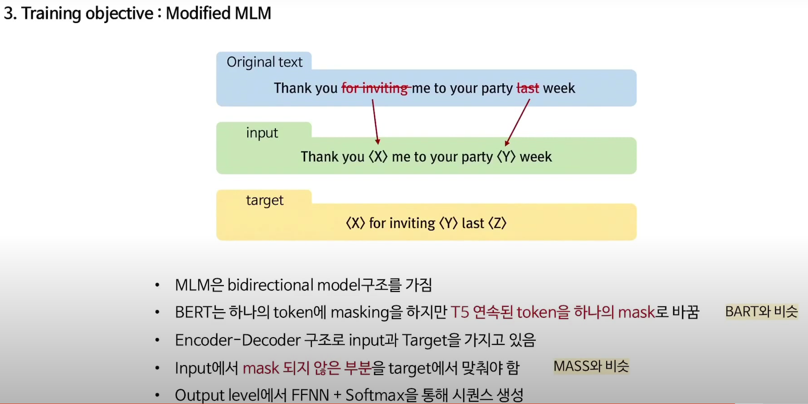