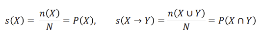
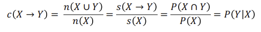
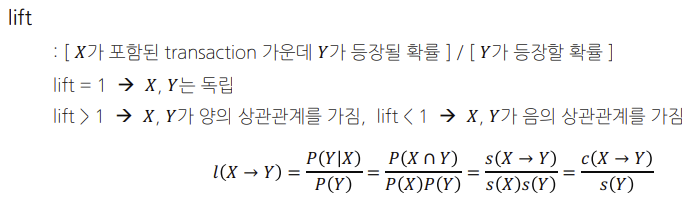
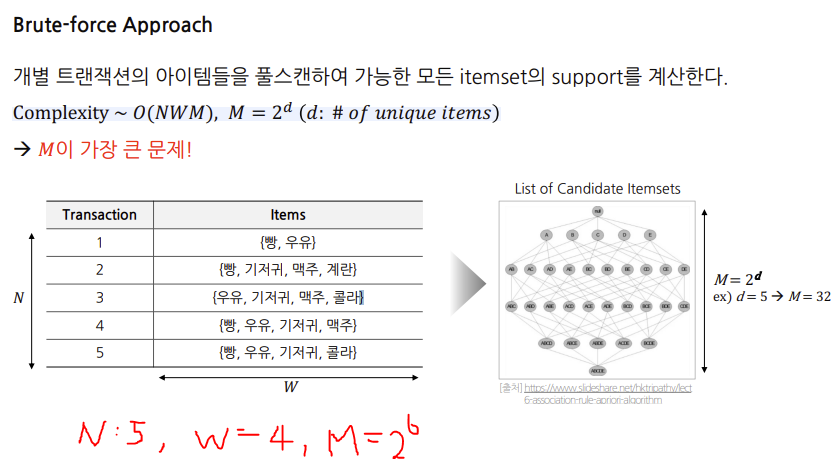
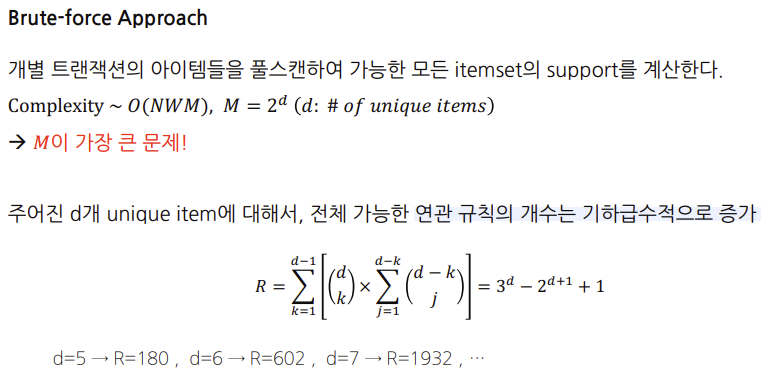
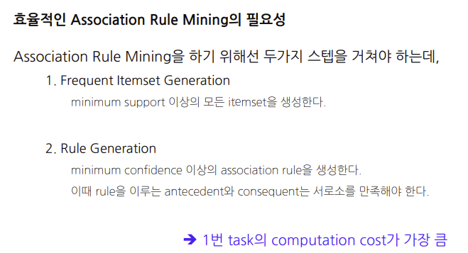
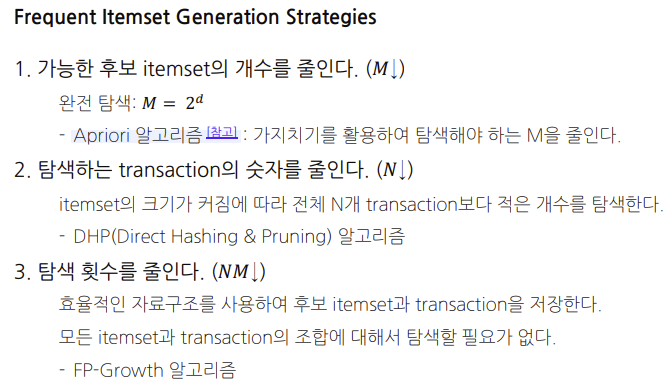

# 연관 규칙
* 상품의 구매, 조회 등 하나의 연속된 거래들 사이의 규칙을 발견하기 위해 적용함
* 

## 빈발집합 (Frequent Itemset)
* itemset
  * k-itemset
* support count ($\sigma$)
  * 전체 transaction data에서 itemset이 등장하는 횟수
* support
  * itemset이 선체 transaction data에서 등장하는 비율
  * support({빵, 우유}) = $\frac{3}{5}=0.6$
* frequent itemset
  * 유저가 지정한 minimum support 값 이상의 itemset을 의미
  * infrequent itemset은 반대로 유정한 minimum support보다 작은 itemset을 의미

## 연관 규칙의 척도 (support, confidence, lift)
frequent itemset들 사이의 연관 규칙을 만들기 위해서는 measurement가 필요하다. 
$X\rightarrow Y$가 존재할 때, 
$$X,Y:itemset, N: 전체\:\:transaction \:\:수$$

### Support
두 아이템 셋 X,Y를 모두 포함하는 transaction의 비율, 즉, 전체 transaction에 대한 itemset의 확률값 좋은(빈도가 높거나, 구성 비율이 높은) 규칙을 찾거나, 불필요한 연산을 줄일 때 사용됨


```arduino
1: ['맥주', '기저귀', '콜라']
2: ['맥주', '콜라', '빵']
3: ['맥주', '기저귀', '콜라', '치즈']
4: ['콜라', '빵', '치즈']
5: ['맥주', '기저귀', '치즈']

['맥주', '기저귀']: 3회
['맥주', '콜라']: 3회
['기저귀', '콜라']: 2회
['맥주', '치즈']: 2회
['기저귀', '치즈']: 2회
['콜라', '빵']: 2회
['콜라', '치즈']: 2회

support('맥주', '기저귀') = 3 / 5 = 0.6
support('맥주', '콜라') = 3 / 5 = 0.6
support('기저귀', '콜라') = 2 / 5 = 0.4
support('맥주', '치즈') = 2 / 5 = 0.4
support('기저귀', '치즈') = 2 / 5 = 0.4
support('콜라', '빵') = 2 / 5 = 0.4
support('콜라', '치즈') = 2 / 5 = 0.4
```


### Confident

$X$가 포함된 transaction 가운데 $Y$도 포함하는 transaction에 대한 비율 ($Y$의 $X$에 대한 조건부 확률), confidence가 높을수록 유용한 규칙을 뜻함




연관 규칙에서 confidence는 규칙의 신뢰도를 측정합니다. 연관 규칙 A -> B에 대한 confidence는 A가 주어졌을 때 B도 발생할 확률을 나타냅니다. 수학적으로는 support(A, B) / support(A)로 계산됩니다.

위에서 작성한 토이 데이터셋을 이용해 예를 들어보겠습니다. 먼저 support(A, B)를 이미 계산했으니, support(A)만 추가로 계산해야 합니다.

각 아이템의 빈도는 다음과 같습니다:
```arduino
'맥주': 4회
'기저귀': 3회
'콜라': 4회
'치즈': 3회
'빵': 2회

support('맥주') = 4 / 5 = 0.8
support('기저귀') = 3 / 5 = 0.6
support('콜라') = 4 / 5 = 0.8
support('치즈') = 3 / 5 = 0.6
support('빵') = 2 / 5 = 0.4

confidence('맥주' -> '기저귀') = support('맥주', '기저귀') / support('맥주') = 0.6 / 0.8 = 0.75
confidence('기저귀' -> '맥주') = support('맥주', '기저귀') / support('기저귀') = 0.6 / 0.6 = 1.0
```
따라서, '맥주'를 구매한 고객은 '기저귀'도 구매할 확률이 75%, 반대로 '기저귀'를 구매한 고객은 '맥주'도 구매할 확률이 100%임을 의미합니다. 이런 식으로 연관 규칙의 신뢰도를 계산할 수 있습니다.

참고로, confidence는 규칙의 효과 크기를 나타내지만, 두 아이템이 독립적으로 발생한 경우를 고려하지 않습니다. 이를 보완하기 위해 lift와 같은 다른 측정치를 사용하기도 합니다.


### Lift
$$\dfrac{X가 포함된 transaction 가운데 Y가 등장할 확률}{Y가 등장할 확률}$$


Lift는 연관 규칙 A -> B에 대한 신뢰도(confidence)를 B의 발생 확률로 나눈 것입니다. 수학적으로는 `confidence(A -> B) / support(B)`로 계산됩니다. Lift 값이 1보다 크다면, A와 B가 양의 상관 관계를 가지며, A가 발생했을 때 B도 발생할 확률이 증가한다는 것을 의미합니다. 반면, Lift 값이 1보다 작다면, A와 B가 음의 상관 관계를 가지며, A가 발생했을 때 B가 발생할 확률이 감소한다는 것을 의미합니다. Lift 값이 1이라면, A와 B는 독립적이라는 것을 의미합니다.

이제 lift('맥주' -> '기저귀')를 계산해봅시다:

```scss
lift('맥주' -> '기저귀') = confidence('맥주' -> '기저귀') / support('기저귀') 
                        = 0.75 / 0.6 
                        = 1.25
```

따라서, '맥주'를 구매한 고객은 '기저귀'를 구매할 확률이 '기저귀'를 구매하는 일반적인 확률보다 1.25배 높다는 것을 의미합니다. 이는 '맥주'와 '기저귀'가 양의 상관 관계를 가지며, '맥주'를 구매한 고객은 '기저귀'도 함께 구매할 가능성이 더 높다는 것을 의미합니다.


## 연관규칙 사용 방법
* Item 수가 많아질수록, 가능한 itemset에 대한 rule의 수가 기하급수적으로 많아지기 때문에 이중에서 유의미한 rule만 사용해야 한다.
  
### 유의미한 Rule이란?
1. minimum support, minimum confidence로 의미 없는 rule을 screen out
   1. 전체 transaction 중에서 너무 적게 등장하거나, 조건부 확률이 아주 낮은 rule을 필터링하기 위함
2. lift 값으로 내림차순 정렬을 하여 의미 있는 rule을 평가함
   1. lift다 크다는 것은 rule을 구성하는 antecedent와 consequent가 연관성이 높고 유의미하다는 뜻

### 그래서 이 Rule을 어떻게 찾을건데?
* Brute-force Approach

다만 위의 사진에서는 $W=4, M=2^6$이므로, $M=2^4$로 표현할 수도 있다. 아이템의 개수가 6개이지만 최대 길이는 4이기 때문.


이 수식은 모든 가능한 연관 규칙의 개수를 계산하는 공식입니다. 각 아이템 집합에 대해, 각 아이템은 세 가지 상태 중 하나를 가질 수 있습니다: 왼쪽 규칙, 오른쪽 규칙, 규칙에 포함되지 않음. 따라서 전체 가능한 조합의 수는 `3^d`입니다.

그러나, 이 중에서 두 가지 경우를 제외해야 합니다: 

1. 모든 아이템이 왼쪽에 있는 경우: 이는 규칙이 될 수 없습니다. (오른쪽에 아이템이 없음) 이 경우의 수는 `2^d`입니다.
2. 모든 아이템이 오른쪽에 있는 경우: 이도 규칙이 될 수 없습니다. (왼쪽에 아이템이 없음) 이 경우의 수는 또한 `2^d`입니다.

따라서 전체 가능한 연관 규칙의 수는 `3^d - 2^{d+1}`입니다.

그러나, 이 수식은 아무런 아이템도 규칙에 포함되지 않는 경우를 제외하고 있습니다. 이 경우는 오직 하나만 있습니다, 따라서 실제 공식은 `3^d - 2^{d+1} + 1`입니다. 

이 공식은 아이템의 개수가 증가함에 따라 가능한 연관 규칙의 수가 기하급수적으로 증가함을 보여줍니다. 이로 인해 아이템의 개수가 많은 경우, 효과적인 연관 규칙 학습 알고리즘을 찾는 것이 중요하게 됩니다.





```python
from mlxtend.preprocessing import TransactionEncoder
import pandas as pd
# 트랜잭션 데이터를 생성합니다.
dataset = [['우유', '양파', '버터', '계란', '요구르트'],
           ['양파', '콘플레이크', '우유', '계란', '요구르트'],
           ['우유', '양파', '버터'],
           ['양파', '우유', '버터', '요구르트'],
           ['양파', '우유', '버터']]

# 트랜잭션 데이터를 불리언 데이터 프레임으로 변환합니다.
te = TransactionEncoder()
te_ary = te.fit(dataset).transform(dataset)
df = pd.DataFrame(te_ary, columns=te.columns_)

# 변환된 데이터 프레임을 출력합니다.
print(df)

from mlxtend.frequent_patterns import apriori
from mlxtend.frequent_patterns import association_rules

# Apriori 알고리즘을 이용하여 빈발 아이템 집합을 찾습니다.
frequent_itemsets = apriori(df, min_support=0.07, use_colnames=True)

# 연관 규칙을 찾습니다.
rules = association_rules(frequent_itemsets, metric="lift", min_threshold=1)

# 연관 규칙을 출력합니다.
print(rules)
```