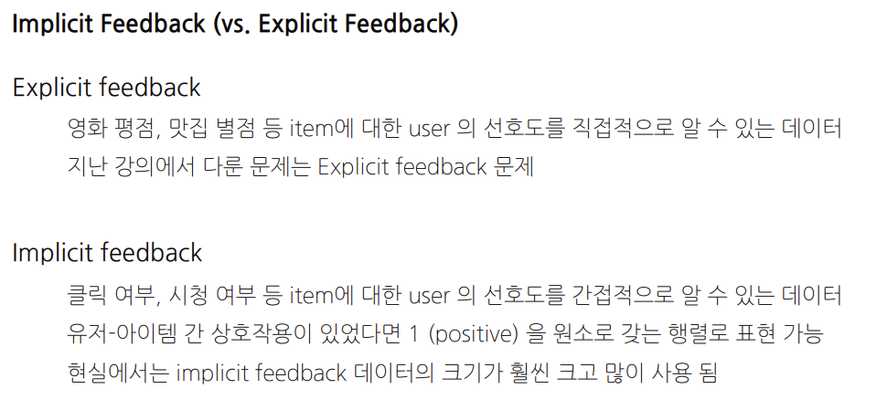
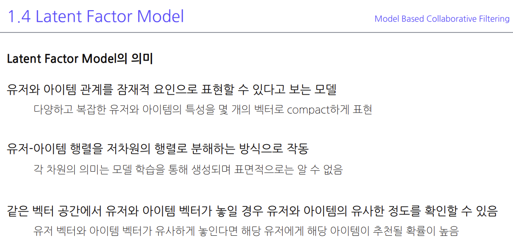
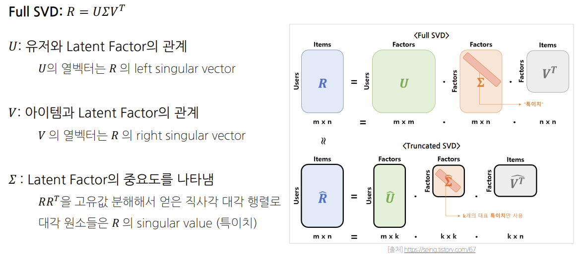
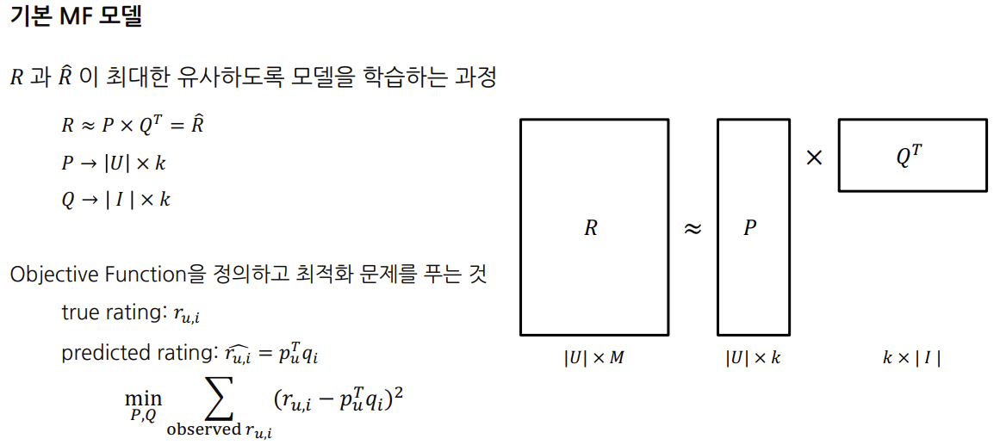
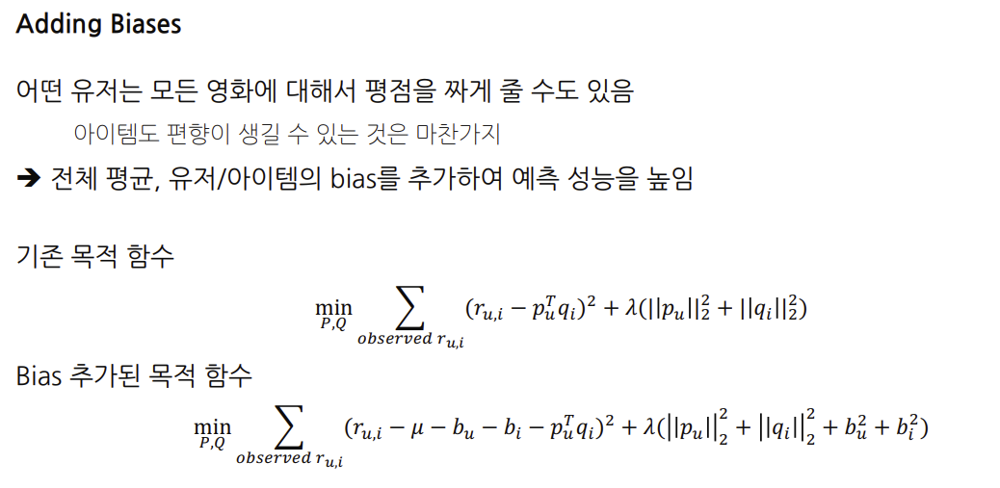
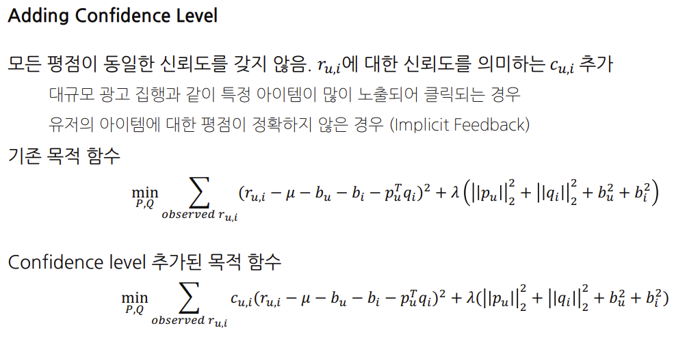
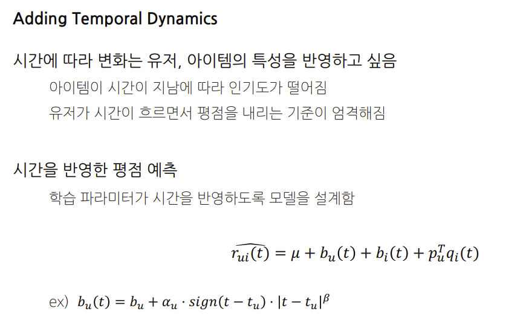
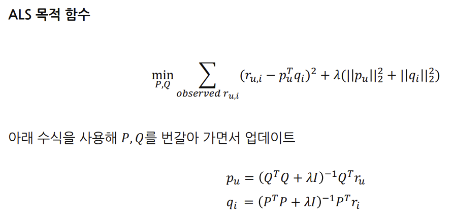
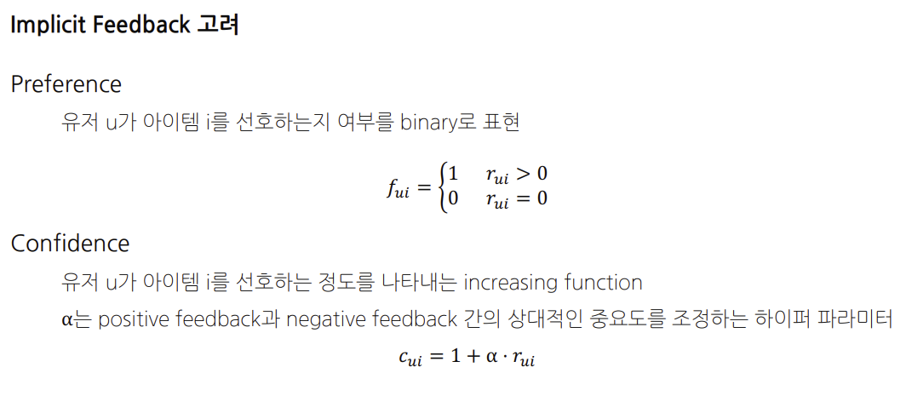
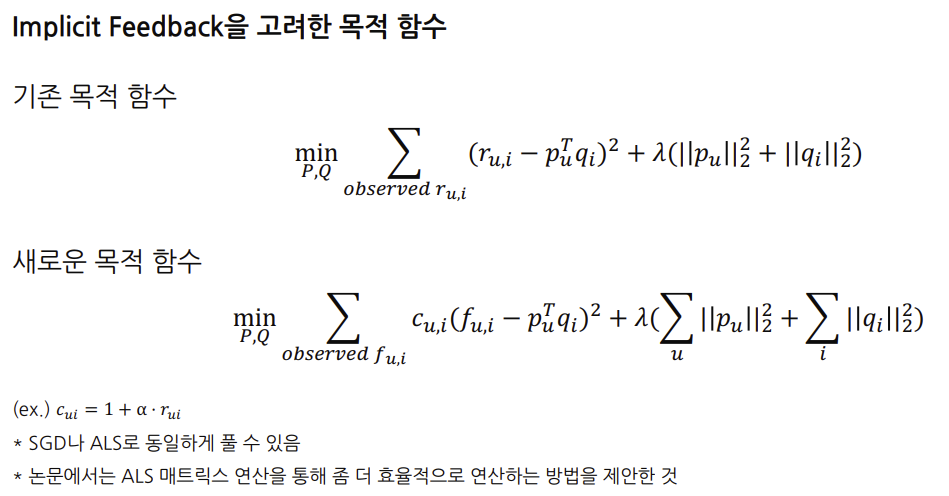

# Model-based Collaborative Filtering (MBCF)의 정의와 원리
## NBCF의 한계
* Sparsity & Scalability Issue
  * Sparsity (희소성) 문제
    * 데이터가 충분하지 않다면 추천 성능이 떨어진다. (유사도 계산이 부정확함)
    * 데이터가 부족하거나 혹은 아예 없는 유저, 아이템의 경우 추천이 불가능하다. (Cold Start)
  * Scalability (확장성) 문제
    * 유저와 아이템이 늘어날수록 유사도 계산이 늘어난다.
    * 유저, 아이템이 많아야 정확한 예측을 하지만 반대로 시간이 오래 걸린다.
## Model based CF 
* 항목 간 유사성을 단순 비교하는 것에서 벗어나 데이터에 내재한 패턴을 이용해 추천하는 CF 기법
  * Parametric Machine Learning을 사용
  * 주어진 데이터를 사용하여 모델을 학습
  * 데이터 정보가 파라미터의 형태로 모델에 압축
  * 모델의 파라미터는 데이터의 패턴을 나타내고, 최적화를 통해 업데이트

## MBCF의 특징
**데이터에 숨겨진 유저-아이템 관계의 잠재적 특성/패턴을 찾음**
* NBCF : 이웃 기반 CF은 유저/아이템 벡터를 데이터를 통해 계산된 형태로 저장 (aka Memory-based CF) Model-based CF의 경우 유저, 아이템 벡터는 모두 학습을 통해 변하는 파라미터이다. 
* 현업에서 MF 기법이 가장 많이 사용되고, 특히 최근에는 MF 원리를 Deep Learning 모델에 응용하는 기법이 높은 성능을 낸다.

## MBCF의 장점 (vs. NBCF)
1. 모델 학습/서빙
   * 유저-아이템 데이터는 학습에먼 사용되고 학습된 모델은 압축된 형태로 저장됨
   * 이미 학습된 모델을 통해 추천하기 때문에 서빙 속도가 빠름
2. Sparsity/Scalabiltiy 문제 개선
   * NBCF에 비해 sparse한 데이터에서도 좋은 성능을 보임 (NBCF와 달리 Sparsisty Ratio가 99.5%가 넘을 경우에도 사용)
   * 사용자, 아이템 개수가 많이 늘어나도 좋은 추천 성능을 보임
3. Overfitting 방지 : NBCF와 비교했을 때 전체 데이터의 패턴을 학습하도록 모델이 작동함, NBCF의 경우 특정 주변 이웃에 의해 크게 영향을 받을 수 있음.
4. Limited Coverage 극복 : NBCF의 경우 공통의 유저/아이템을 많이 공유해야만 유사도 값이 정확해진다. NBCF의 유사도 값이 정확하지 않은 경우 이웃의 효과를 보기 어렵다.

## 또다른 이슈 : 내재적 피드백 

# SVD (Singular Value Decomposition)
특이값 분해(Singular Value Decomposition, SVD)는 복잡한 행렬을 여러 개의 간단한 행렬의 곱으로 나타내는 방법입니다. 이 과정에서 어떤 행렬이든 세 개의 행렬로 분해될 수 있습니다.

$A$라는 $m$ x $n$ 행렬이 있을 때, SVD는 다음과 같이 정의됩니다.

$$A = U Σ V^T$$

여기서 
- U와 V는 직교 행렬(orthogonal matrix)로, $U^T * U = I, V^T * V = I$ 가 성립합니다. 여기서 I는 항등 행렬입니다.
- Σ는 대각 행렬(diagonal matrix)로, 행렬의 대각선을 제외한 모든 원소가 0인 행렬을 의미합니다. Σ의 대각선 원소들은 A의 특이값(singular value)이며, 일반적으로 내림차순으로 정렬됩니다.

추천 시스템에서는 SVD가 많이 사용됩니다. 사용자-아이템 행렬(user-item matrix)을 SVD를 통해 분해하면, 사용자와 아이템의 잠재적 특성(latent feature)을 찾을 수 있습니다. 이 특성은 아이템의 특징이나 사용자의 선호도 등을 나타낼 수 있습니다. SVD를 통해 찾은 이런 특성을 바탕으로 사용자가 아직 평가하지 않은 아이템에 대한 평점을 예측할 수 있습니다.

그러나 SVD는 결측치가 없는 행렬에만 적용할 수 있으므로, 추천 시스템에서는 일반적으로 SVD의 변형인 Matrix Factorization 방법을 사용합니다. Matrix Factorization은 결측치가 있는 사용자-아이템 행렬을 두 개의 잠재 특성 행렬로 분해하며, 이는 SVD와 유사한 형태입니다.

SVD는 데이터의 차원을 줄이는 데도 사용됩니다. 이를 통해 데이터의 중요한 특성을 유지하면서 데이터의 크기를 줄일 수 있습니다. 이러한 방법은 데이터 압축, 노이즈 제거, 이미지 인식 등 다양한 분야에서 활용됩니다.

## SVD의 한계
* 분해 (Decomposition)하려는 행렬의 Knowledge가 불완전할 떄 정의되지 않는다.
  * 희소성이 높은 데이터의 경우 결측치가 매우 많고, 실제 데이터는 대부분 희소행렬임
* 따라서 결측된 entry를 모두 채우는 Imputation을 통해 Dense Matrix를 만들어 SVD를 수행함. 
  * 그런데 Imputation은 데이터의 양을 상당히 증가시키므로, Computation 비용이 높아짐
* 정확하지 않은 Imputation은 데이터를 왜곡시키고 예측 성능을 떨어뜨림
  * 행렬의 entry가 매우 적을 떄 SVD를 적용하면 과적합 되기 쉬움

**그래서 SVD의 원리를 차용하되 다른 접근 방법을 쓰자! : MF의 등장**

# MF (Matrix Factorization)
* User-Item 행렬을 저차원의 User와 Item의 Latent Factor 행렬의 곱으로 분해하는 방법
* SVD의 개념과 유사하나, 관측된 선호도(평점)만 모델링에 활용하여,  관측되지 않은 선호도를 예측하는 일반적인 모델을 만드는 것이 목표.
* Rating Matrix를 $P$와 $Q$로 분해하여 $R$과 최대한 유사하게 $\hat{R}$을 추론 (최적화)
$$R\approx P \times Q^T = \hat{R}$$

Objective Function을 보면, 실제 관측된 데이터만을 사용하여 모델을 학습한다는 차이점이 SVD와의 차이점이다.  **SVD는 행렬 분해를 위해 결측 entry를 채워 넣었다.** 

## ALS (Alternative Least Square)

Alternating Least Squares(ALS) 모델은 Matrix Factorization 모델의 일종입니다. Matrix Factorization 모델은 평점 행렬을 두 개의 행렬로 분해하여 사용자와 아이템의 잠재 요인을 학습하는 모델입니다. ALS 모델은 사용자와 아이템의 잠재 요인을 순차적으로 업데이트하는 방식으로 학습합니다. 먼저 사용자의 잠재 요인을 업데이트하고, 그 다음에 아이템의 잠재 요인을 업데이트합니다. 이 과정을 반복하여 사용자와 아이템의 잠재 요인을 학습합니다.

### Basic Concept
* 유저와 아이템 매트릭스를 번갈아가며 업데이트한다. 두 매트릭스 중 하나를 상수로 놓고 나머지 매트릭스를 업데이트한다. $p_u, q_i$ 가운데 하나를 고정하고 다른 하나로 least-square 문제를 푸는 것이다.
  * $p_u, q_i$ 둘 중 하나를 상수로 고정할 경우 목적함수가 quadratic form이 되어 convex해진다.

### SGD와의 비교
* Sparse한 데이터에 대해 SGD보다 더 Robust하다. 
* 대용량 데이터를 병렬처리하여 빠른 학습이 가능하다.
---
ALS(Alternating Least Squares)는 SVD(Singular Value Decomposition)에 비해 더 강건합니다. 이유는 다음과 같습니다.

* ALS는 SVD와 달리 최적화 문제를 분할하여 해결합니다. 이는 ALS가 SVD보다 더 빠르고 효율적으로 최적화 문제를 해결할 수 있음을 의미합니다.
* ALS는 SVD와 달리 희박한 데이터 세트에서 더 많은 정보를 활용할 수 있습니다. 이는 ALS가 SVD보다 희박한 데이터 세트에서 더 정확한 예측을 제공할 수 있음을 의미합니다.

전반적으로 ALS는 SVD보다 더 강건한 추천 시스템입니다. 이는 ALS가 SVD보다 더 빠르고 효율적으로 최적화 문제를 해결하고 희박한 데이터 세트에서 더 많은 정보를 활용할 수 있기 때문입니다.

다음은 두 모델의 주요 차이점 요약입니다.

| 특징 | ALS 모델 | SVD 모델 |
|---|---|---|
| 최적화 문제 | 분할 | 통합 |
| 희박한 데이터 세트 | 강건 | 취약 |
| 정확성 | 정확 | 덜 정확 |
| 효율성 | 효율적 | 덜 효율적 |

두 모델 중 어떤 모델이 더 나은지 결정하는 것은 특정 추천 시스템의 요구 사항에 따라 다릅니다.

---

### ALS 모델의 장점

* 분산 처리가 가능하여 학습 속도가 빠릅니다.
* 희소한 데이터에 강건합니다.
* 사용자와 아이템의 잠재 요인을 명시적으로 표현할 수 있습니다.

### ALS 모델의 단점
* 데이터의 크기가 크면 학습 시간이 오래 걸릴 수 있습니다.
* ALS 모델은 비선형 최적화 문제를 해결하는 모델이기 때문에 최적의 해를 찾지 못할 수 있습니다.
* 사용자와 아이템의 잠재 요인이 선형적으로 관련되어 있다고 가정합니다.
* 초기값에 민감: ALS 모델은 초기값에 민감하기 때문에 초기값을 잘 설정하는 것이 중요합니다.
* 과적합될 수 있습니다.

ALS 모델은 추천 시스템에 널리 사용되는 모델입니다. 사용자와 아이템의 잠재 요인을 명시적으로 표현할 수 있기 때문에 사용자와 아이템의 관계를 이해하는 데 도움이 됩니다. 또한, 분산 처리가 가능하여 학습 속도가 빠르기 때문에 대규모 데이터에도 사용할 수 있습니다.

# BPR (Bayesian Personalized Ranking)
BPR(Bayesian Personalized Ranking) 모델은 추천 시스템에 사용되는 협업 필터링 모델의 일종입니다. BPR 모델은 사용자와 아이템의 잠재 요인을 학습하여 사용자와 아이템의 관계를 이해하고, 사용자에게 아이템을 추천합니다. BPR 모델은 다음과 같은 과정을 거쳐 학습합니다.

1. 사용자와 아이템의 평점 행렬을 생성합니다.
2. 사용자와 아이템의 잠재 요인을 초기화합니다.
3. 사용자와 아이템의 잠재 요인을 순차적으로 업데이트합니다.
4. 최적의 잠재 요인을 찾을 때까지 과정을 반복합니다.

BPR 모델은 다음과 같은 장점이 있습니다.

* 사용자와 아이템의 잠재 요인을 명시적으로 표현할 수 있습니다.
* 사용자와 아이템의 관계를 이해하는 데 도움이 됩니다.
* 추천 정확도가 높습니다.

BPR 모델은 다음과 같은 단점이 있습니다.

* 데이터의 크기가 크면 학습 시간이 오래 걸릴 수 있습니다.
* 초기값에 민감합니다.
* 사용자와 아이템의 잠재 요인이 선형적으로 관련되어 있다고 가정합니다.

BPR 모델은 추천 시스템에 널리 사용되는 모델입니다. 사용자와 아이템의 잠재 요인을 명시적으로 표현할 수 있기 때문에 사용자와 아이템의 관계를 이해하는 데 도움이 됩니다. 또한, 추천 정확도가 높기 때문에 사용자에게 적합한 아이템을 추천할 수 있습니다.

---

## ALS와 BPR의 차이점
BPR(Bayesian Personalized Ranking) 모델과 ALS(Alternating Least Squares) 모델은 모두 추천 시스템에서 사용되는 비지도 학습 모델입니다. **BPR 모델은 사용자와 아이템 간의 순위 관계를 학습하는 데 중점을 두는 반면, ALS 모델은 사용자와 아이템 간의 매칭을 학습하는 데 중점**을 둡니다.

**BPR 모델**은 사용자와 아이템 간의 순위 관계를 학습하기 위해 **이진 분류 기법**을 사용합니다. 즉, 사용자와 아이템 간의 순위 관계가 더 높은 경우 1을, 순위 관계가 더 낮은 경우 0을 예측합니다. BPR 모델은 이진 분류 기법을 사용하여 사용자와 아이템 간의 순위 관계를 학습함으로써 사용자에게 더 적합한 아이템을 추천할 수 있습니다.

**ALS 모델은 사용자와 아이템 간의 매칭을 학습하기 위해 최소 자승법**을 사용합니다. 최소 자승법은 데이터에 가장 잘 맞는 매칭을 찾는 알고리즘입니다. ALS 모델은 최소 자승법을 사용하여 사용자와 아이템 간의 매칭을 학습함으로써 사용자에게 더 적합한 아이템을 추천할 수 있습니다.

**두 모델 모두 사용자와 항목의 쌍을 예측하지만 다른 접근 방식을 사용합니다.**

BPR 모델은 사용자와 항목의 쌍 사이의 순위를 예측하는 데 중점을 둡니다. 즉, 사용자가 항목 A를 항목 B보다 더 좋아할 가능성이 더 높다고 예측하는 데 사용됩니다. ALS 모델은 사용자와 항목 간의 유사성을 예측하는 데 중점을 둡니다. 즉, 사용자 A가 사용자 B보다 항목 C를 더 좋아할 가능성이 더 높다고 예측하는 데 사용됩니다.

두 모델의 장단점이 있습니다. BPR 모델은 더 정확한 예측을 제공할 수 있지만 더 복잡하고 학습하는 데 더 오래 걸릴 수 있습니다. ALS 모델은 더 간단하고 빠르게 학습할 수 있지만 BPR 모델만큼 정확하지 않을 수 있습니다.

두 모델은 모두 추천 시스템에 유용합니다. BPR 모델은 사용자에게 더 개인화된 추천을 제공하는 데 더 적합합니다. ALS 모델은 대규모 데이터 세트에서 추천을 생성하는 데 더 적합합니다.

다음은 두 모델의 주요 차이점 요약입니다.

| 특징 | BPR 모델 | ALS 모델 |
|---|---|---|
| 예측 | 순위 | 유사성 |
| 복잡성 | 복잡 | 간단 |
| 학습 시간 | 오래 걸림 | 빠름 |
| 정확성 | 정확 | 덜 정확 |
| 개인화 | 개인화됨 | 덜 개인화됨 |
| 대규모 데이터 세트 | 적합하지 않음 | 적합 |

두 모델 중 어떤 모델이 더 나은지 결정하는 것은 특정 추천 시스템의 요구 사항에 따라 다릅니다.

# 부록
## Q1 
여기에서 배치학습을 통해서 속도를 증강시킬수는 없을까? 그리고, SVD는 결측치가 있으면 쓸 수 없다고 했는데 왜 이 코드는 정상적으로 돌아갈까? 배치학습이 가능하냐를 물어본 건 실수였어. 미니배치 등으로 속도를 증강시킬 수 있느냐고 물어본거긴 해
## A1
1. 배치학습: `surprise` 라이브러리의 알고리즘들은 기본적으로 전체 데이터셋에 대해 한 번에 학습을 수행하는 방식, 즉 배치학습을 사용합니다. 이는 딥러닝에서 사용되는 미니배치 방식과는 다르게 전체 데이터를 사용하여 모델을 학습시키는 것을 의미합니다. 따라서 별도의 배치 학습 설정은 필요하지 않습니다.

2. SVD와 결측치: SVD는 원래 결측치가 없는 행렬에 대해서만 정의됩니다. 하지만 `surprise` 라이브러리에서 사용되는 SVD 알고리즘은 이를 변형하여 사용자-아이템 행렬의 결측치를 내재적으로 처리합니다. 

   기본적으로, SVD는 주어진 행렬을 세 개의 다른 행렬의 곱으로 분해하는 방법입니다. 이 분해는 원래 행렬이 결측치 없이 완전한 경우에만 가능합니다. 그러나 추천 시스템에서는 사용자-아이템 행렬이 대부분 희소(sparse)하며, 대부분의 항목이 평가되지 않아 결측치로 채워져 있습니다.

   이 문제를 해결하기 위해, `surprise` 라이브러리는 SVD의 변형된 형태를 사용하여 결측치를 처리합니다. 이 알고리즘은 주어진 등급에 대해서만 오차를 최소화하려고 합니다. 즉, 결측치에 대한 예측이 아니라, 이미 등급이 할당된 항목에 대한 예측의 정확성을 높이는 데 초점을 맞춥니다. 이를 통해 희소 행렬에 대해 SVD를 효과적으로 적용할 수 있습니다.

아, 그렇군요. 미니배치에 대해 말씀드리겠습니다.

일반적으로 미니배치 방식은 대량의 데이터를 처리할 때 사용되는 방법이며, 일반적으로 딥러닝 모델의 학습에 주로 사용됩니다. 그런데 미니배치 방식을 통해 속도를 증가시키려면, 해당 알고리즘이 미니배치 학습을 지원해야 합니다. 

현재 `surprise` 라이브러리의 SVD 알고리즘은 미니배치 방식을 지원하지 않습니다. 이 라이브러리는 대부분의 사용자-아이템 행렬이 희소하므로, 효율적인 연산을 위해 행렬의 전체 구조를 고려하는 전체 배치 학습 방식을 사용합니다. 

만약 더 큰 규모의 데이터셋을 처리하려면, 분산 컴퓨팅을 지원하는 라이브러리를 사용해야 할 수 있습니다. 예를 들어 Apache Spark의 MLLib 라이브러리는 ALS (Alternating Least Squares)라는 방법을 통해 빅데이터 규모의 추천 시스템을 학습시키는 것을 지원합니다.

따라서 `surprise`의 SVD 알고리즘의 속도를 향상시키려면, 병렬 처리 기능을 활용하는 등의 다른 방법을 찾아봐야 합니다. 하지만 이는 `surprise` 라이브러리 자체에 내장된 기능이 아니기 때문에, 코드의 복잡도가 늘어나고 추가적인 컴퓨팅 리소스가 필요할 수 있습니다.