# 협업 필터링
**많은 유저들로부터 얻은 기호 정보**를 이용해 유저의 관심사를 자동으로 예측하는 방법

* 최종 목적 : 유저 $u$가 아이템 $i$에 부여할 평점을 예측하는 것
* 방법
  * 주어진 데이터를 활용해 유저-아이템 행렬을 생성한다.
  * 유사도 기준을 정하고, 유저 혹은 아이템 간의 유사도를 구한다.
  * 주어진 평점과 유사도를 활용하여 행렬의 비어 있는 값 (평점)을 예측한다. 

Collaborative Filtering (CF)은 사용자들 간의 상호작용과 취향의 유사성에 기반하여 아이템을 추천하는 방법입니다. 이 방법은 '과거의 사용자 행동이 미래의 사용자 행동을 예측하는데 도움이 될 수 있다'는 가정에 기반하고 있습니다. 이러한 추천 시스템은 주로 두 가지로 분류됩니다:

1. **User-Based Collaborative Filtering**: 이 방법은 특정 사용자와 유사한 취향을 가진 다른 사용자들을 찾아 그들이 선호하는 아이템을 추천합니다. 이를 '이웃(neighbors)'을 찾는 것이라고도 하며, 사용자들 간의 유사도는 보통 피어슨 상관계수나 코사인 유사도 등으로 계산됩니다.

2. **Item-Based Collaborative Filtering**: 이 방법은 사용자가 과거에 선호했던 아이템들과 유사한 다른 아이템을 추천합니다. 이는 아이템 간의 유사도를 계산하여 이루어지며, 보통 아이템에 대한 사용자들의 평가 패턴을 기반으로 합니다.

Collaborative Filtering의 장단점은 다음과 같습니다:

**장점**:

- **콘텐츠 독립**: CF는 아이템에 대한 콘텐츠 정보가 없어도 사용자의 상호작용 데이터만으로 추천이 가능합니다. 따라서 콘텐츠의 특성을 이해하는데 어려움이 있는 경우에 유용합니다.
- **Serendipity**: CF는 사용자가 아직 알지 못하는 새로운 영역의 아이템을 추천할 수 있습니다. 이는 사용자의 기존 취향을 벗어난 아이템을 추천하며, 이를 'serendipity(우연한 발견)'라고 합니다.

**단점**:

- **Cold Start**: 새로운 사용자나 새로운 아이템에 대한 정보가 부족한 경우, CF는 추천에 어려움을 겪습니다. 이를 'cold start' 문제라고 합니다.
- **희소성**: 대부분의 사용자가 매우 적은 수의 아이템만을 평가하는 경우, 사용자-아이템 행렬은 희소(sparse)해집니다. 이런 희소성은 CF에서 유사도 계산을 어렵게 만듭니다.
- **인기 편향**: CF는 인기 있는 아이템을 더 자주 추천하는 경향이 있습니다. 이는 니치한 아이템이나 잘 알려지지 않은 아이템들이 추천되지 않는 결과를 가져옵니다.

 

 **특징**:
 * 구현이 간단하고 이해가 쉽다.
 * <span style="color:red">**아이템이나 유저가 계속 늘어날 경우 확장성이 떨어진다. (Scalability)**</span>
 * <span style="color:red">**주어진 평점/선호도 데이터가 적을 경우, 성능이 저하된다. (Sparsity)**</span>
 * <span style="color:yellow">NBCF를 적용하려면 적어도 sparsity ratio가 99.5%를 넘지 않는 것이 좋음</span>


## CF 분류 

### Neighborhood-based CF (Memory-based CF)
#### User-based
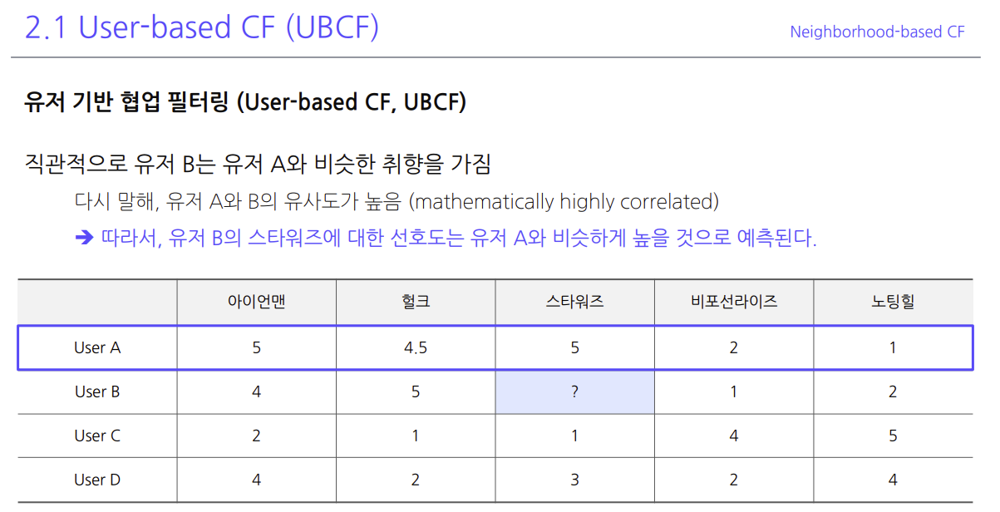
#### Item-based
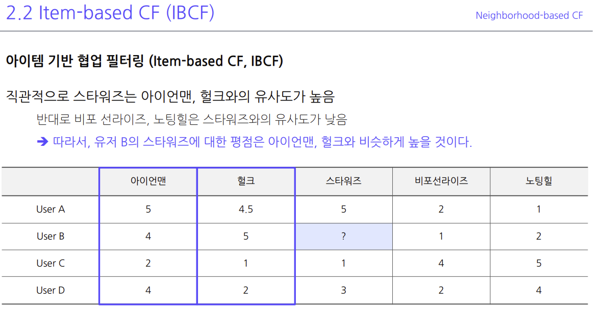

### Model-based CF
#### Non-parametric (KNN, SVD)
#### KNN
* 그런데 NBCF를 사용한다면, 아이템 $i$에 대한 평점을 예측하기 위해서는 $\Omega_i$에 속한 모든 유저와의 유사도를 구해야 한다. ($\Omega_i$는 아이템 $i$에 대해 평가를 한 유저 집합) 
하지만 <span style="color:red">**유저가 많아질수록 계속해서 연산은 늘어나고**</span>, 오히려 성능이 떨어지기도 한다.
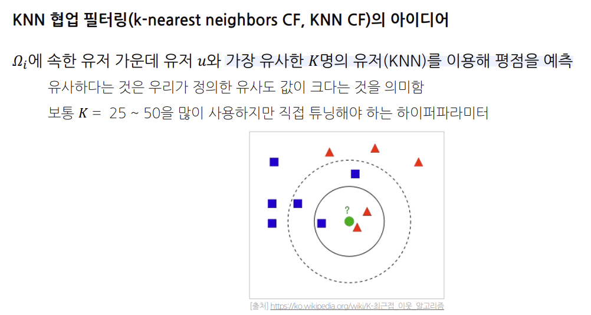
* 그래서 유사도를 어떻게 구할건데? 


## 유사도 측정 방법 
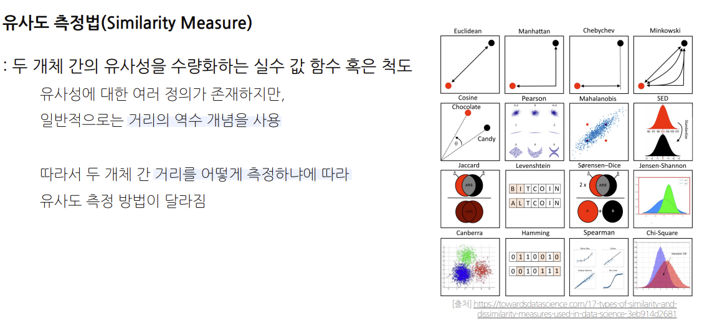

### Mean Squared Difference Similarity
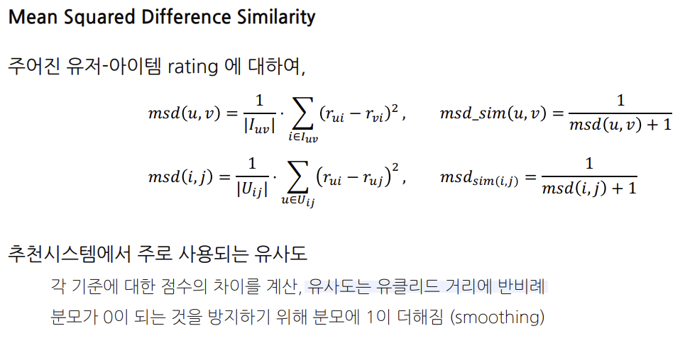
$I_{uv}$는 사용자 $u$와 사용자 $v$가 모두 평가한 아이템의 집합을 의미합니다. 즉, 두 사용자가 모두 평점을 매긴 아이템들의 집합입니다.

이것은 Mean Squared Difference (MSD) 식에서 두 사용자의 평점의 차이를 계산하는 데 사용됩니다. 이 수식은 두 사용자의 유사도를 계산하는 한 방법으로, 두 사용자가 공통으로 평가한 모든 아이템에 대한 평점의 차이를 제곱하고, 그 값을 모두 더한 후, 공통 아이템의 수로 나눠 평균을 구합니다.

그런 다음 MSD를 유사도로 변환하기 위해 보통 역수를 취하거나, 또는 최대값에서 MSD를 뺀 값을 사용합니다. 이렇게 하면 평점 패턴이 매우 비슷한 사용자일수록 더 높은 유사도를 가지게 됩니다.

### Cosine Similarity
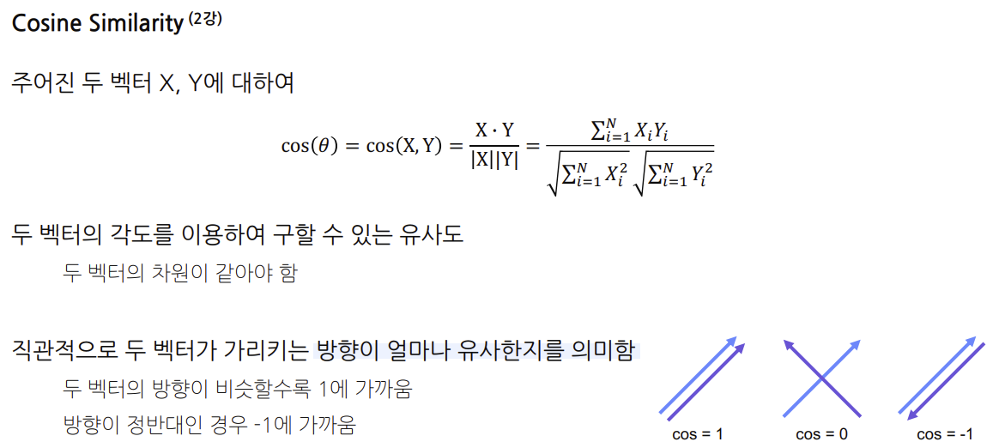

### Pearson Similarity (피어슨 상관계수)
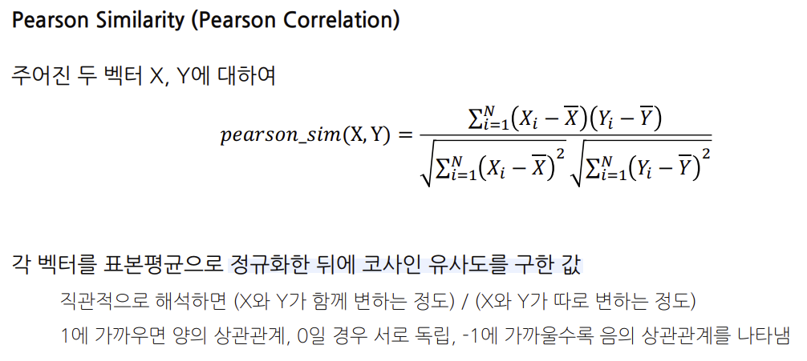

### Jaccard Similarity (자카드 계수)
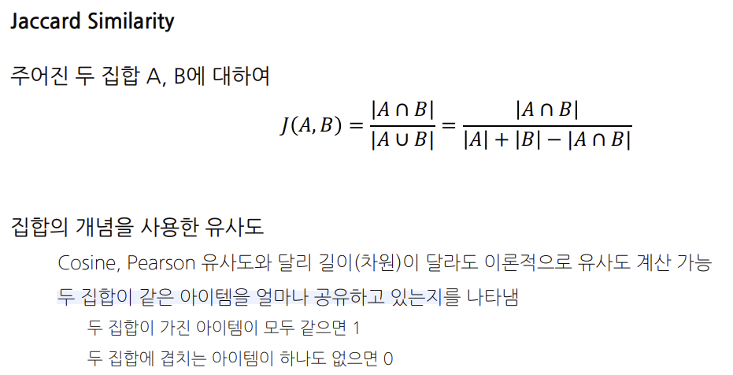


# UBCF, IBCF - Absolute Rating, Relative Rating
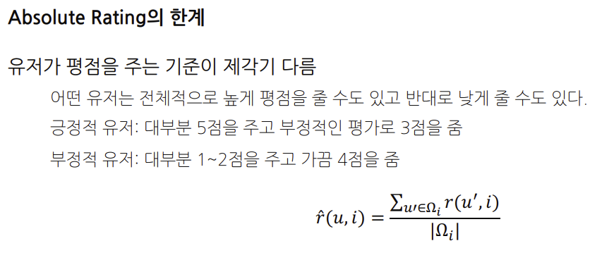
## Absolute Rating 
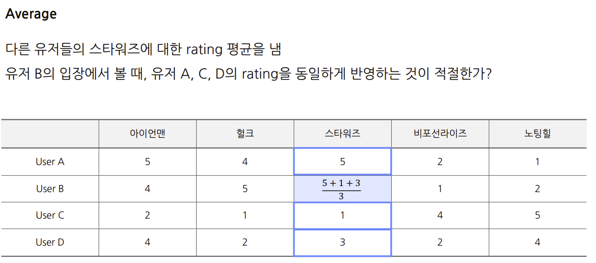
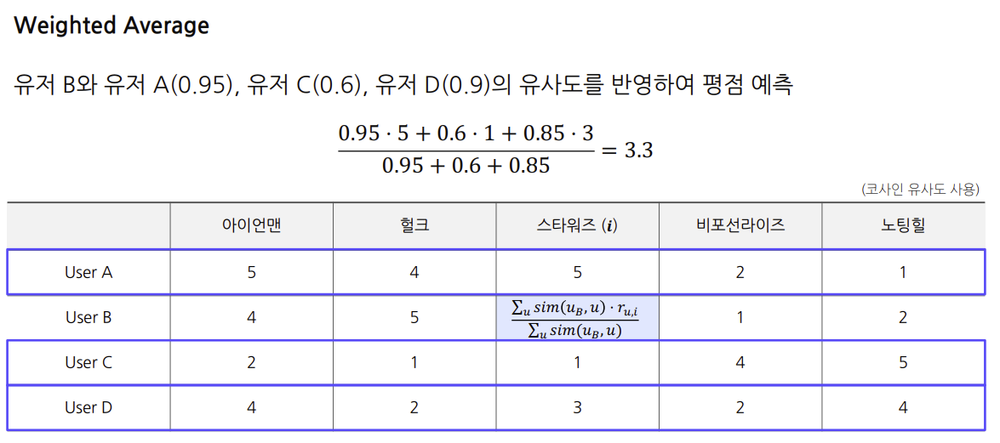

## Absolute Rating 의 한계 
* <span style="color:red">**유저가 평점을 주는 기준이 제각기 다름**</span>
  * 따라서 Relative Rating을 사용해보자. 
  * 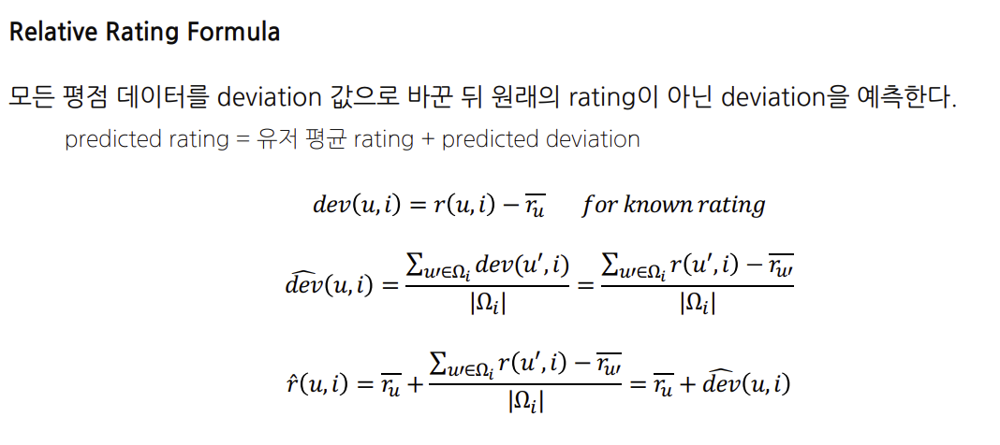


--- 
# Question

## Q1
Mean Squared Difference Similarity를 사용한다면, 두 사용자가 공통으로 평가한 모든 아이템에 대한 평점을 찾아야 하기 때문에, 사용자 A와 사용자B가 공통으로 평가한 아이템의 집합은 동일하다. 그래야만 유사도를 계산할 수 있다.

그렇다면 코사인 유사도를 계산할 때도 두 사람이 공통으로 평점을 메긴 아이템들을 기준으로 유사도를 계산해야 하는가?

### A1 
네, 맞습니다. 코사인 유사도를 계산할 때에도 두 사용자가 공통으로 평가한 아이템들에 대한 평점을 기반으로 계산을 진행합니다. 

코사인 유사도는 두 벡터의 방향이 얼마나 유사한지를 측정하는 척도입니다. 사용자 간의 코사인 유사도를 계산할 때 각 사용자는 아이템에 대한 평점 벡터를 형성하며, 벡터의 각 성분은 해당 사용자의 아이템에 대한 평점입니다. 이 때, 두 사용자가 공통으로 평가한 아이템에 대한 평점만을 고려하여 벡터를 형성하고 이들 벡터 간의 코사인 유사도를 계산합니다.

예를 들어, 사용자 A와 B가 각각 [4, 5, 0, 5]와 [5, 5, 0, 4]라는 평점 벡터를 가질 때, 두 벡터 간의 코사인 유사도는 다음과 같이 계산됩니다. 

$$cos(θ) = (4*5 + 5*5 + 0*0 + 5*4) / sqrt[(4^2 + 5^2 + 0^2 + 5^2) * (5^2 + 5^2 + 0^2 + 4^2)] $$

즉, 코사인 유사도를 사용할 때는 공통 아이템에 대한 평점만을 고려하므로 두 사용자가 공통으로 평가한 아이템의 집합이 동일해야 합니다.

# 코드
```python
from google.colab import drive
drive.mount('/content/drive')

!pip install scikit-surprise

import os
import pandas as pd
import seaborn as sns
import scipy
import numpy as np
import random
from matplotlib import pyplot as plt
from datetime import datetime
from tqdm import tqdm
%matplotlib inline

from surprise import accuracy
from surprise.model_selection import train_test_split
from surprise import KNNBasic, KNNWithMeans, KNNWithZScore
from surprise.model_selection.validation import cross_validate
from sklearn.metrics import mean_squared_error, mean_absolute_error

import warnings
warnings.filterwarnings("ignore")

base_path = os.path.join(os.curdir, 'data')
data_path = '/content/drive/MyDrive/data/ml-latest-small'

rating_path = os.path.join(data_path, 'ratings.csv')
ratings_df = pd.read_csv(rating_path, encoding='utf-8')

from surprise import Reader, Dataset

reader = Reader(rating_scale=(0.5, 5.0))
data = Dataset.load_from_df(ratings_df[['userId', 'movieId', 'rating']], reader)

from surprise import accuracy
from surprise.model_selection import train_test_split

# train / test 데이터 나누기, surprise에서 제공하는 함수

train_data, test_data = train_test_split(data, test_size=0.2, random_state=10)

train_df = pd.DataFrame(train_data.build_testset(), columns=['user', 'item', 'rating'])
print(train_df.head())

def ensemble_predict(user_based_model, item_based_model, test_data):
    user_based_predictions = user_based_model.test(test_data)
    item_based_predictions = item_based_model.test(test_data)
    
    final_predictions = []
    
    for user_based_pred, item_based_pred in zip(user_based_predictions, item_based_predictions):
        if user_based_pred.details['was_impossible']:
            final_predictions.append(item_based_pred)
        else:
            final_predictions.append(user_based_pred)
    
    return final_predictions

# 사용자 기반 모델
user_based_sim_options = {
    'name': 'msd',
    'user_based': True
}
user_based_model = KNNBasic(k=40, min_k = 10, sim_options=user_based_sim_options)
user_based_model.fit(train_data)
user_based_predictions = user_based_model.test(test_data)
rmse = accuracy.rmse(user_based_predictions)
mae = accuracy.mae(user_based_predictions)
print("RMSE:", rmse)
print("MAE:", mae)


# 아이템 기반 모델

item_based_sim_options = {
    'name': 'msd',
    'user_based': False
}
item_based_model = KNNBasic(k=40, min_k = 10, sim_options=item_based_sim_options)
item_based_model.fit(train_data)
item_based_predictions = item_based_model.test(test_data)
rmse = accuracy.rmse(item_based_predictions)
mae = accuracy.mae(item_based_predictions)
print("RMSE:", rmse)
print("MAE:", mae)


# 최종 예측 수행
final_predictions = ensemble_predict(user_based_model, item_based_model, test_data)
rmse = accuracy.rmse(final_predictions)
mae = accuracy.mae(final_predictions)

print("RMSE:", rmse)
print("MAE:", mae)

from surprise import SVD, Dataset, Reader, accuracy
from surprise.model_selection import train_test_split

# 아래에서 'ratings'는 당신의 평점 데이터프레임이어야 합니다.
reader = Reader(rating_scale=(ratings_df['rating'].min(), ratings_df['rating'].max()))
data = Dataset.load_from_df(ratings_df[['userId', 'movieId', 'rating']], reader)

# train-test 데이터 분리
train_data, test_data = train_test_split(data, test_size=0.2)

# SVD 모델 생성 및 학습
svd_model = SVD()
svd_model.fit(train_data)

# 예측 수행
svd_predictions = svd_model.test(test_data)

# 오차 측정
rmse = accuracy.rmse(svd_predictions)
mae = accuracy.mae(svd_predictions)

print("RMSE:", rmse)
print("MAE:", mae)

user_based_cv_result = cross_validate(knn_basic, data, measures=['RMSE', 'MAE'], cv=5, verbose=True)
```

```python
# 시간이 굉장히 많이 소요됩니다. (약 30분)
# 필요 시 몇몇 하이퍼 파라미터의 옵션을 줄여 실행하셔도 무관합니다.

benchmark = []

for algorithm in [KNNBasic(), KNNWithMeans(), KNNWithZScore()]:
    for k in [10, 20, 40]:
        for similarity in ['cosine', 'msd', 'pearson']:
            for user_based in [True, False]:            
                algorithm.k = k
                algorithm.min_k = 10
                algorithm.sim_options = {'name':  similarity, 'user_based': user_based}
                results = cross_validate(algorithm, data, measures=['RMSE'], cv=2, verbose=False)

                # Get results & append algorithm name
                rmse = results['test_rmse'].mean()
                benchmark.append([str(algorithm.__class__.__name__), k, similarity, user_based, rmse])

benchmark_df = pd.DataFrame(benchmark,
                            columns = ['algorithm', 'k', 'similarity', 'user_based', 'rmse']
                           ).sort_values(by='rmse')
```

```python
def get_precision(relevant, recommend):
    
    _intersection = set(recommend).intersection(set(relevant))
    return len(_intersection) / len(recommend)

def get_recall(relevant, recommend):
    
    _intersection = set(recommend).intersection(set(relevant))
    return len(_intersection) / len(relevant)

def get_average_precision(relevant, recommend):
    
    _precisions = []
    
    for i in range(len(recommend)):
        _recommend = recommend[:i+1]
        _precisions.append(get_precision(relevant, _recommend))
    
    return np.mean(_precisions)

def get_ndcg(relevant_item, recommend_item):
    
    k = len(recommend_item)
    discount = np.log2(np.arange(k) + 2)
    cg = []
    for item in recommend_item:
        if item in relevant_item:
            cg.append(1)
        else:
            cg.append(0)

    dcg = np.sum(np.divide(cg, discount))
    
    k_for_icg = min(k, len(relevant_item))
    icg = np.zeros(k)
    for i in range(k_for_icg):
        icg[i] += 1

    idcg = np.sum(np.divide(icg, discount))
        
    return dcg / idcg

```

```python
# train data에 있는 유저 X 아이템 전체 pair에 대해서 예측 평점을 구함

preds_lst = []
users = [train_data.to_raw_uid(uid) for uid in train_data.all_users()]
items = [train_data.to_raw_iid(iid) for iid in train_data.all_items()]

for user in tqdm(users):
    for item in items:
        pred = knn_basic.predict(user, item)
        preds_lst.append([user, item, pred.est])

all_predictions = pd.DataFrame(data=preds_lst, columns=["user_id", "item_id", "rating"])
```

# Colab 실습파일
https://colab.research.google.com/drive/1u_CBUvOI_lTk5TfVy6nAQbddhy43gQiS#scrollTo=aiMYYpjmB3UB