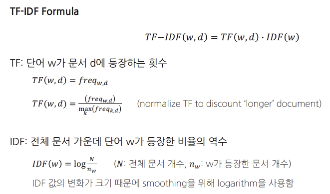
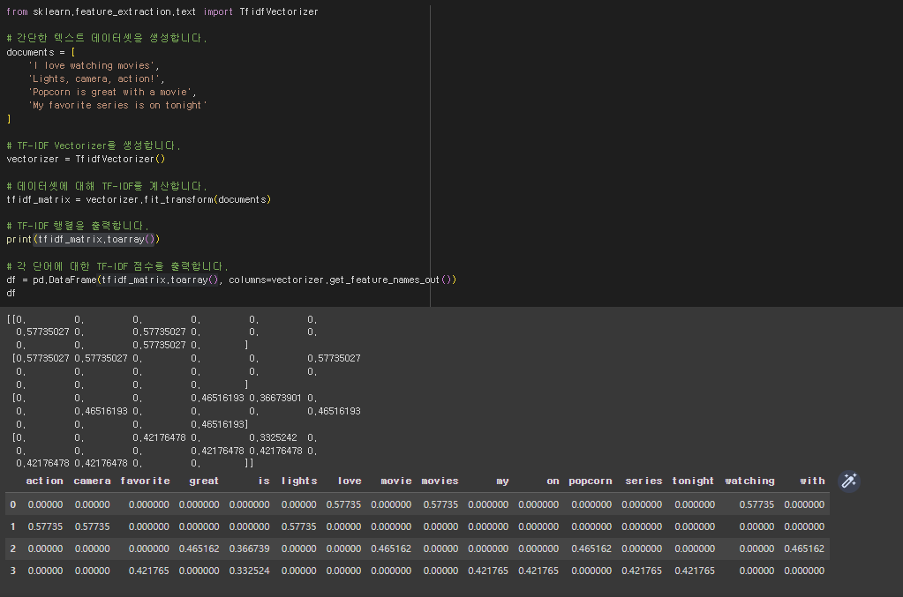
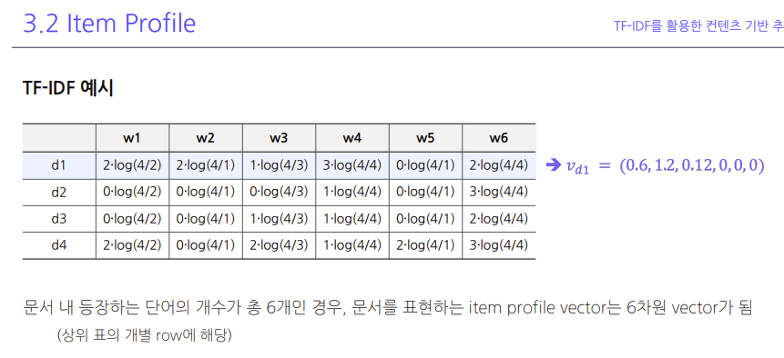
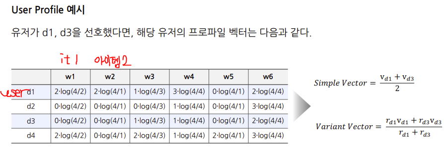
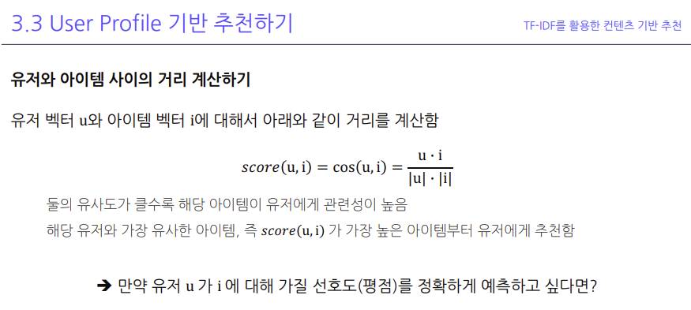
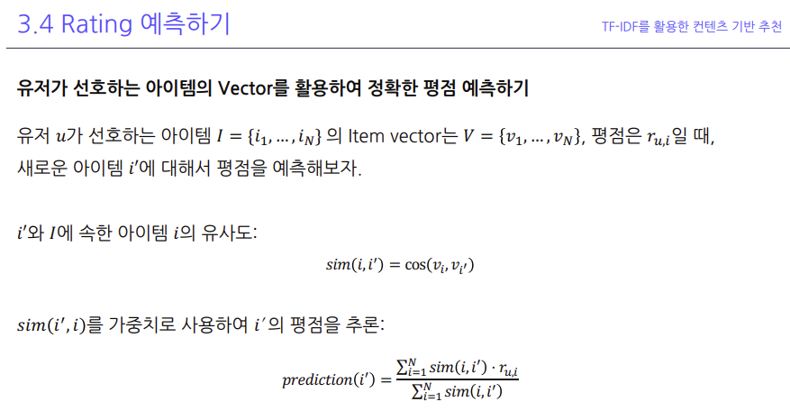
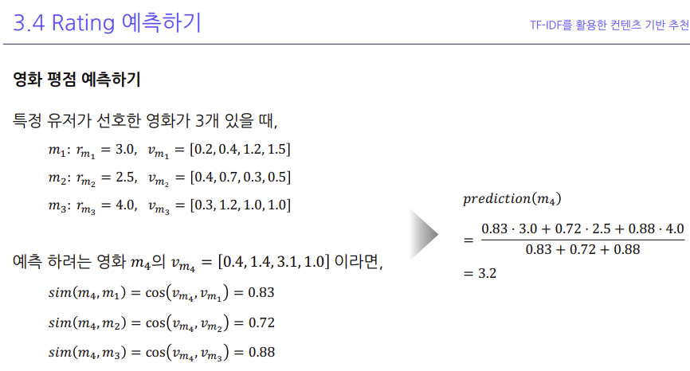
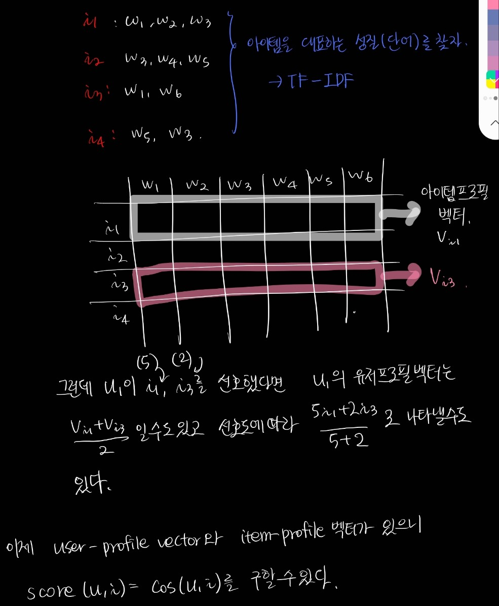

컨텐츠 기반 추천 알고리즘(Content-Based Recommendation Algorithm)은 사용자가 과거에 선호했던 아이템의 내용(content)을 분석하여, 그와 비슷한 아이템을 추천하는 방식입니다. 예를 들어, 사용자가 특정 영화를 좋아했다면, 그 영화와 비슷한 장르, 감독, 배우 등을 가진 다른 영화를 추천하게 됩니다.

컨텐츠 기반 추천 알고리즘에서 중요한 것은 아이템의 특성을 어떻게 표현하느냐입니다. 이를 위해 종종 사용되는 기법이 TF-IDF(Term Frequency-Inverse Document Frequency)입니다.

TF-IDF는 텍스트 데이터를 수치화하는 방법으로, 어떤 단어가 특정 문서 내에서 얼마나 중요한지를 나타내는 통계적 수치입니다. 'TF'는 Term Frequency로, 특정 단어가 문서 내에 얼마나 자주 등장하는지를 나타냅니다. 'IDF'는 Inverse Document Frequency로, 특정 단어가 다른 문서들에서 얼마나 자주 등장하는지의 역수입니다. 따라서, TF-IDF는 문서 내에서 자주 등장하지만 다른 문서에서는 잘 등장하지 않는 단어에 높은 가중치를 부여하게 됩니다.

예를 들어, **영화 추천 시스템에서 각 영화를 나타내는 설명문을 TF-IDF로 벡터화**하면, 영화 간의 유사도를 계산하는 데 사용할 수 있습니다. 그리고 사용자가 과거에 선호했던 영화와 유사한 영화를 추천할 수 있습니다. 이처럼 컨텐츠 기반 추천 알고리즘은 사용자의 과거 행동 패턴과 아이템의 특성을 바탕으로 추천을 제공합니다.




두 개의 정의 모두 TF (Term Frequency)를 계산하는 방법이며, 문맥에 따라 사용하는 방식이 달라질 수 있습니다.


TF = freq_{w,d}: 이 방식은 특정 단어 w가 문서 d에서 얼마나 자주 등장하는지를 나타냅니다. 즉, 단순히 특정 단어의 빈도수를 TF 값으로 사용합니다.

TF(w,d)=freq_{w,d}/max_k (freq_{k,d}): 이 방식은 특정 단어 w의 문서 d에서의 빈도수를 해당 문서에서 가장 자주 등장하는 단어의 빈도수로 나누어 정규화합니다. 이렇게 하면 모든 문서에서 TF 값을 비교할 때 문서의 길이나 문서에서의 단어 사용 빈도에 영향을 받지 않게 됩니다.

이 두 방법 중 어떤 것을 사용할지는 특정 작업에 대한 목표나 데이터셋의 특성에 따라 결정될 수 있습니다. 예를 들어, 문서의 길이가 다양하거나 일부 단어가 극단적으로 자주 등장하는 경우에는 두 번째 방법을 사용하여 TF 값을 정규화하는 것이 적절할 수 있습니다.



```python
from sklearn.feature_extraction.text import TfidfVectorizer

# 간단한 텍스트 데이터셋을 생성합니다.
documents = [
    'I love watching movies',
    'Lights, camera, action!',
    'Popcorn is great with a movie',
    'My favorite series is on tonight'
]

# TF-IDF Vectorizer를 생성합니다.
vectorizer = TfidfVectorizer()

# 데이터셋에 대해 TF-IDF를 계산합니다.
tfidf_matrix = vectorizer.fit_transform(documents)

# TF-IDF 행렬을 출력합니다.
print(tfidf_matrix.toarray())

# 각 단어에 대한 TF-IDF 점수를 출력합니다.
df = pd.DataFrame(tfidf_matrix.toarray(), columns=vectorizer.get_feature_names_out())

```
## Item Profile


## User Profile 기반 추천하기
Item Profile을 모두 구축했으나, 우리가 해야 할 일은 유저에게 아이템을 추천하는 것이다.
* 유저가 과거에 선호했던 아이템 리스트가 있고, 개별 아이템은 TF-IDF를 통해 벡터로 표현됨
* 각 유저의 아이템 리스트 안에 있는 아이템의 벡터들을 통합하면 User Profile이 됨
  * Simple : 유저가 선호한 아이템 벡터들의 평균값을 사용
  * Variant : 유저가 아이템에 내린 선호도로 정규화(normalize)한 평균값을 사용





