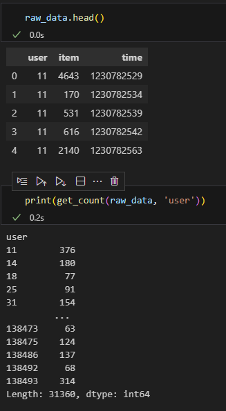
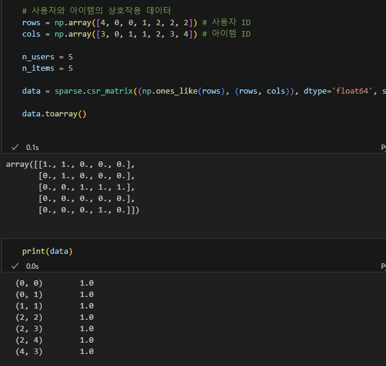

# User
* 전체 고유 사용자는 31360명이고, 아이템은 6807개이다.
* Sparsity Ratio는 97.6%이다. 

# Year
* 전체 데이터 개수는 6799개이고, 고유 연도는 93개이다.

# Wrtier 
* 전체 데이터는 11305~11306개정도이고, 고유 작가는 2989명이다. 

# Title
`title_data['title'].nunique()` 는 6806개이다.  

# genre
* 고유 장르는 18개이다. 

# director
고유 감독은 1340명이다. 

물론입니다. 각 함수의 입력 인자와 반환값에 대해 좀 더 구체적으로 설명하겠습니다.

1. `get_count(tp, id)`: 이 함수는 두 개의 입력 인자를 받습니다. 'tp'는 데이터 프레임이며, 'id'는 그룹화를 원하는 컬럼의 이름입니다. 이 함수는 id를 기준으로 그룹화한 후 각 그룹의 크기를 반환합니다. 반환값은 각 id값에 대한 개수를 가지는 시리즈입니다. : 11번 유저는 376개, 14번 유저는 180개 등을 리뷰했다.
   

1. `filter_triplets(tp, min_uc=5, min_sc=0)`: 이 함수는 세 개의 입력 인자를 받습니다. 'tp'는 데이터 프레임이고, 'min_uc'와 'min_sc'는 각각 사용자와 아이템에 대한 최소 평가 수를 나타냅니다. 이 함수는 min_uc와 min_sc 조건에 맞지 않는 사용자 또는 아이템을 필터링한 데이터 프레임, 사용자별 리뷰 수를 가진 시리즈, 아이템별 리뷰 수를 가진 시리즈를 반환합니다. 여기 부분을 조절해가면서 실험할 수 있겠다.

2. `split_train_test_proportion(data, test_prop=0.2)`: 이 함수는 두 개의 입력 인자를 받습니다. 'data'는 데이터 프레임이고 'test_prop'는 테스트 데이터의 비율을 나타냅니다. 이 함수는 data를 사용자별로 그룹화한 후, 각 사용자의 아이템 평가 중 일부(test_prop 비율)를 테스트 데이터로 분리합니다. 이 함수는 훈련 데이터 프레임과 테스트 데이터 프레임 두 개를 반환합니다. 여기도 조절 가능할 것 같지만, 잘 쓰진 않을 것 같다.

3. `numerize(tp, profile2id, show2id)`: 이 함수는 세 개의 입력 인자를 받습니다. 'tp'는 데이터 프레임이고, 'profile2id'와 'show2id'는 각각 사용자 식별자와 아이템 식별자를 숫자로 매핑하는 딕셔너리입니다. 이 함수는 사용자와 아이템 식별자를 해당 숫자 인덱스로 변환한 데이터 프레임을 반환합니다. 이 데이터 프레임은 'uid'와 'sid'라는 두 개의 컬럼을 가집니다. 

#### unique_uid : 5개라도 평가한 사용자의 id (11, 14, 18, 25....print)

`tp['uid'].max() + 1`과 `tp['uid'].nunique()`는 사용자의 총 수를 구하는 방법이지만, 두 방법은 사용자 ID가 연속적인지 아닌지에 따라 서로 다른 결과를 초래할 수 있습니다.

예를 들어, 사용자 ID가 [0, 1, 2, 3, 4]와 같이 연속적이면, `tp['uid'].max() + 1`와 `tp['uid'].nunique()` 모두 사용자 수를 5로 산출합니다. 

하지만, 만약 사용자 ID가 [0, 1, 2, 4]와 같이 연속적이지 않고 빈 공간이 있다면, `tp['uid'].max() + 1`는 여전히 5를 출력하지만, `tp['uid'].nunique()`는 실제 사용자 수인 4를 출력합니다.

따라서 `tp['uid'].max() + 1`를 사용하는 이유는, 가능한 모든 사용자 ID의 범위를 포함하려는 것으로 보입니다. 이렇게 하면 사용자 ID가 연속적이지 않거나 일부 사용자의 데이터가 누락되더라도, 데이터 행렬의 행 수가 일정하게 유지되어 모델이 올바르게 작동하도록 보장합니다. 또한 이런 방식은 데이터에 누락된 사용자 ID가 다시 나타날 수 있는 상황에 대비하는 것으로 볼 수 있습니다.

이런식으로 `load_data` 같은 부분들이 처리가 되고 있다.

# MultiVAE.py 만들기 
1. filter_triplets에서 min_uc와 min_sc 설정을 args로 받을 수 있게 하면 좋을 듯? 
2. Stacking을 (CV)를 위해서 split_train_test_proportion에 있는 np.random.seed(98765)를 관리할 필요가 있다.
   1. np.random.seed는 idx_perm을 할 때도 사용되네
3. train, valid, test.csv 와 같이 이미 데이터가 있으면 건들지 않도록 (새로 만들지 않도록) 하는 것도 괜찮을듯?