# 2023-06-01-(목)-210204
## 목표
* 모든 코드는 from-scratch로 돌려보고, Recbole로도 실험을 해봐야겠다.
## NBCF
1. `knn_basic = KNNBasic(k=40, min_k=10)`으로 진행하니 학습시간만 한참 걸렸음. 
   * 위 코드는 3.8.5 recsys 가상환경에서 돌렸음.

## Recbole 연결
###  문제점
1. distutils라는 라이브러리가 3.8.5 에서는 동작하지 않는 것 같은데, 조현석 멤버는 돌렸다고 해서 3.8.16 버전을 설치하고 새로운 가상환경을 설치하려고 함.
2. recbole이 돌아가는 것 같긴 한데, wandb 설정, tensorboard 설정 등 설정할 수 있는 게 너무 많은 것 같다. 
3. 우선은 train_df 를 1%만 사용해서 데이터를 확 축소시켜서 전체 사이클을 돌려봐야겠다. 현재는 5백만개니까 짧은 실험이 감당이 되지 않는다.
4. 1%만 사용해서 돌리는 것은 성공했는데, run.py는 성공했으나 run_hyper.py는 아직 작동시키는 법을 모르겠다. 
   1. Hyperopt / numpy 버전 문제인 줄 알았는데 그건 아닌 것 같다.
   2. 모델마다 Config file을 어떻게 다뤄야하는 지 익혀야 할 것 같은데?

---
When I try to run fmin and define rstate as np.random.RandomState(SEED), I got the error

'numpy.random.mtrand.RandomState' object has no attribute 'integers'

My fmin call looks like this:
fmin(f_lgbm, lgbm_param, algo=tpe.suggest, max_evals=MAX_EVAL, trials=trials, rstate=np.random.RandomState(SEED))

I am running the latest hyperopt on conda python 3.8.6 on win11.

즉, Hyperopt를 관리하는 과정에서 numpy에서는 numpy.random.mtrand.RandomState라는 것이 없어졌다. 

np.random.RandomState was deprecated, so Hyperopt now uses np.random.Generator. Replace the fmin call with:

fmin(f_lgbm, lgbm_param, algo=tpe.suggest, max_evals=MAX_EVAL, trials=trials, rstate=np.random.default_rng(SEED))

---

# 2023-06-02-(금)-102543
# 목표
- [x] ~~나가기 전까지 Hyper 실험할 수 있는 환경까지 만들어보기?~~
  * ~~그냥 Wandb Sweep으로 해결했음.~~ 
  
- [ ] 이제 다음 목표는 Valid Set 구축이다. 고정된 hyperparam에 대해서 단일모델을 여러 train, valid에 돌려 보았을 때, 가장 Robust한 것은 무엇인가?
- [ ] Valid Set을 따로 구축할 수도 있고, CV 전략을 recbole에서 구현해뒀을 것 같은데 체크해보자.
- [ ] Wandb에는 현재 best valid score만 뜨고 있다. epoch마다 valid score가 어떻게 변하는지도 기록할 수 있게 설정을 바꾸어보자.

## 실험 결과
* ItemKNN은 다음과 같다. (0.0054)
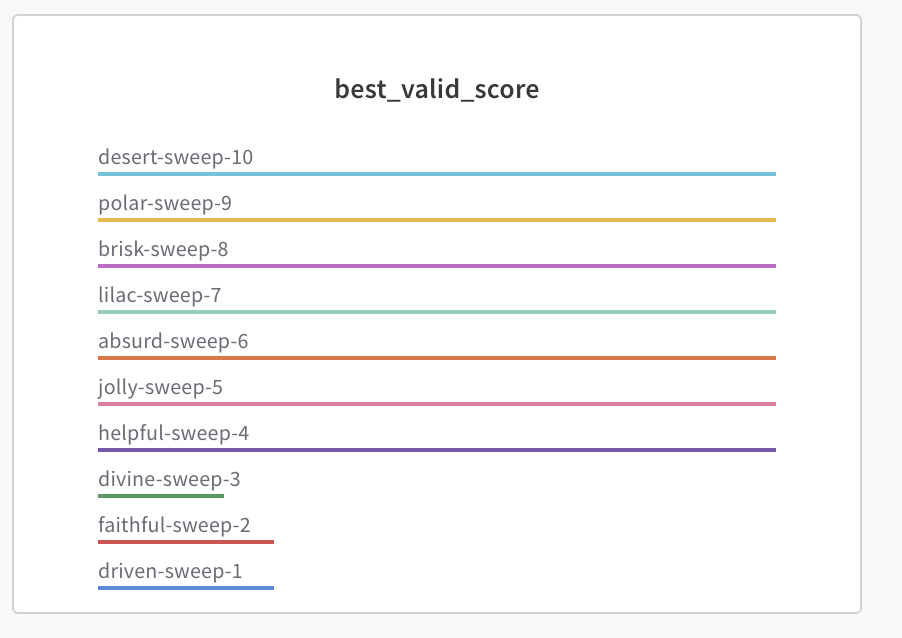 
* BPR 을 돌려보니까, 0.016이 최대이다. (1%에서)
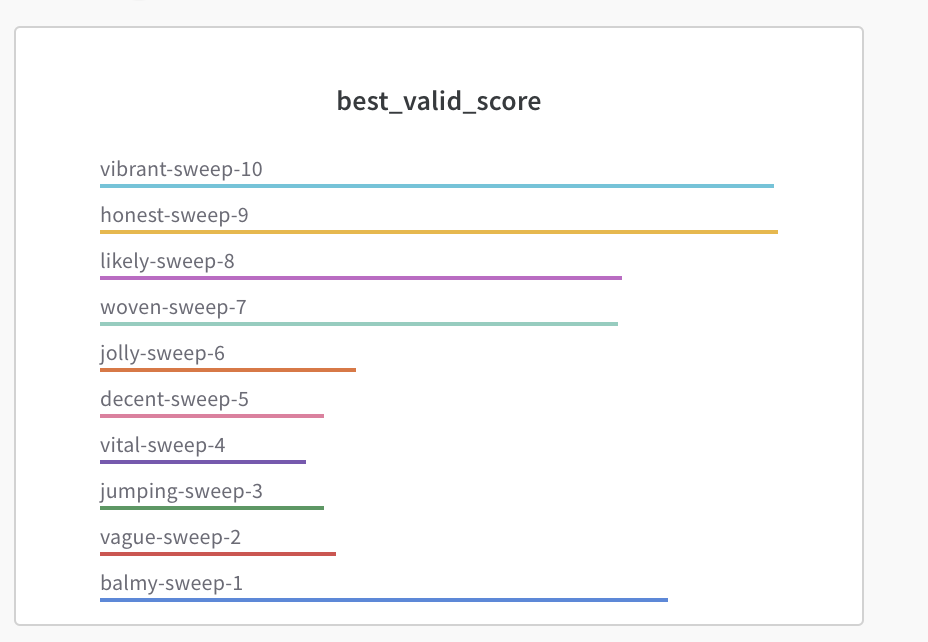

### NeuMF (~0.03)
은 0.03 정도였다. (1%에서) 그리고 편차가 BPR보다 작았다. 

### ConvNCF (0.025~0.027)
는 0.025~0.027인 것 같은데, 학습 시간이 아주 오래 걸렸다. 또한 GPU를 많이 잡아먹는 것 같아서, 쉽게 시도할 영역이 아닌 것 같기도 하다. 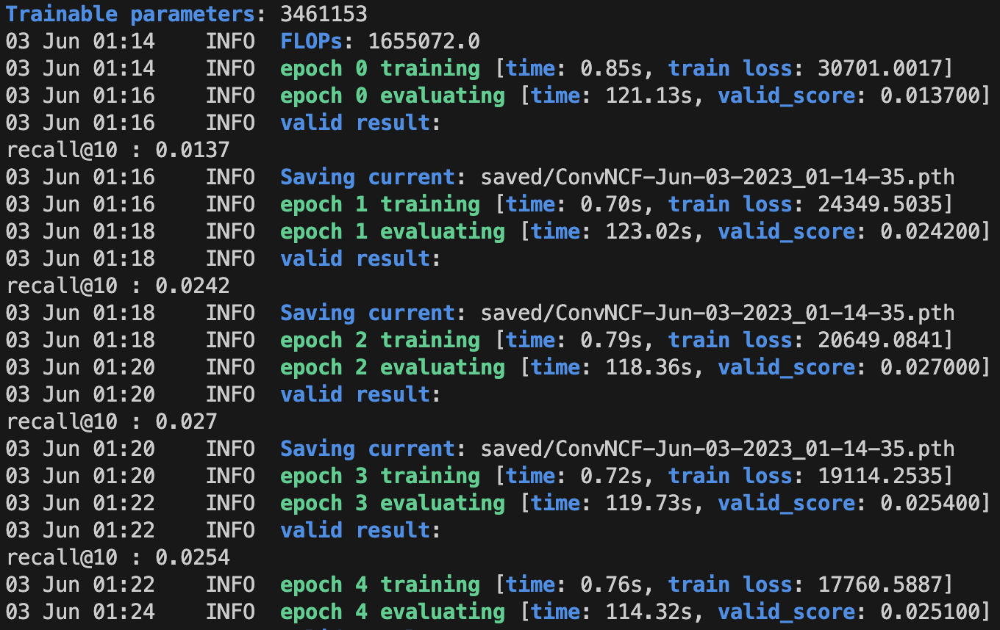
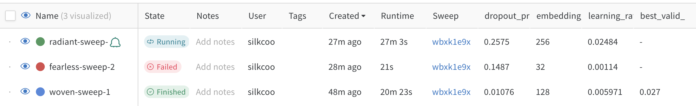
* Failed까지 뜬 걸 보면 용량을 많이 잡아먹는 것 같다. 따라서 보류.

### DMF (~0.03)
는 기본 모델로 돌렸을때 0.03까지 나왔음. 파라미터별로 변동성이 큰지 안큰지는 확인 안해봤음.

### FISM (~0.034)
은 0.034 정도까지 나왔는데, 1%만 사용했음에도 이정도의 가능성이 보였음. 

### NAIS (0.0022)
는 0.0022인데, 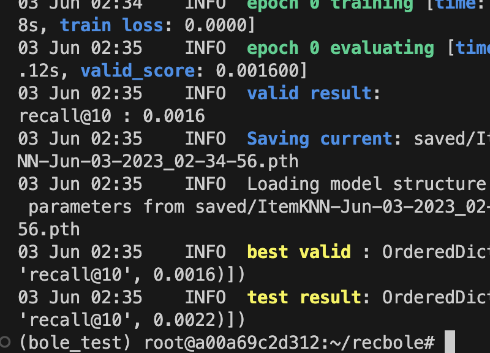 이런 느낌인 걸로 봐서는 따로 학습하는 것이 아닌 것 같다.

### NGCF는 다음과 같은 느낌이다. train_loss 자체가 작은데 그 이유가 뭐지? 개수를 작게 잡아서 그럴지도 모른다. 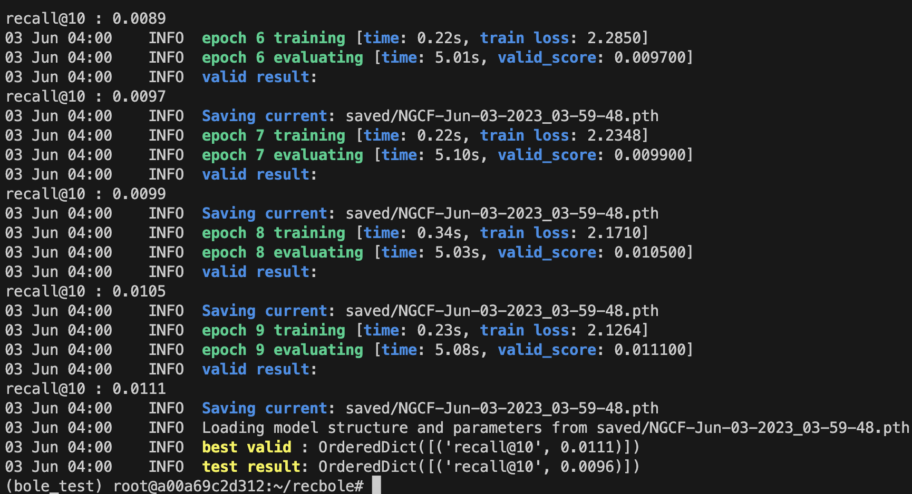
* SpectralCF 는 학습속도도 빠르고 점수도 0.0283? 
  
### GCMC (0.0298?)
* GCMC는 작은 데이터셋에 대해서는 과적합이 심한 것일까? 0.03을 넘지 못했고, 학습속도가 꽤 오래 걸린다. 이 말은 데이터셋이 100배 늘어나면 아주 오래 걸릴 것이란 뜻이다. 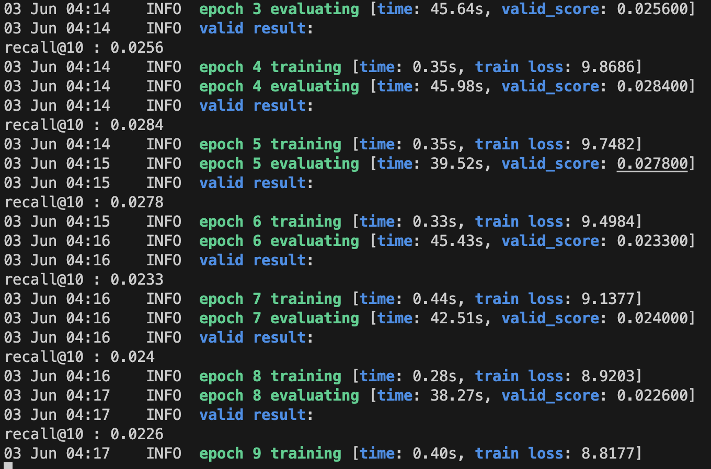 그런데 valid는 0.298정도인데 테스트가 0.0336? 정도면 괜찮은데?
### LightGCN (0.0191, 0.0212)
* 파라미터 수 1717952
* 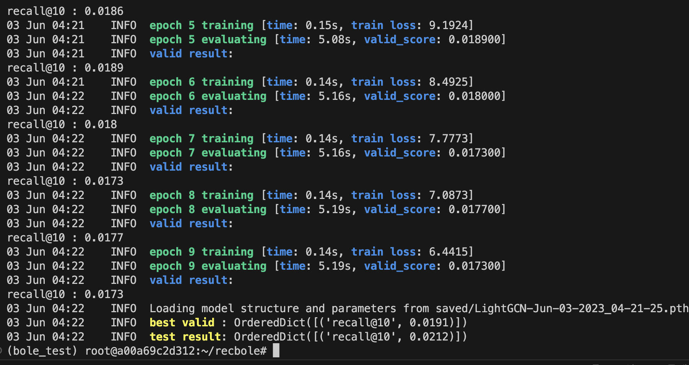

### DGCF 
* 파라미터수 1717952
* 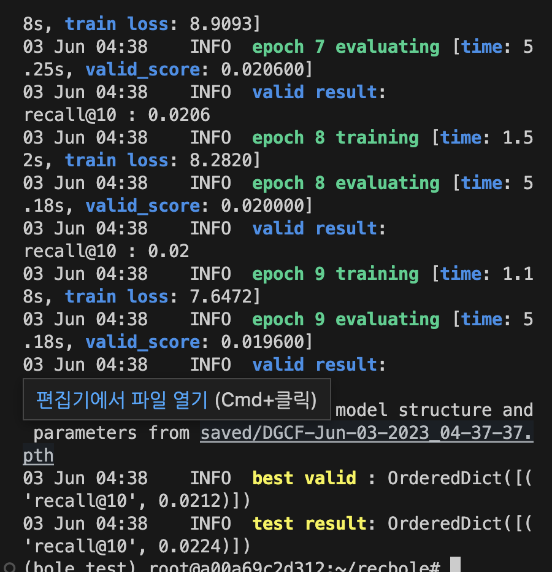 

### LGCN 모델과 DGCF 모델의 차이, 그리고 장단점
DGCF와 LightGCN은 둘 다 그래프 컨볼루션 네트워크를 기반으로 하는 모델입니다. 그러나 그들의 목표와 방법론에는 몇 가지 차이점이 있습니다.

**DGCF (Disentangled Graph Collaborative Filtering)**

DGCF는 사용자-아이템 상호작용 그래프에서 이질적인 관계를 분리하여 개별적으로 학습하고, 이러한 관계를 융합하여 최종 추천을 생성하는 방법을 제안합니다. DGCF는 사용자의 개인적인 편향과 사용자 간의 소셜 영향력을 분리하여 더 정확한 추천을 생성하려는 노력을 합니다.

**장점**: 
- DGCF는 그래프 구조를 사용하여 복잡한 사용자-아이템 상호작용을 모델링합니다.
- 이질적인 관계를 분리하여 학습하므로 각 관계의 별도의 영향력을 파악할 수 있습니다.

**단점**:
- 모델의 복잡성과 계산량이 늘어나므로 학습 시간이 길어질 수 있습니다.
- 모델의 효과는 주로 데이터가 충분히 크고 복잡할 때 나타납니다.

**LightGCN (Light Graph Convolutional Network)**

LightGCN은 그래프 컨볼루션 네트워크 (GCN)의 변형으로, 복잡한 레이어 정규화와 비선형 활성화 함수를 제거하여 모델의 복잡성을 줄이고 성능을 향상시키려고 합니다.

**장점**: 
- 모델이 간단하고 직관적이므로 이해하기 쉽고 구현하기 쉽습니다.
- 불필요한 요소를 제거함으로써 성능이 향상되며, 이는 여러 벤치마크 데이터 세트에서 입증되었습니다.

**단점**:
- 비선형 활성화 함수와 레이어 정규화를 제거하므로, 일부 복잡한 사용자-아이템 상호작용을 제대로 모델링하지 못할 수 있습니다.
- 그래프 구조의 정보만을 사용하여 추천을 생성하므로, 추가적인 사용자나 아이템의 특성을 고려하지 않습니다. 

두 모델 모두 그래프 정보를 이용하여 사용자와 아이템 사이의 복잡한 상호작용을 모델링하려고 시도하지만, 그들의 접

근 방식과 중점은 다릅니다. 선택할 모델은 당신의 문제 정의, 사용 가능한 데이터, 그리고 계산 자원 등에 따라 달라질 수 있습니다.

### LINE 모델 (성능이 좋지는 않음)
* 파라미터수 3435904
* 근데 train_loss가 음수가 나오는데 그 이유가 있는가? LINE 모델은 무엇인가?
* 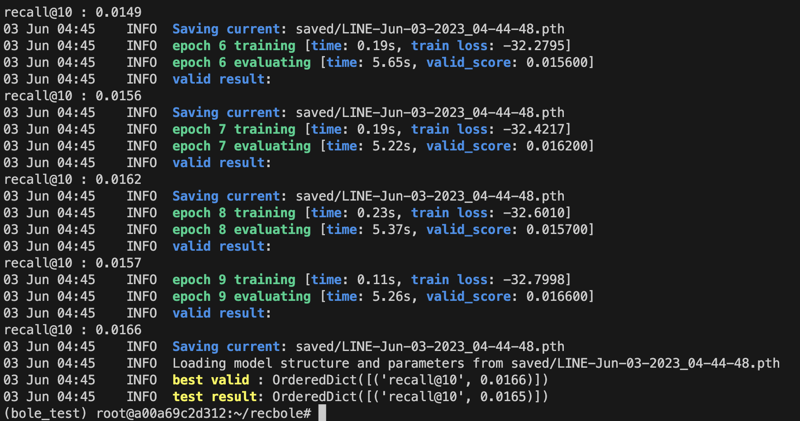 

### MultiVAE (best valid : OrderedDict([('recall@10', 0.0301)]) test result: OrderedDict([('recall@10', 0.033)]))
* 파라미터수 6492637 * 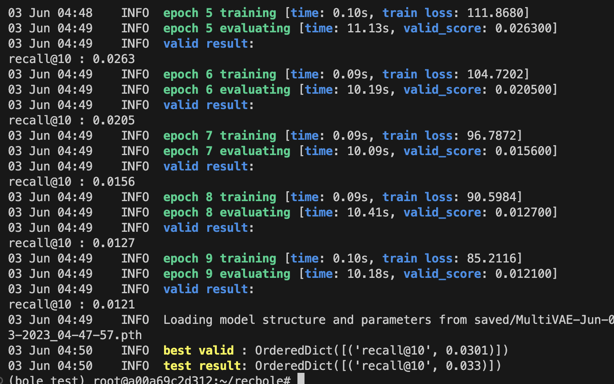
* epoch 10만 돌리고 있는데, 금방 과적합이 되어버리는 경향이 있는 것 같기도?

RecBole에서 제공하는 General Recommendation 모델 중 대규모 데이터셋에 대해 잘 작동하는 모델은 아래와 같습니다:

1. **BPR (Bayesian Personalized Ranking):** 이 모델은 명시적인 평점 대신 사용자의 선호도 순위를 학습합니다. 이러한 접근 방식은 대규모 데이터셋에 잘 확장되며, 종종 implicit feedback 데이터셋에서 잘 작동합니다.

2. **NeuMF (Neural Matrix Factorization):** NeuMF는 기존의 Matrix Factorization 방식에 딥러닝 요소를 추가한 모델입니다. 이 모델은 대용량 데이터셋에 잘 확장될 수 있습니다.

3. **LightGCN:** LightGCN은 복잡한 변환을 최소화하여 더 간단하고 효과적인 GNN을 제안합니다. 이 간단한 설계 덕분에 LightGCN은 대규모 데이터셋에서 효과적으로 작동합니다.

4. **EASE (Embarrassingly Shallow AutoEncoders for Sparse Data):** 이 모델은 매우 효율적인 메모리 사용량과 높은 처리 속도를 제공하므로 대용량 데이터셋에 잘 확장될 수 있습니다.

다른 모델들도 대규모 데이터셋에서 효과적일 수 있지만, 특히 복잡한 모델 (예: DGCF, RecVAE 등)의 경우, 모델 복잡도나 학습 시간이 크게 증가할 수 있으므로 주의가 필요합니다.

그리고 일반적으로, 모델이 작은 데이터셋에서 잘 작동하지 않는다면, 같은 모델이 큰 데이터셋에서 잘 작동할 가능성은 적습니다. 그러나, 항상 그런 것은 아닙니다. 데이터 분포의 변화, 데이터 품질, 데이터에 내재된 패턴 등 다양한 요인이 모델의 성능에 영향을 미치기 때문에, 경우에 따라서는 1% 데이터에서 성능이 나쁘더라도 전체 데이터에서는 성능이 좋아질 수 있습니다. 

그러므로 최적의 모델을 선택하는 가장 좋은 방법은 여러 모델을 테스트하고 검증하는 것입니다. 이를 위해 교차 검증, 그리드 검색, 랜덤 검색 등의 기법을 사용하여 모델 성능을 향상시킬 수 있습니다.

### MultiDAE (test 0.0329)
* 파라미터수 6454173 
* 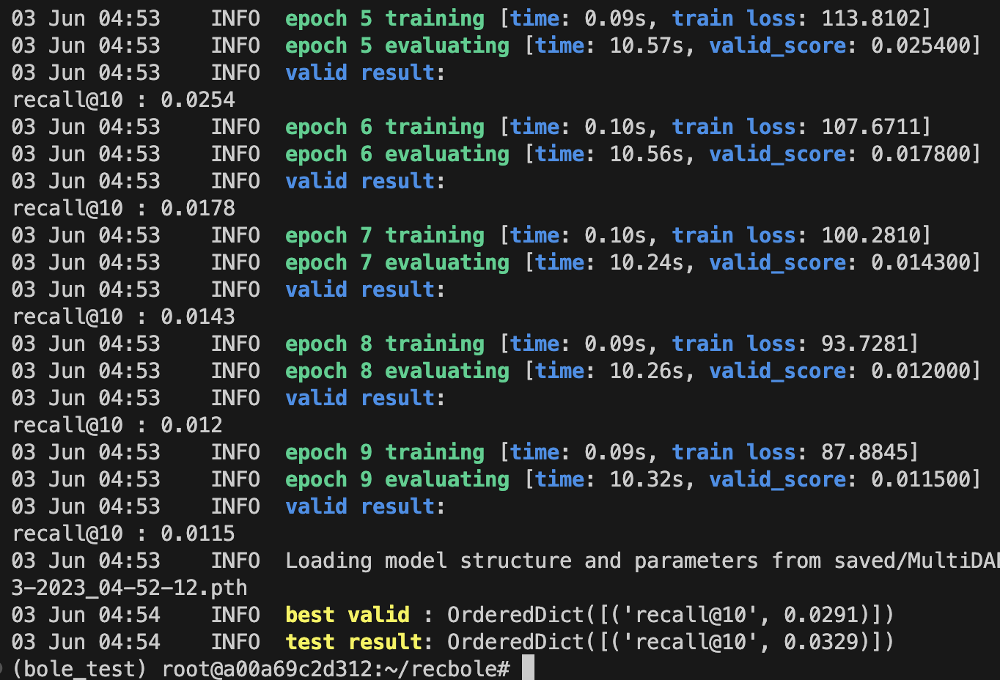
* 0.0329인데, 할만하지 않을까?
* 근데 이것도 조금 빠르게 과적합되는 느낌이 있네

### MacridVAE
* 파라미터수 3603344
* MultiVAE의 변형이라고 하는 것 같은데, 자세한 정보를 알 수가 없네. 파라미터수가 절반으로 감소한 것 같다. 일단은 맥크리드VAE는 이미지와 텍스트를 모두 처리할 수 있게 만든 모델이라고 Bard가 이야기했는데, 그 정보를 믿을 수 있는지는 몰?루?
* 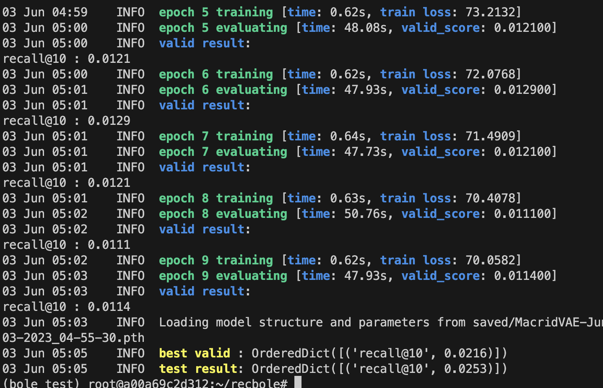 

### CDAE
Collaborative Denoising AutoEncoder(CDAE)는 암묵적 피드백(implicit feedback)을 기반으로 한 추천 시스템을 위한 모델입니다. 2016년에 제안된 이 모델은 원래 사용자-아이템 상호작용 행렬의 빈 공간을 채우기 위해 개발되었습니다.

CDAE의 핵심 아이디어는 denoising autoencoder의 원리를 이용하여, 입력으로 들어온 사용자-아이템 상호작용을 재구성하는 것입니다. 그러나 입력의 일부가 무작위로 제거(즉, noise가 추가)된 상태에서 이 재구성이 수행되므로, 모델은 노이즈가 없는 원래의 입력을 복원하는 방법을 학습하게 됩니다. 이러한 과정을 통해, 모델은 사용자의 아이템에 대한 선호도를 보다 잘 모델링하게 됩니다.

CDAE의 장점:

암묵적 피드백 처리: CDAE는 암묵적 피드백(예: 클릭, 조회 등)을 잘 처리합니다. 이러한 데이터는 사용자의 긍정적인 피드백을 나타내지만, 사용자가 특정 아이템에 대해 의견을 내지 않은 경우의 의미에 대해 모호합니다. CDAE는 이러한 문제를 처리하는 데 효과적입니다.

고차원 및 희소 데이터 처리: CDAE는 고차원 및 희소한 사용자-아이템 상호작용 데이터를 처리하는 데 유용합니다.

CDAE의 단점:

새로운 아이템에 대한 처리: CDAE는 새로운 아이템(즉, 모델이 학습 과정에서 본 적 없는 아이템)에 대해 추천을 생성하는 데 어려움이 있습니다. 이는 모든 항목이 모델 학습 과정에 포함되어야 하기 때문입니다.

계산 비용: 큰 데이터셋에서 CDAE를 학습하는 것은 계산적으로 많은 비용이 들 수 있습니다. 이는 사용자와 아이템 간의 모든 가능한 상호작용을 모델링하려는 모델의 특성 때문입니다.

모델의 선택은 항상 당신의 특정 문제와 데이터에 의존하기 때문에, CDAE가 특정 문제에 가장 적합한 모델인지 확인하려면 직접 실험을 수행해야 합니다.

Collaborative Denoising AutoEncoder(CDAE)를 사용하는 주된 목적은 추천 시스템에서 사용자-아이템 상호작용에 기반한 고도의 개인화된 추천을 생성하는 것입니다. CDAE는 사용자와 아이템 간의 복잡한 상호작용을 학습하고 모델링하여, 사용자의 선호도를 더 잘 이해하고, 그에 따라 사용자가 관심을 가질 가능성이 높은 아이템을 추천합니다.

CDAE는 특히 암묵적 피드백 데이터(예: 사용자의 클릭, 조회 등)를 처리하는데 효과적입니다. 이러한 데이터는 사용자가 아이템을 얼마나 좋아하는지에 대한 강력한 신호를 제공하지만, 사용자가 아이템에 대해 의견을 내지 않은 경우의 의미는 불분명합니다. CDAE는 이러한 암묵적 피드백의 불확실성을 모델링하는데 도움을 줍니다.

더 나아가, CDAE는 대규모, 고차원, 희소한 사용자-아이템 상호작용 데이터를 처리하는데 유용합니다. 이는 실제 세계의 많은 추천 시스템 시나리오에서 공통적으로 나타나는 특성입니다. 이러한 이유로, CDAE는 사용자에게 맞춤화된 아이템 추천을 제공하는 다양한 추천 시스템에서 사용됩니다.

희소 데이터를 처리하기 좋다고 하는데 결과는 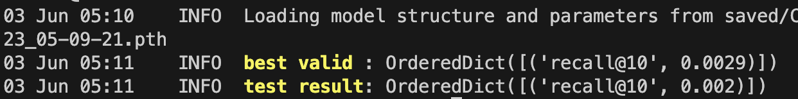 

* 학습 속도는 빠르긴 하다.
### ENMF 
ENMF(Explainable Neural Matrix Factorization)는 추천 시스템에서 사용하는 알고리즘 중 하나로, 이 모델의 핵심 목표는 기존의 Matrix Factorization(MF) 기법을 확장하여 더욱 풍부한 사용자와 아이템의 상호작용 패턴을 학습하는 것입니다.

ENMF는 각 사용자와 아이템에 대한 잠재 요인(latent factors)을 학습하고, 이를 사용하여 사용자-아이템 행렬의 누락된 항목을 예측합니다. 그러나 기본 MF와 달리, ENMF는 뉴럴 네트워크를 사용하여 잠재 요인을 모델링하고 예측력을 향상시킵니다. 뉴럴 네트워크는 비선형 패턴을 학습할 수 있기 때문에, ENMF는 사용자와 아이템 간의 복잡한 상호작용을 더 잘 캡처할 수 있습니다.

ENMF의 장점:
1. 뉴럴 네트워크를 사용하므로, 사용자와 아이템 간의 복잡한 상호작용을 더 잘 학습할 수 있습니다.
2. 사용자와 아이템의 특성을 잘 포착하여, 더 정확한 예측을 제공할 수 있습니다.
3. 추천의 해석 가능성을 높이는데 유용합니다. MF 모델은 보통 "블랙박스"로 간주되지만, ENMF는 뉴럴 네트워크의 중간 계층을 통해 추천의 원인을 설명하는 데 도움이 될 수 있습니다.

ENMF의 단점:
1. 뉴럴 네트워크를 학습하는 것은 종종 복잡하고 시간이 많이 걸릴 수 있습니다. 따라서, ENMF는 계산적으로 더욱 요구사항이 높습니다.
2. ENMF는 하이퍼파라미터가 많이 필요하며, 이를 최적화하는 것이 어려울 수 있습니다. 이로 인해 모델의 성능이 상당히 민감하게 반응할 수 있습니다.
3. MF와 마찬가지로, ENMF는 "cold-start" 문제에 대해 취약합니다. 즉, 새로운 사용자나 아이템에 대한 정보가 부족할 때 예측력이 떨어집니다.

참고로, 제가 제공한 이 내용은 대략적인 개요이며, 실제로 ENMF를 적용할 때는 모델의 구체

적인 세부 사항과 사용자와 아이템의 특성, 그리고 목표 작업에 따라 성능과 적합성이 달라질 수 있습니다.

* train_loss가 무한대로 발산하고 있는데 이게 맞나?
* 일단 epoch11까지는 무난하게 0.002부터 0.02까지 올라가길래 epoch 100으로 실험해봤구만.... 아깝다.

### NNCF 모델 
