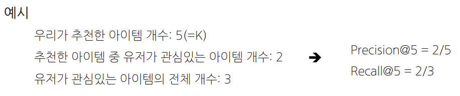
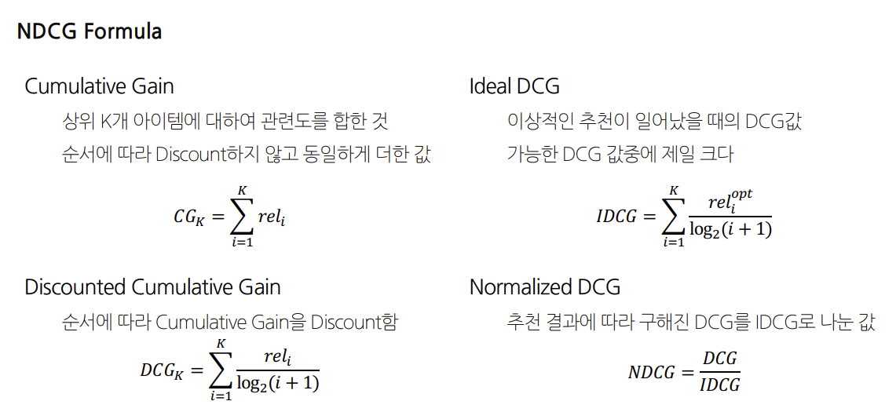
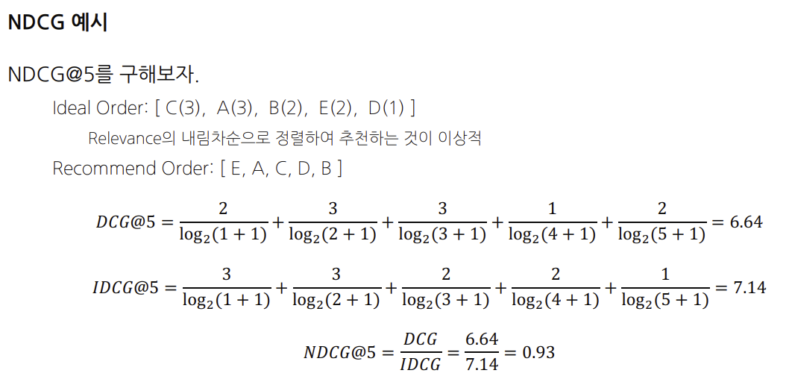

## Explicit Feedback
* 유저에게 아이템에 대한 만족도를 직접 물어본 경우
## Implicit Feedback
* 유저가 아이템을 클릭하거나 구매한 경우 

# 추천 문제 정의
* 추천문제는 랭킹 또는 예측을 하는 것이다.
## 랭킹 : 유저에게 적합한 아이템 Top K개를 추천하는 문제
* Top K 개를 선정하기 위한 기준 혹은 스코어가 필요하지만, 유저가 아이템에 가지는 정확한 선호도를 구할 필요는 없음 
* **평가 지표 : Precision@K, Recall@K, MAP@K, NDCG@K, Hit Rate**

## 예측 : 유저가 아이템을 가질 선호도를 정확하게 예측 
* Explicit Feedback : 철수가 아이언맨에 대해 내릴 평점 값을 예측
* Implicit Feedback : 영희가 아이폰12를 조회하거나 구매할 확률값을 예측
* 유저-아이템 행렬을 채우는 문제
* **평가 지표 : MAE, RMSE, AUC**

## 새로 적용한 추천 시스템 혹은 추천 모델의 성능 평가는 어떻게 해야하는가?
* 비즈니스 / 서비스 관점
  * 추천 시스템 적용으로 인해 매출 및 PV 증가
  * 추천 아이템으로 인해 유저의 CTR 상승
* 품질 관점
  * 연관성
  * 다양성
  * 새로움
  * 참신함

# Precision/Recall@K
* Precision@K 
  * 우리가 추천한 K개 아이템 가운데 실제 유저가 관심있는 비율
* Recall@K
  * 유저가 관심있는 전체 아이템 가운데 우리가 추천한 아이템의 비율

* AP@K 
  * Precision@1부터 Precision@K 까지의 평균값
  * Precision@K와 달리, 관련 아이템을 더 높은 순위에 추천할수록 점수가 상승함
    * $AP@K$ = $\dfrac{1}{m}\sum_{i=1}^{K}Precision@i$
> 물론입니다. 이해를 돕기 위해 간단한 토이 데이터셋을 이용해 AP@K를 계산해보겠습니다.
>
>먼저, 실제로 사용자가 좋아하는 아이템의 리스트와 추천 시스템이 생성한 아이템의 리스트를 준비하겠습니다. 
>
>사용자가 좋아하는 아이템 리스트: ['아이템1', '아이템2', '아이템3', '아이템4', '아이템5']
>추천 시스템이 생성한 아이템 리스트: ['아이템6', '아이템1', '아이템2', '아이템3', '아이템4'] 
>
>이때 K를 5로 가정하겠습니다. 
>
>AP@K의 계산은 다음과 같습니다:
>
>1. Precision@1: '아이템6'은 관련 없는 아이템이므로 0입니다.
>2. Precision@2: '아이템1'은 관련 있는 아이템이므로 1/2=0.5입니다.
>3. Precision@3: '아이템2'는 관련 있는 아이템이므로 2/3=0.67입니다.
>4. Precision@4: '아이템3'은 관련 있는 아이템이므로 3/4=0.75입니다.
>5. Precision@5: '아이템4'는 관련 있는 아이템이므로 4/5=0.8입니다.
>
>이제 이 값을 모두 더하고 개수로 나눠주면 AP@K를 얻을 수 있습니다.
>
>$AP@K = (0 + 0.5 + 0.67 + 0.75 + 0.8) / 5 = 0.544$
>추천 시스템이 생성한 아이템 리스트의 순서가 변경되면 Precision@K의 각 값은 바뀌지 않을 수 있지만, AP@K는 바뀔 수 있습니다.
>
>예를 들어, 아래와 같은 새로운 추천 리스트를 고려해봅시다:
>추천 시스템이 생성한 아이템 리스트: ['아이템1', '아이템6', '아이템2', '아이템3', '아이템4']
>
>이때 K는 여전히 5라고 가정하겠습니다.
>
>AP@K의 계산은 다음과 같습니다:
>
>Precision@1: '아이템1'은 관련 있는 아이템이므로 1입니다.
>Precision@2: '아이템6'은 관련 없는 아이템이므로 1/2=0.5입니다.
>Precision@3: '아이템2'는 관련 있는 아이템이므로 2/3=0.67입니다.
>Precision@4: '아이템3'는 관련 있는 아이템이므로 3/4=0.75입니다.
>Precision@5: '아이템4'는 관련 있는 아이템이므로 4/5=0.8입니다.
>이제 이 값을 모두 더하고 개수로 나눠주면 AP@K를 얻을 수 있습니다.
>
> $$AP@K = (1 + 0.5 + 0.67 + 0.75 + 0.8) / 5 = 0.744$$
>
>이전 예제의 AP@K 값(0.544)과 비교하면, 관련 있는 아이템이 더 높은 순위에 위치할수록 AP@K 값이 더 높아지는 것을 볼 수 있습니다. 따라서 AP@K는 추천 리스트에서 관련 있는 아이템의 순위를 중요하게 고려합니다.
>
>이렇게 구한 AP@K는 상위 5개의 추천 아이템에서 관련 있는 아이템이 높은 순위에 있을수록 높아지는 특성을 반영하고 있습니다.
>
* MAP@K
  * 모든 유저에 대한 AP@K의 평균
    * $MAP@K$ = $\dfrac{1}{|U|}\sum_{u=1}^{|U|}\left( AP@K \right)_u$
* NDCG (Normalized Discounted Cumulative Gain)
  * 추천 시스템에 가장 많이 사용되는 지표 중 하나, 원래는 검색(Information Retrieval)에서 등장한 지표 
  * Precision@K, MAP@K와 마찬가지로 Top K 리스트를 만들고, 유저가 선호하는 아이템을 비교하여 값을 구함.
  * MAP@K와 마찬가지로 추천의 순서에 가중치를 더 많이 두어 성능을 평가하며 $1$에 가까울수록 좋다.
  * MAP과 달리, 연관성을 이진(binary)값이 아닌 수치로도 사용할 수 있기 때문에 유저에게 얼마나 더 관련 있는 아이템을 상위로 노출시키는지 알 수 있다.

>먼저, 관련도(Relevance)는 추천 시스템이 추천하는 아이템이 사용자의 요구나 선호와 얼마나 잘 맞는지를 수치로 표현한 것입니다. 이 값은 특정 사용자가 특정 아이템에 대해 부여한 평점, 클릭 여부, 구매 이력 등 다양한 방식으로 계산될 수 있습니다. 예를 들어, 영화 추천 시스템에서는 사용자가 영화에 부여한 별점이 관련도가 될 수 있습니다.
>그리고 누적 이득(Cumulative Gain)은 상위 K개 아이템의 관련도를 모두 합한 것입니다. 이때 순서에 따른 가중치는 부여하지 않으므로, 아이템이 추천 리스트에서 어느 위치에 있는지는 고려하지 않습니다.
>
>예를 들어, 아래와 같은 추천 리스트와 관련도가 있다고 가정해봅시다.
>
>추천 시스템이 생성한 아이템 리스트: ['아이템1', '아이템2', '아이템3', '아이템4', '아이템5']
>
>각 아이템의 관련도(예: 사용자의 별점): [5, 3, 4, 1, 2]
>
>이때 상위 3개 아이템에 대한 누적 이득(Cumulative Gain)은 아래와 같이 계산됩니다.
>
>Cumulative Gain@3 = 관련도(아이템1) + 관련도(아이템2) + 관련도(아이템3) = 5 + 3 + 4 = 12
>
>따라서 이 경우, Cumulative Gain@3은 12가 됩니다. 이것이 누적 이득의 개념입니다.
>
>하지만 추천 시스템의 성능을 평가할 때에는 보통 누적 이득만으로는 부족하고, 누적 할인 이득(Cumulative Discounted Gain)과 정규화된 누적 할인 이득(Normalized Cumulative Discounted Gain; NDCG)을 사용합니다. 이들은 추천 리스트에서 아이템의 위치를 고려하여, 상위에 위치한 아이템에 더 큰 가중치를 부여합니다. 이렇게 하면 추천 시스템이 관련도가 높은 아이템을 상위에 추천하도록 장려할 수 있습니다.

