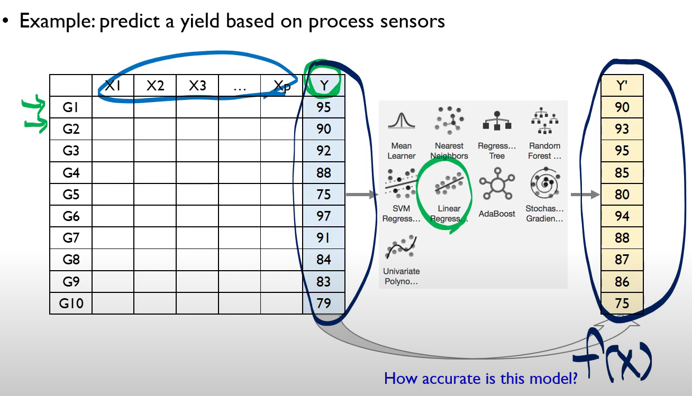
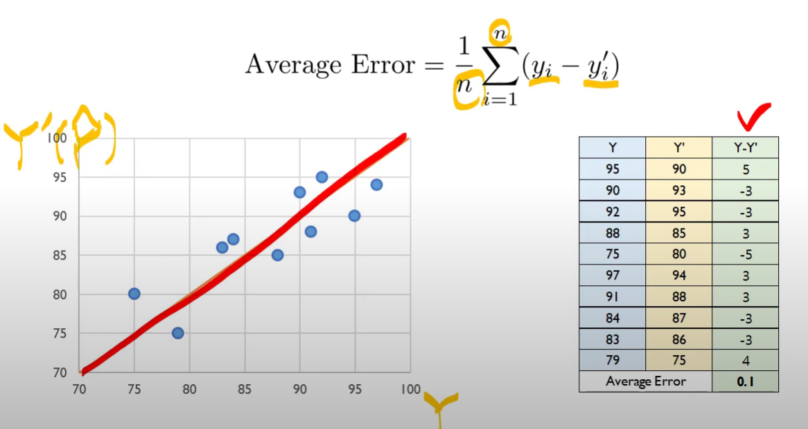
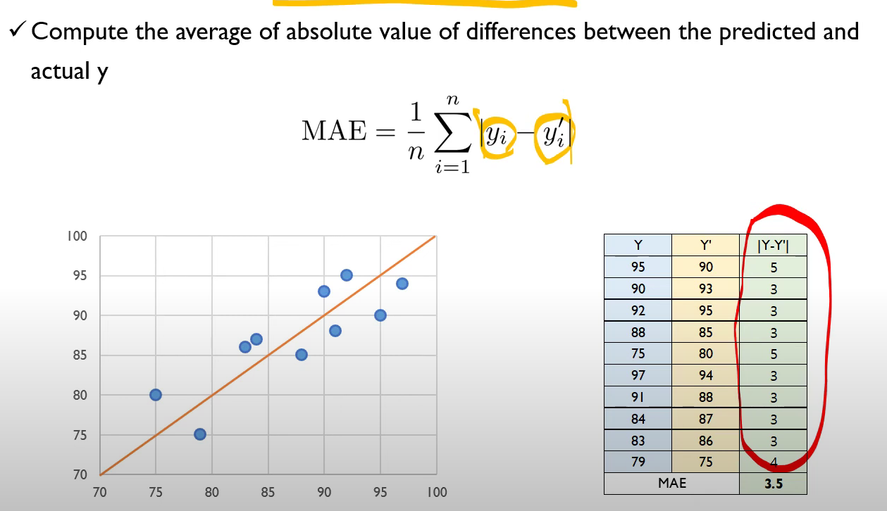
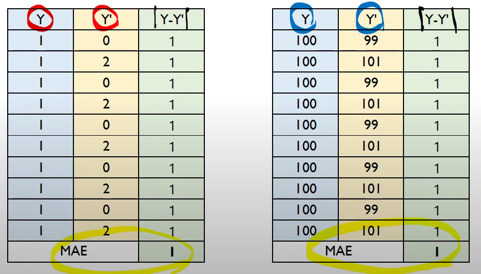
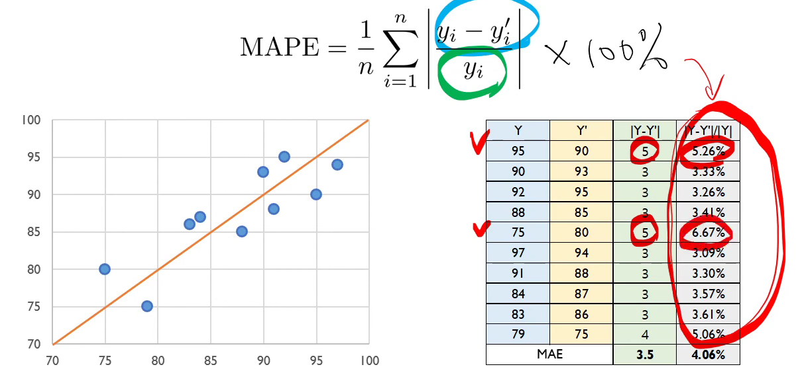
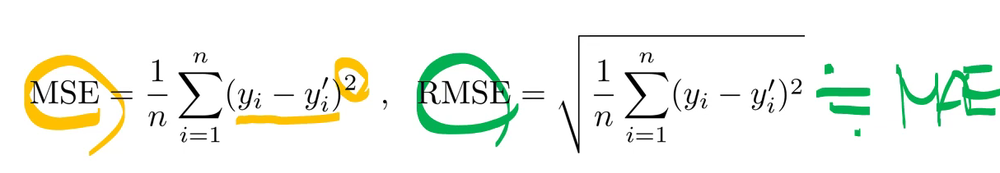

## AE (Average Error)
* Compare the average difference between the actual and predicted y
* Mislead to an inappropriate conclusion based on the sign effect 
* 부호 효과 때문에 사실은 사용하면 안되는 지표에 가깝다.

## MAE (Mean Absolute Error)
* Compare the average of absolute value of differences between the predicted and actual $y$
* 그런데 MAE조차도 아쉬운 부분이 있다. 

## Mean Absolute percentage Error (MAPE)
* MAE can only provide the degree of absolute difference between the predicted and actual $y$ but cannot provide the relative difference between them  
* Provide the relative absolute differnece in terms of %
* Commonly adopted by domains in which relative differences are more important than the absolute difference  

## (Root) Mean Squared Error ((R)MSE)
* Use the square instead of absolute value to resolve the effect of sign.
* 만약 데이터가 정규분포를 따르거나 극단적인 아웃라이어가 없는 경우 MAE와 유사해진다.
* MAP, MAPE는 실용적이지 않다. 그 이유는 절댓값을 씌웠기 때문에 미분이 불가능하기 때문이다. 