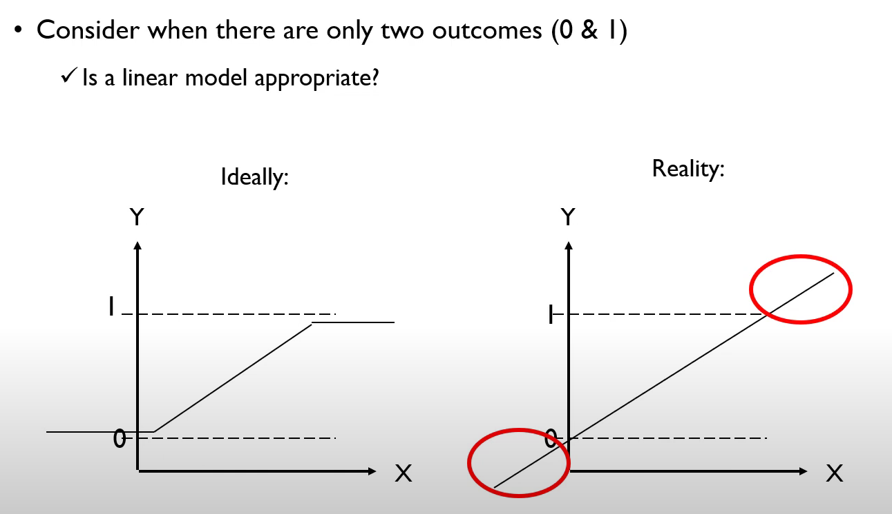
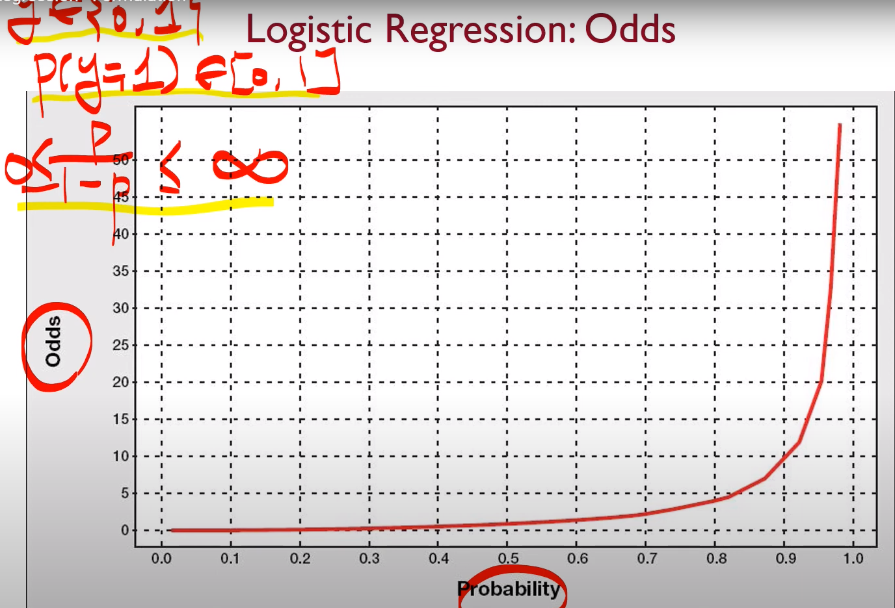
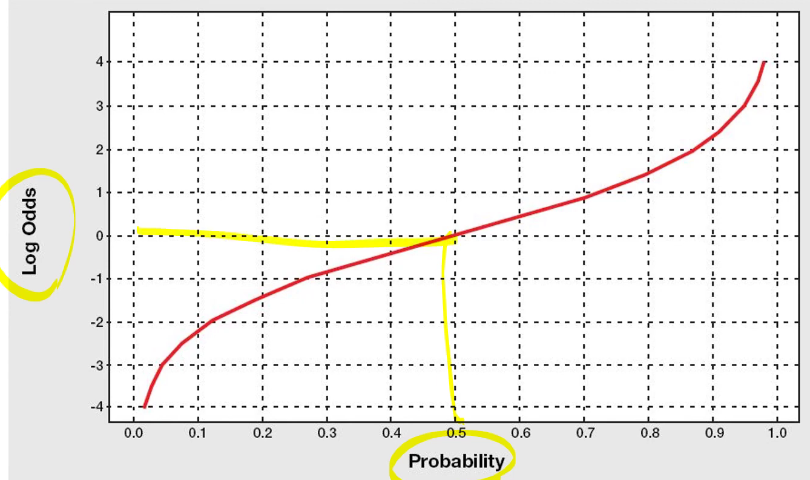
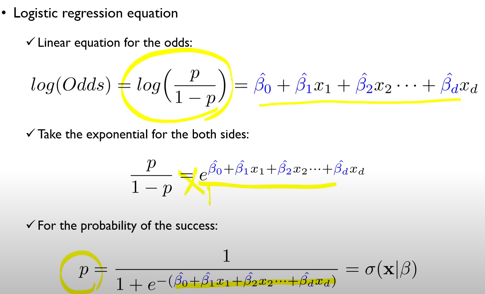
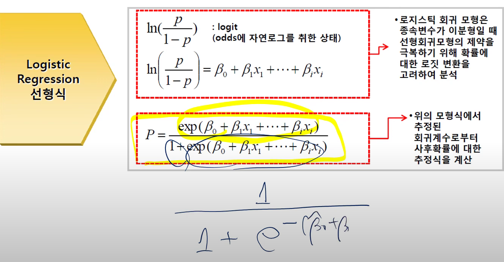

MLR은 Fit a linear relationship을 하는 것이었다.

* 왼쪽과 같은 회귀식이 나오면 좋겠지만, 기존의 회귀식은 오른쪽 그림과 같이 되어버린다. 그래서 로지스틱 회귀를 배운다.

### Problem
* Binary 분류의 경우, 가능한 결과는 0 또는 1 밖에 없다.
* 일반적인 선형 회귀식에서 설명변수들의 결합은, 범위에 대한 아무런 제약이 없다. 그래서 X들의 조합으로 가질 수 있는 범위와, 2범주 분류에서 y가 가질 수 있는 범위 사이에서 미스매치가 발생합니다.
* 오른쪽의 회귀식을 유지함으로써 얻을 수 있는 장점이 있다. 통계적으로 각각의 변수가 얼마나 설명력을 가지고 있는지를 알 수 있고, 또 해당 설명 변수가 증감에 따라 성공확률 혹은 특정범주에 들어갈지 아닐지를 결정해주는 역할을 할 수 있다.

### Logistic Regression : Goal
* Gold : Find a functino of the predictor variables that relates them to a 0/1 outcome 
* Features
  * Instead of Y as outcome variable (like in linear regression), we use a function of Y called the "logit"
  * Logit can be modeled as a linear function of the predictors
  * The logit can be mapped back to a probability, which, in turn, can be mapped to a class.

### Logistic Regress: Odds 
* 알아야 하는 개념이 있는데요, 우리 말로는 승산, 실제로는 Odds라는 용어가 있다.
* $Odds = \dfrac{p}{1-p}$
  * $p$ : probability of belonging to class 1 (success)
* For the previous examples
  * Winning odds of the Spain = $\dfrac{2}{9}$, then the winning probability of the spain = $\dfrac{2}{11}$
* 왜 승산의 개념을 도입했을까?
  * 우리가 추정해야하는 $y$값은 $0$ 또는 $1$이라는 discrete한 값을 가지고, 여기에 대해 해당 $P(y=1) \in [0,1]$이다. 여기에 승산이라는 개념을 도입함으로써 $0\leq\dfrac{p}{1-p}\leq \infty$를 표현할 수 있게 됐다. 
  * 하지만 이러한 승산이 가진 단점은 음수를 표현할 수 없다는 점과 비대칭이라는 점이다.
  * 그렇기 때문에 승산에 log를 씌워보자! 그러면 이제 $-\infty < \log(\dfrac{p}{1-p})<\infty$가 되면서 Symmetric하게 되었다. 
  * 그래서 다음과 같은 결론이 나옵니다.   두 페이지의 $p$에 대한 표현은 같은 식이다.