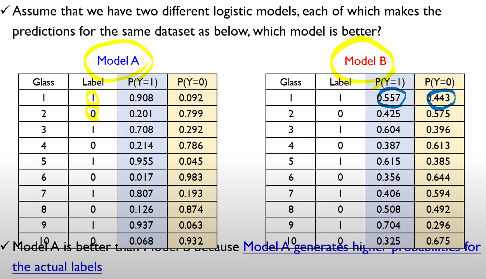
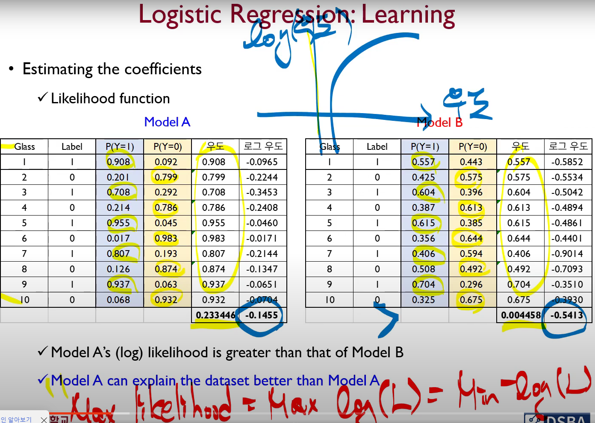
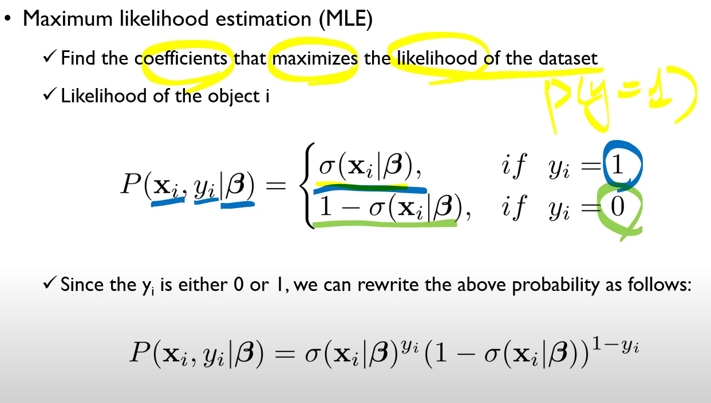
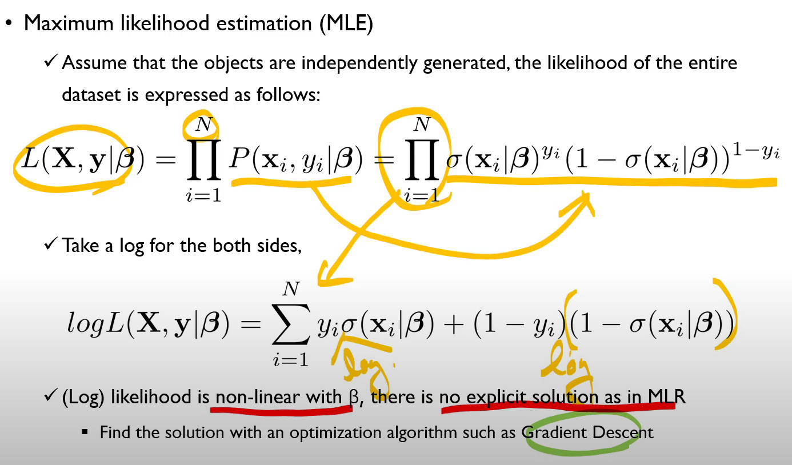
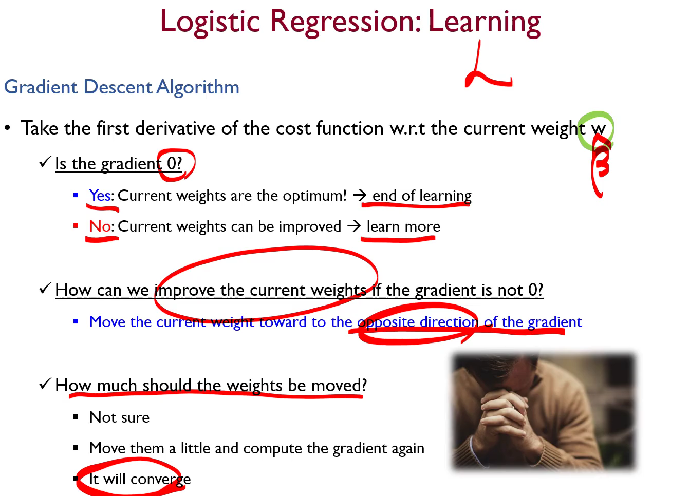
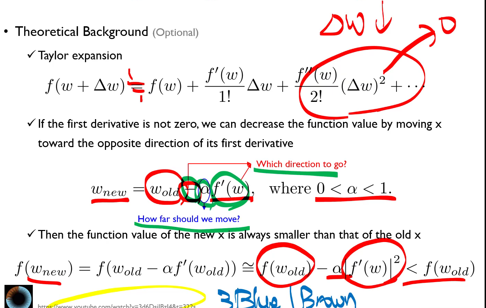
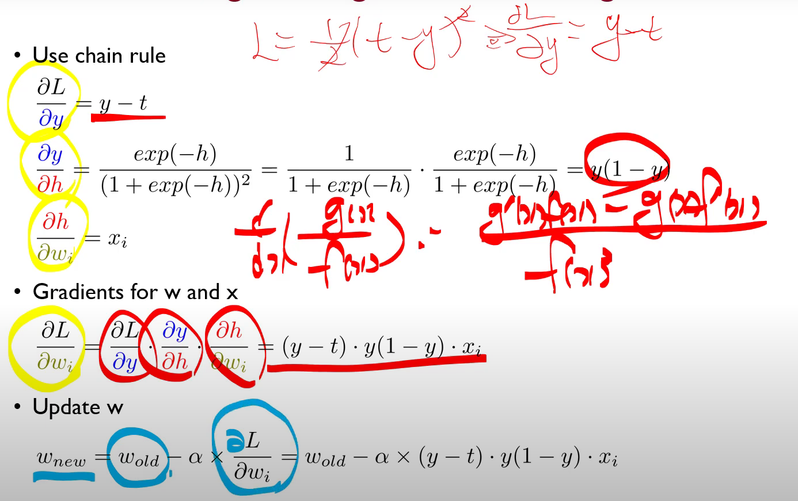
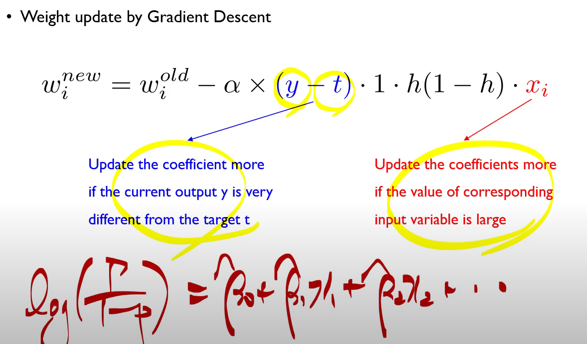
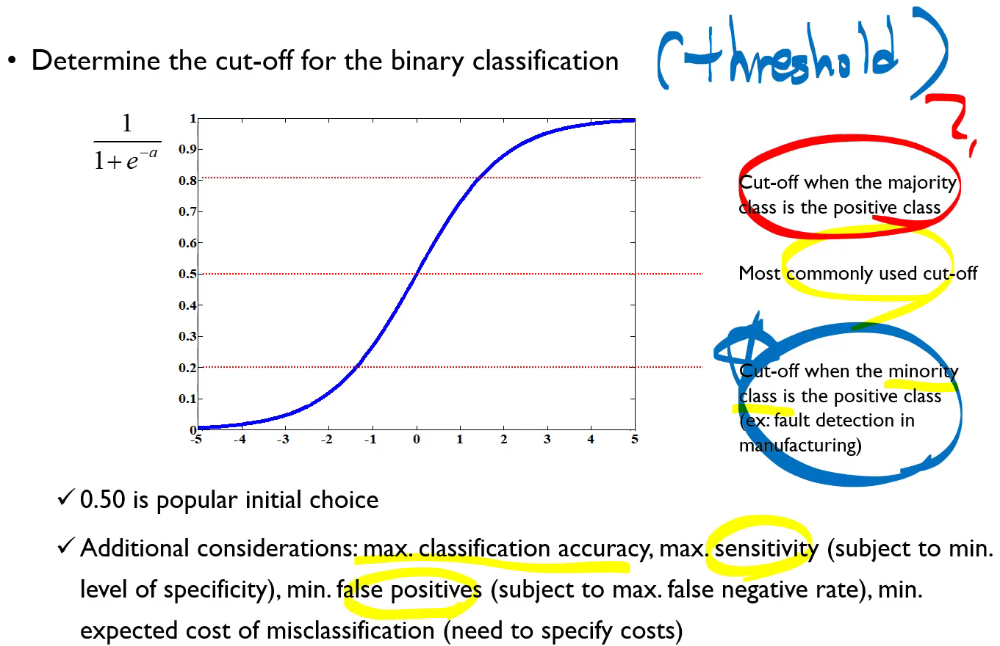

# Estimating the coefficients
선형회귀분석을 이야기하면서 강조했던 부분은, 선형회귀분석은 closed form 이 존재한다. $\hat{\beta}=(X^TX)^{-1}X^Ty$로 명시적으로 주어진다. 그러나 로지스틱 회귀는 해가 명시적으로 주어지지 않는다.
* 두 모델 Model A와 Model B 중에 어떤 모델이 더 좋은 것일까? 
* Model A가 Model B보다 더 확률을 높게 잡아주기 때문에 더 좋은 모델인 것 같다.

## Likelihood function
* Likelihood for an individual object is its predicted probability being classified as the correct class
  * Likelihood of Glass 1 is 0.908
  * Likelihood of Glass 2 is 0.799
* If the objects are assumed to be generated independently, the likelihood of the entire dataset is the product of every object's likelihood.
* Generally the likelihood of a dataset is very small (values between 0 and 1 are compounded), log-likelihood is commonly used.
* 모든 객체들이 i.i.d로 산출되었다면, $P(A,B)=P(A)*P(B)$이다. 데이터셋에 대한 likelihood는 노란색들을 전부 곱해서 산출할 수 있다. 
* **이걸 하기 위한 방법이 maximum likelihood estimation (MLE)**

## Maximum likelihood estimation (MLE)
* $\boldsymbol{\beta}$라는 회귀계수들이 추정되었다고 치고, x_i와 y_i 라는 종속변수들이 있을 때, 
*  

## Gradient Descent Algorithm
 

* When a set of predicotrs(independent variables) are given, we can estimate the probability of the success. S자의 커브를 갖는다는 게 중요한 의미를 갖는다.
* 왜 그러냐면, 실생활에선 어떤 변수가 다른 변수에 대해 완벽하게 선형적으로 비례하거나 하는 것이 아니라 특정 구간에서만 비례하는 양상이 있기 때문이다.

## Logistic Regression : Cut-Off
* Determine the cut-off for the binary classification
  * 0.5 is popular initial choice
  * Additional considerations : max.classification accuracy, max.sensitivity (subject to min. level of specificity), min false positives (subject to max.false negative rate), min.expected cost of misclassification 