# 1. Multiple Linear Regression
* Regression Example : Predict the selling price of Toyota Corolla 
* Goal
  * Fit a linear relationship between a quantitative dependent variable $Y$ and a set of predictors $X_1, X_2, \cdots, X_p$
  * 시스템이나 사람이 어떻게 할 수 없는 변동성을 노이즈($\epsilon$)라고 한다.  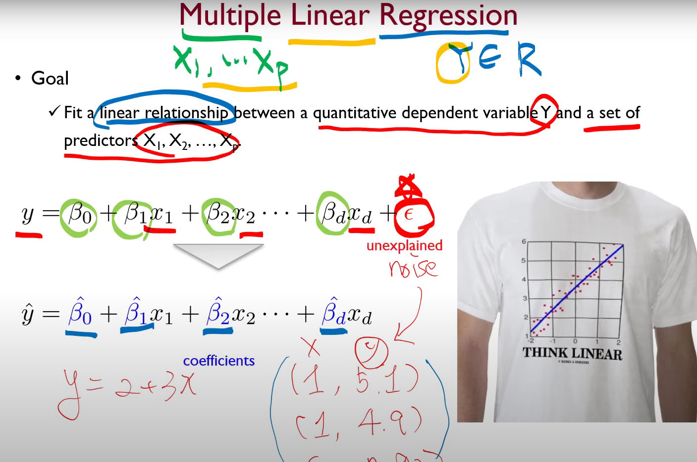
* 설명적 회귀 분석 vs 예측적 회귀 분석 
  * 설명적 회귀 분석이 분석 대상으로 하는 것은 $\beta$들이다. 얼마나 적합하게 $\beta$들이 추정되었고 각각의 변수들이 영향력을 갖는지를 보고 싶은 것이다.
  * Predictive Regression 같은 경우는 과거의 데이터들로 (미래의) 데이터들에 대해 라벨이 없을 때 얼마나 잘 예측하느냐를 목적으로 한다. 즉 이 경우에는 $Y$를 얼마나 잘 설명하는지, $Y$가 분석 대상이다. 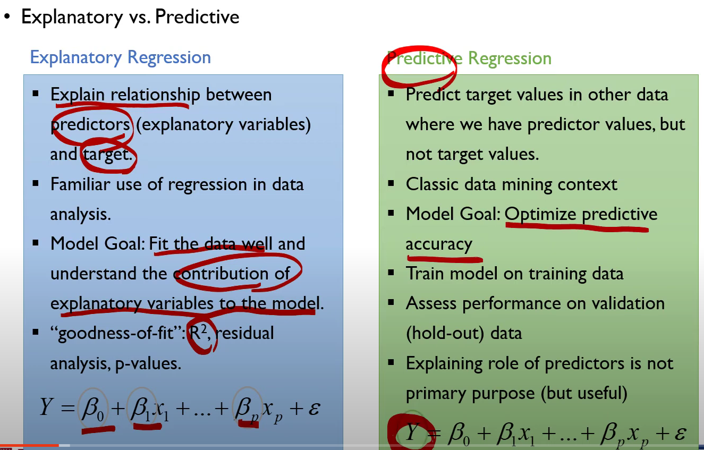
* 회귀모형의 타입은 2가지로 생각할 수 있다.
  * Simple & Multiple (How many $x$?) 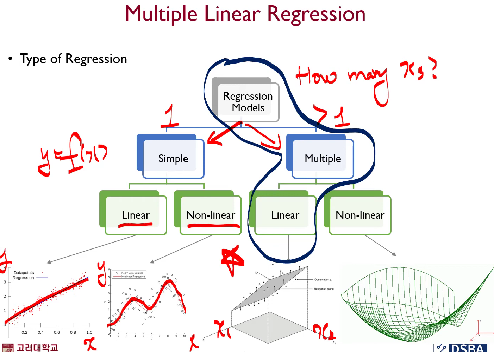
* > Linear Regression의 가장 큰 **가정**은 입력 변수와 타겟 변수 사이에 선형 관계가 있을 것이다.
* Estimating the coefficients

## Ordinary least square (OLS : 최소 자승법) : Minimize the squared difference between the actual target value and the estimated value by the regression model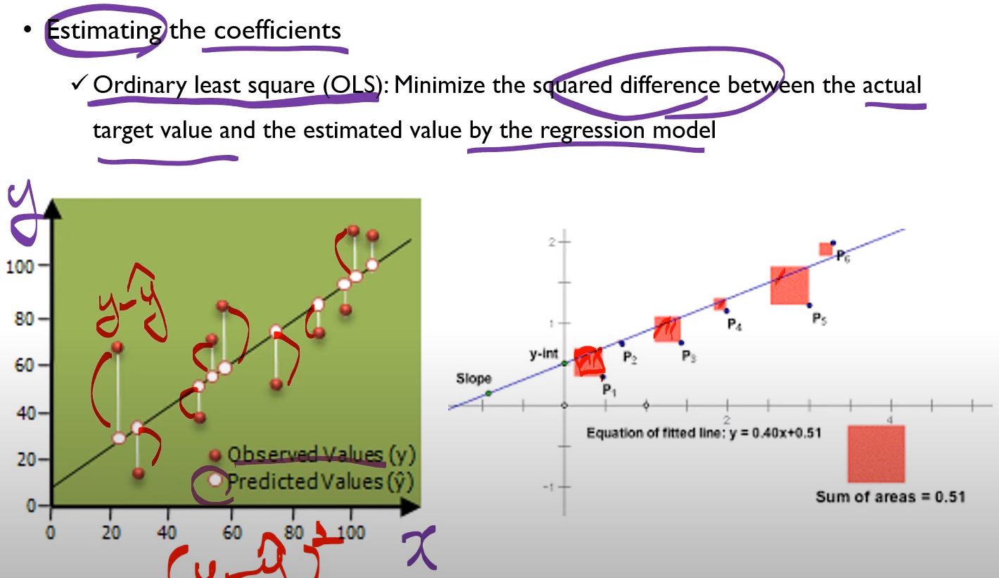 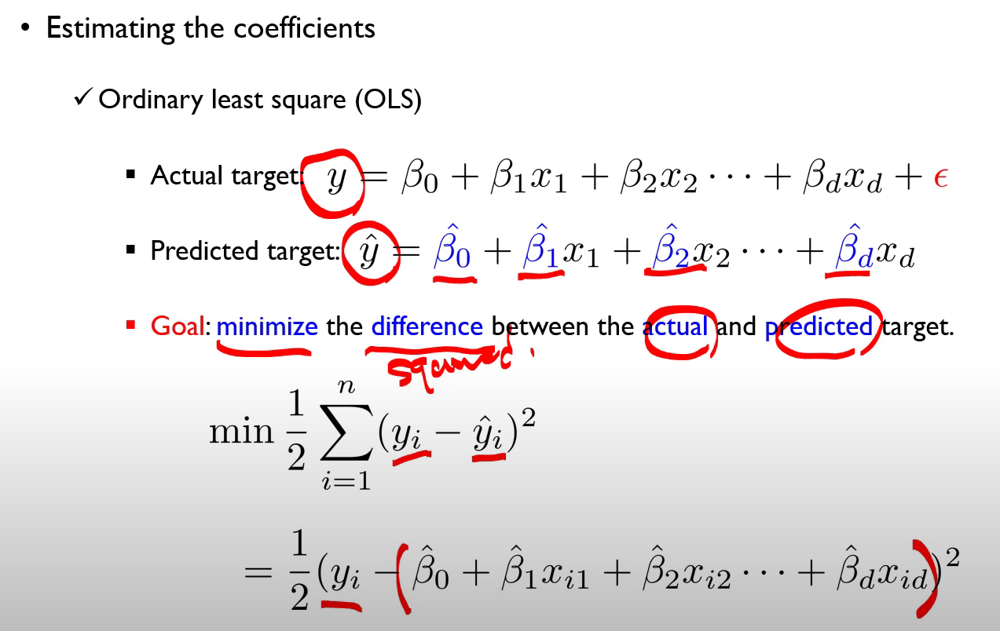 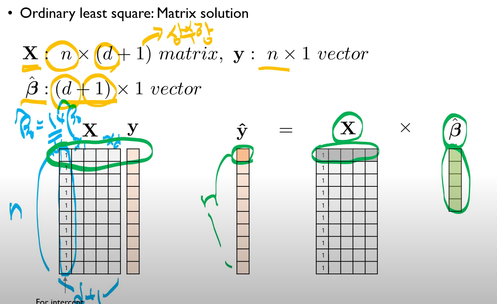 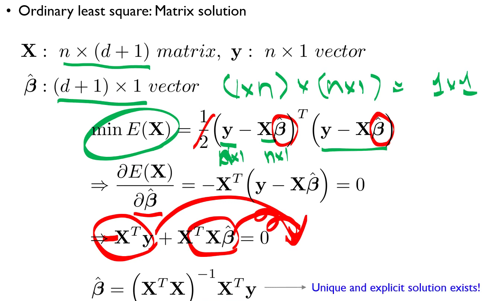
  * **Closed form solution for the regression coefficients** 
  * 통계에서 개발된 Regression이기 때문에, 이렇게 계산된 $\boldsymbol{\beta}$ 가 best $\boldsymbol{\beta}$라는 것을 어떻게 입증 해줄 수 있으려면, 다음 조건들을 충족시켜야한다.
    * 노이즈는 정규 분포를 따라야 한다. 우리가 어떻게 할 수 없는 노이즈이지만, 모아보면 정규분포가 되어야 한다.
    * $Y$ 값의 변동성이, 특정한 변수의 변화에 영향을 받지 말아야한다. (homoskedasticity)
    * > 위의 두 가지는 데이터로 검증을 할 수 있다.
    * 선형 관계인지가 확실해야 한다. 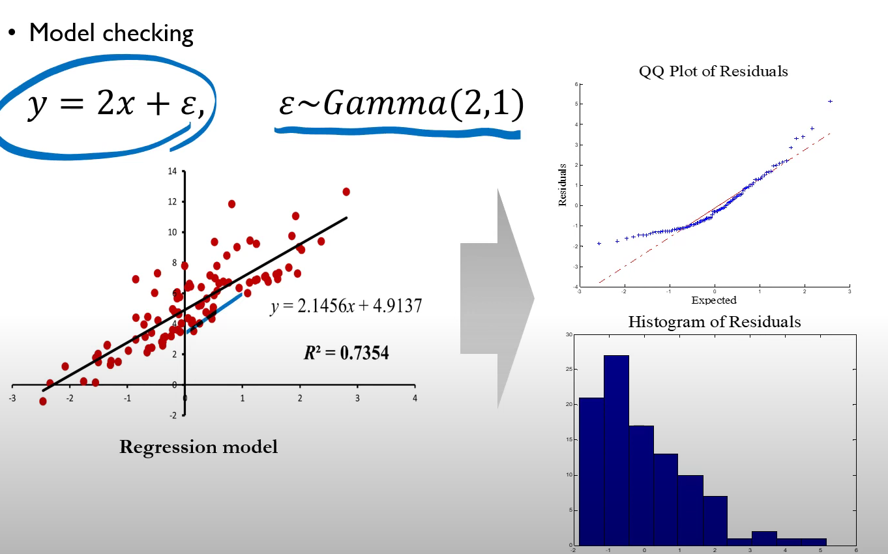
      * 데이터를 만들기 위해 $2x+\epsilon$을 만들었다. 정규분포가 아닌 노이즈를 섞어서 $y$를 만들어서 QQ Plot 
      * 잔차도의 **QQ Plot** : 정규분포를 가정했을 때 순위들을 $x$축에 넣고 실제값을 $y$축으로 두고 잔차를 그렸을 때, $-1$ 즈음에서 이탈하는 것을 볼 수 있다. 95% 신뢰도라고 하면 $+-1.96$이라고 외울텐데 모든 데이터가 100\% 선형관계를 맺을 수는 없지만 잔차에 대한 QQ Plot을 그렸을 때 $-2$부근에서 이탈하면 수긍 가능하겠지만..
    * 각각의 관측들이 독립적이어야한다. 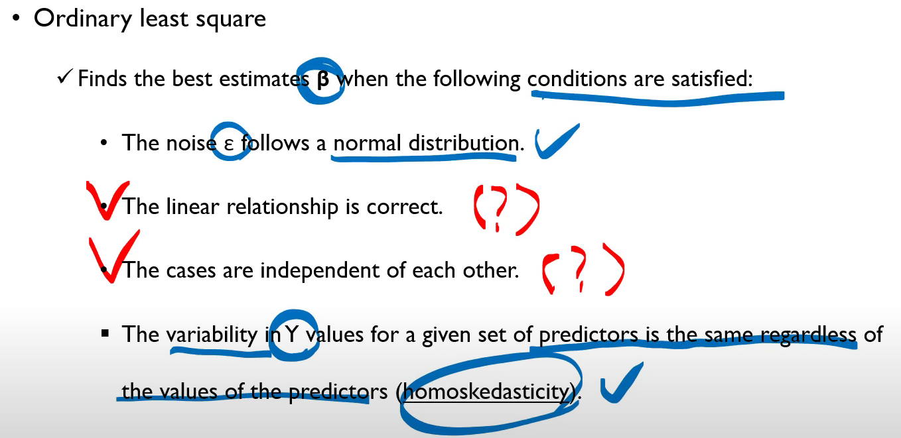, 즉 Residual plots는 4번째 그림처럼 나와야지 나머지 같은 패턴은 나오면 안된다. 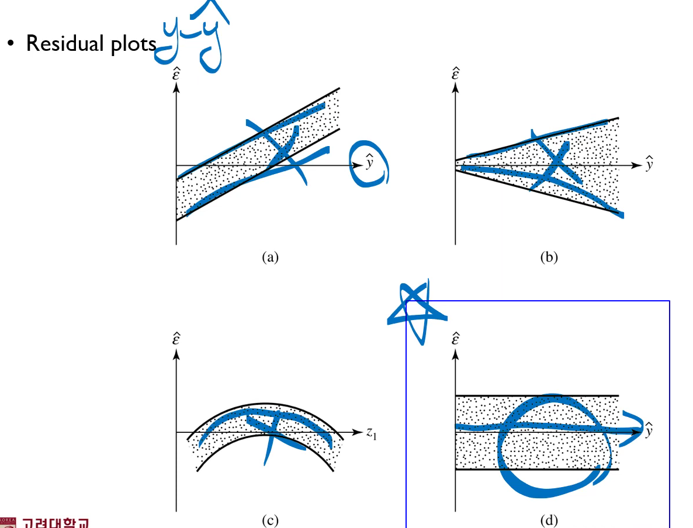
  * 추정된 회귀 계수가 얼마나 적합한지 혹은 회귀 모델이 얼마나 주어진 데이터를 잘 설명하는지 지표가 Goodness of fit이다.
    * OLS의 목적은 SSE를 최대한 줄이는 것이었다. 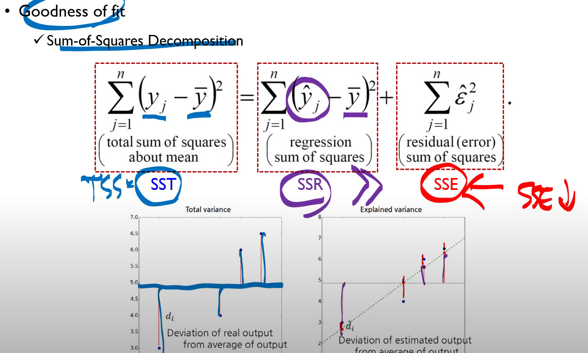 
    * > SST = SSR + SSE
    * $R^2 = 1-\dfrac{SSE}{SST}=\dfrac{SSR}{SST}$
    * $R^2$이 클 수록, $x$와 $y$ 사이에 선형 관계가 만족한다.
    * $R^2$ 값이 높다고 내가 분석을 잘 한 것이 아닙니다. 그냥 데이터셋 이 $x$와 $y$, 설명변수와 종속변수 사이에 강한 선형관계가 있다는 것을 의미한다.
## $R^2$ score의 가장 큰 단점
  * 변수 수가 많아질수록 $R^2$이 단조증가한다는 점이다.
  * 변수를 하나 더 증가시킴으로써 얻을 수 있는 이득이 확실할 때만 $R^2$가 커진다는 것을 의미합니다. Adjusted $R^2$ 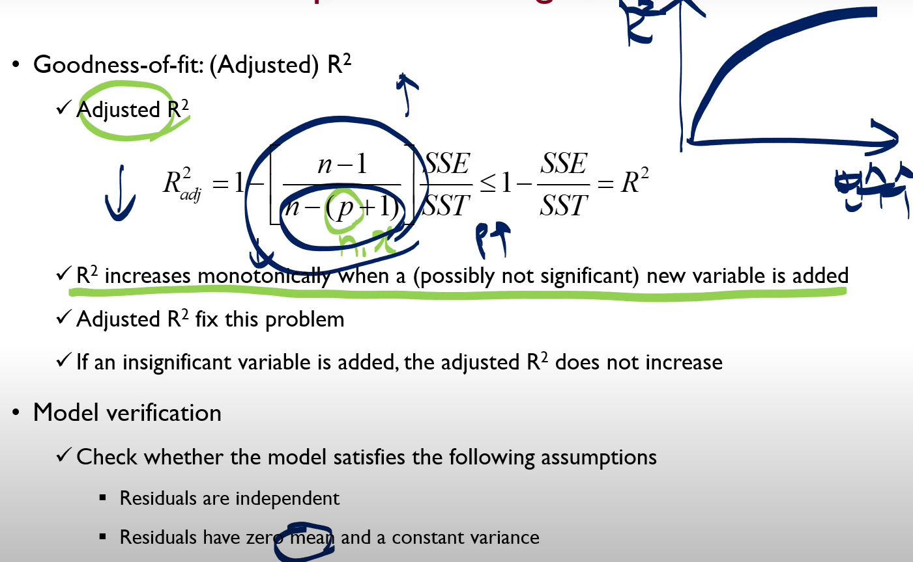
* Data preprocessing
  * Create dummy variables for fuel types (중고차 가격 예상 문제에서)
    * $|D-P|=|P-C|=|C-D|$를 맞춰야하기 때문에, 각각의 카테고리를 1,2,3으로 두어버리면 각각의 특성이 다르다는 문제가 생긴다. 디젤과 페트롤 차이와 페트롤 CNG 차이와, CNG 디젤의 차이가 같아야한다.
    * 단, 다중선형회귀분석 같은 경우에는, **다중 공산성 (Multicol Linearity)**가 생긴다 C=1-A-B 라는 관계가 생긴다면 선형회귀분석에 문제가 생기기 때문에 원핫인코딩을 변형해서 Dies, Petrol로 나타낸다.

