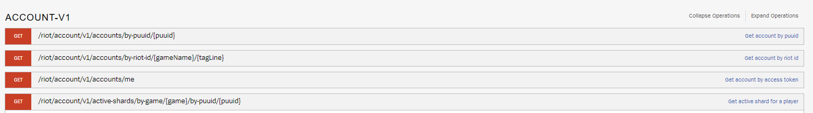

# ACCOUNT-V1
## /riot/account/v1/accounts/by-puuid/{puuid}
  * puuid 를 가지고 소환사의 명(gameName-ex: Hide on Bush) 이랑 tagLine ('KR1')를 반환함 

* 위의 사진을 보면 puuid를 갖고 계정 정보를 알려주거나

* gameName(소환사의명), tagLine을 가지고 알려주거나 - 이걸로 확인해보니까, 현재 접속중인 사람과 아닌 사람을 구분지어 질 수 있는 것 같다. '갱많이좀' 유저를 확인해 보니, 현재 게임 중임을 알 수 있었다.

* <span style="color:yellow">me 는 나에 대한 정보를 알려주거나.</span>
* active-shards/by-game 등을 통해 game id와 puuid를 알면 계정 정보를 알려주는 것 같기도 한데 - <span style="color:red">레전드 오브 룬테라 혹은 발로란트를 해본 적이 있는 유저라는 뜻 같기도 하다.</span>
  * game 인자와 puuid 인자를 받는데, game의 value로 넣을 수 있는 것이 val과 lor였다. 그리고 puuid를 넣고 Query Param을 선택하면 {
    "puuid": "Mt8FDRwwHbWb9aVXdyq-YJEwlV-V1T_y0ExNbj7OGf6fFgkL344KXq49dkHc1rS0sRhr_6DvWEsAyQ",
    "game": "val",
    "activeShard": "kr"
},  {
    "puuid": "Mt8FDRwwHbWb9aVXdyq-YJEwlV-V1T_y0ExNbj7OGf6fFgkL344KXq49dkHc1rS0sRhr_6DvWEsAyQ",
    "game": "lor",
    "activeShard": "apac"
} 


# CHAMPION_MASTERY-V4

# CHAMPION-V3

# CLASH-V1

# LEAGUE-EXP-V4

# LEAGUE-V4

# LOL-CHALLENGES - V1

# LOL-STATUS-V4

# MATCH-V5 
## puuid
* puuid를 이용하면 최근 게임 리스트를 보여주는데, 2021년 6월 16일 이전의 정보는 불러올 수 없고, startTime, endTime, queue, type, start, count 등을 통해 얼마나 불러올 지 찾을 수 있다.

# SPECTATOR-V4
* Specatator에 <span style="color:red">encryptedSummonerId</span>를 입력하면 <span style="color:yellow">현재 진행 중인 게임</span>을 볼 수 있다.


# SUMMONER-V4
* sohwan = "https://kr.api.riotgames.com/lol/summoner/v4/summoners/by-name/" +<span style="color:red">'hide on bush'</span> +'?api_key=' + api_key
* 위의 request를 통해 해당 유저의 id, accountid, puuid, name, profileIconId, revisionDate, summonerLevel을 받아올 수 있음. 
   https://kr.api.riotgames.com/lol/spectator/v4/active-games/by-summoner/uExHbkRZ9Lp-WhP99k5ugHetE6NLwXQd4ZcTz2PmNti3D4M?api_key=RGAPI-a12f7c21-e79c-40bd-a1d3-3e4afe54d947
* 위와 같이 입력하면 되는 것 같긴 한데... ?api-key 앞에 원하는 유저의 encryptedSummonerId를 입력하면 된다.

* **/lol/spectator/v4/featured-games** 이건 뭘 보여주는 지 모르겠다. 현재 진행 중인 게임들의 목록?을 일부 보여주는 것은 아닐지?

* encryptedSummoonerID는 {
    <span style="color:red">"id": "uExHbkRZ9Lp-WhP99k5ugHetE6NLwXQd4ZcTz2PmNti3D4M",</span>
    "accountId": "V-1OrFbifA2tRUykVkO4hIrVjY6F1crLkEEbH2uMQRkm2Ew",
    "puuid": "Mt8FDRwwHbWb9aVXdyq-YJEwlV-V1T_y0ExNbj7OGf6fFgkL344KXq49dkHc1rS0sRhr_6DvWEsAyQ",
    "name": "갱많이좀",
    "profileIconId": 4157,
    "revisionDate": 1686391293150,
    "summonerLevel": 318
} 여기에서 저 빨간 부분을 뜻하는 것이었음.


### 게임ID가지고 할 수 있는 것 
```python
r = "https://asia.api.riotgames.com/lol/match/v5/matches/KR_6389016109?api_key=RGAPI-a12f7c21-e79c-40bd-a1d3-3e4afe54d947" # KR_6389016109 는 게임 아이디
r = requests.get(r)
``` 
`r.json()`을 하면 dict가 나오는데, 이는 metadata와 info라는 key를 가지고 있음.

X.metadata를 하면 dataVersion, matchid, participants가 나오는데 이 참가자를 가지고 숙련도 등을 받아올 수도 있을 것이다. participants에 나오는 값은 puuid이다. 


# TODO
- [x] 최종 픽순서를 얻어올 수는 없다.
- [x] 좌표값 수정하는 과정을 거쳐야한다. 그냥 matchId로 가져오는 라인 정보는 올바르지 않을 가능성이 높다.
- [x] 해당 판의 티어평균을 내서 '날짜별/티어별 게임 저장'을 해야할 것 같다.
- [x] 날짜별 게임 저장을 하면 특정 날짜 전후의 변화 양상을 볼수도 있을 것이다.
- [ ] 날짜별로 소환사의 상태 변화를 측정할 수 있어야 할 것 같다. (티어 상승 가능성을 파악하기 위함?)


### 변화한 것
* 2023-06-20-(화)-034558 : `get_converted_data'에서 티어계산하는 부분을 없앴다. 아마 100% 이상 시간이 오를 것.
- [ ] 기존의 게임 매치데이터 하나를 받아오면, 좌표정보와 exp, gold를 기반으로 역할군을 재설정하는 코드를 만들 필요가 있을 것 같다.
  * 이렇게 되면 단점은, 골드와 exp, 위치만 기반으로 하였을 때는 (딜)서폿이 원딜보다 돈을 많이 벌고 그런 경우를 캐치할 수 없다는 것.