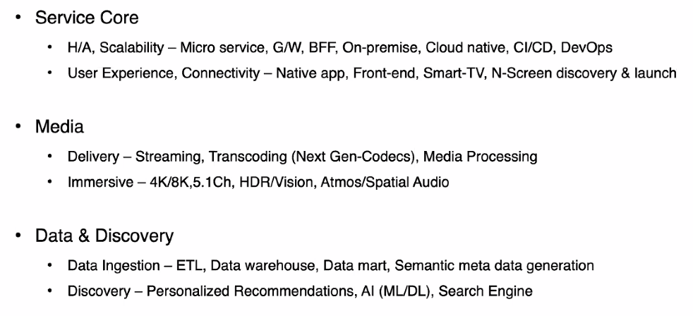
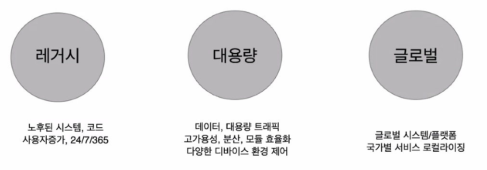
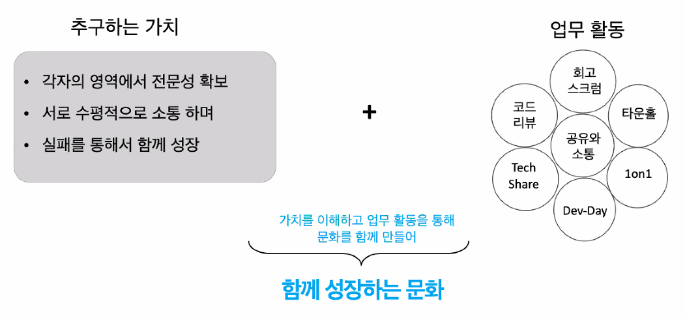
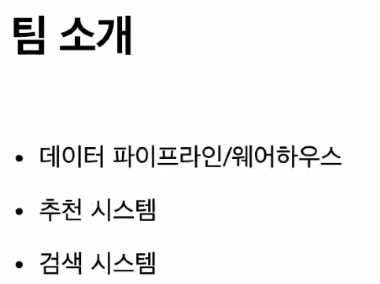
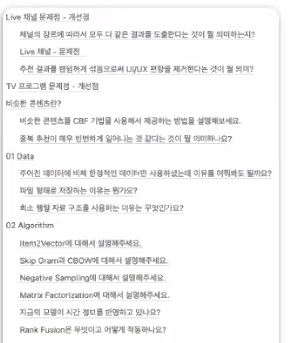
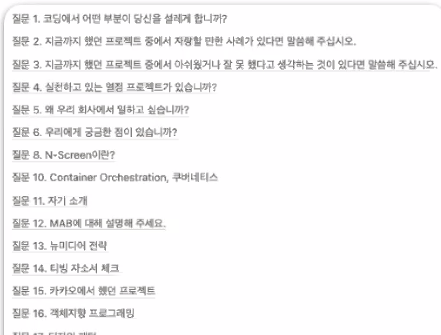

### Challange

### **추구하는 가치**

* K-컨텐츠를 통해 전 세계 모든 사용자에게 즐거움을 선사하는 (OTT) 서비스를 만드는 것

 
 * 데이터 파이프라인 / 웨어하우스
 * 추천 시스템
   * Tving 내 컨텐츠 추천
     * 사용자 대상 추천
     * 컨텐츠 간 유사 컨텐츠 추천
   * AWS 기반 구성
     * SageMaker
     * Airflow
     * API Gateway, Lambda, DynamoDB
   * W/Tving, 데이터 엔지니어링팀
     * 팀원들과 같이 구성한 모델이 서비스까지 배포되는 경험
     * 대용량 트래픽, 수백만 사용자 행태 데이터 핸들링
     * 우수한 동료들과 소통, 동반 성장
 * 검색 시스템
   * 10년 전부터 구성되어 있던 외주 시스템이 있는데, 내부에 엔지니어를 채용해서 인하우스를 개발하고 있는 상황이다.

# Why TVING?
* Acutal user, product 개발에 대한 로망, 보람
* PD, 엔터테인먼트 업계에 대한 동심(?)  

## 그래서 지금은?
* 보람을 체감할 수 있게 하는 환경
* 비즈니스에 대한 이해
* 추천이라는 도메인, 정확히는 유저와 AI의 소통에 대한 고민

## 부캠에서 얻은 것 중에 지금까지도 유용했던 것은?
* 실험 기반의 공유들, discussion (Peer session)
* AI Math

## Next Partner (이상형)
* 재미와 실속 밸런스를 지킬 수 있는 멋진 사람
* 정확하게 파악해보려는 욕구를 가진 대단하고 멋진 사람
* 소통 능력이 좋은 훌륭하고 대단하고 멋진 사람

## 면접준비 과정 공유
* TVING 추천 서비스 및 목록에 대한 문제점과 개선점을 자유롭게 작성 
* 
### 2차 면접 준비 과정

## 티빙 복지 / 장점

# Q&A
* 상호 전문성이 다 다르니까 인정하고, 서로 배운 것들이 업무하면서 생길거에요. 공유하고 동반성장할 수 있는 사람. 더불어서 주도적으로 업무를 수행해주었으면 좋겠습니다. 어느 정도 믿고 맡겨야 하는 부분도 생기거든요. 기술적으로는 아무래도 주로 사용되는 언어가 파이썬이랑 G?? 언어? 인프라가 다 AWS 위에 올라가 있기 때문에 AWESOME DAY라고 무료로 교육받는 것이 있으니, 그 교육을 받아오시면 좋을 것 같긴 합니다. (반나절이면 들을 수 있음)
* 개발 직군의 팀 구성이나 업무 분배는 주성철님이 말씀해주셨던 부분으로 갈음 될 것이다.
* 자동화를 많이 진행하게 됩니다. 
* 티빙과 같은 OTT 같은 경우는 추천 말고 어떤 AI 기술을 쓰나요?
  * 메타 데이터 추출, 생성 
  * 시청 행태나 이런 것도 추천, 검색도 있지만 이용자에 대한 행태를 통해서 이 사람은 다음 달에도 이용권을 구매할 것인가, 아닌가? 중지를 하거나, 언제 Tving으로 돌아올 것인가? 이것을 마케팅이랑 접목을 해서 메세지를 보낸다거나..
* 