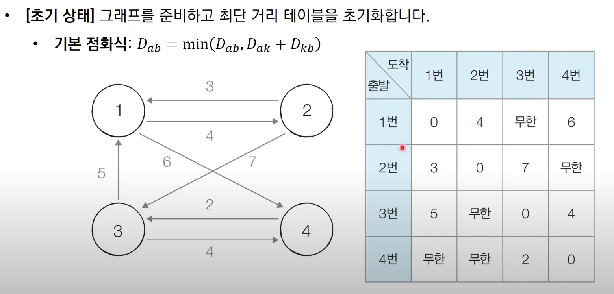

* A->C로 가는 경로와 A->B, B->C를 이용해서 최단거리를 결정한다는 점에서 DP의 일부라고 볼 수도 있지만, 방문하지 않은 노드 중에서 최단 거리가 가장 짧은 것을 선택하는 맥락에서 그리디 알고리즘으로 분류가 되기도 한다.

1. 출발노드를 설정한다.
2. 최단 거리 테이블을 초기화한다.
   1. 초기화 과정에서 처음에는 기본적으로 모든 노드까지의 비용을 무한으로 설정한다. 그리고 자기 자신에 대한 과정은 0으로 설정한다. 
3. <span style="color:red">방문하지 않은 노드</span> 중에서 최단 거리가 가장 짧은 노드를 선택한다.
4. 해당 노드를 거쳐 다른 노드로 가는 비용을 계산하여 최단 거리 테이블을 갱신한다.
5. 위의 과정에서 3번과 4번을 반복한다.


## 특징 
* 총 $O(V)$번에 걸쳐서 최단거리가 가장 짧은 노드를 매번 선형 탐색해야한다.
* 따라서 전체 시간 복잡도는 $O(V^2)$이다.
* 일반적으로 코테의 최단경로문제에서 전체 노드의 개수가 5000개 이하라면 이 코드로 문제를 해결할 수 있다. 그러나 10000개가 넘어가면?
```python

import sys
input = sys.stdin.readline 
INF = int(1e9)

n, m = map(int, input().split())
start = int(input())
graph = [[] for i in range(n+1)]
visited = [False] * (n+1)
distance = [INF] * (n+1)

for _ in range(m):
    a,b,c = map(int, input().split())
    graph[a].append((b,c))

def get_smallest_node():
    min_value = INF
    index = 0
    for i in range(1, n+1):
        if distance[i] < min_value and not visited[i]:
            min_value = distance[i]
            index = i
    return index

def dijkstra(start):
    distance[start]=0
    visited[start]=0
    for j in graph[start]:
        distance[j[0]]=j[1] 
    for i in range(n-1):
        now = get_smallest_node()
        visited[now]=True
        for j in graph[now]:
            cost = distance[now] + j[1]
            if cost < distance[j[0]]:
                distance[j[0]] = cost
dijkstra(start)
for i in range(1, n+1):
    if distance[i] == INF:
        print("INF")
    else:
        print(distance[i])

```

## 개선된 다익스트라
* Heapq을 활용한다.
* 
* 최악의 경우에도 $n\log{n}$의 시간복잡도를 보장한다.
* 최대힙을 구현하는 경우에는 힙에 삽입할 때 $-v$를 넣고 꺼낼 때 다시 $-v$처리해서 빼면 된다.
* 시간복잡도는 $O(E log V)$

```python
import heapq 

def heapsort(iterable):
    h = []
    result = []
    for v in iterable:
        heapq.heappush(h, v) 
    for i in range(len(h)):
        result.append(heapq.heappop(h))
    return result

result = heapsort([1,3,5,7])
print(result)
```

```python

import heapq
import sys
input = sys.stdin.readline
INF = int(1e9)

n, m = map(int, input().split())
start = int(input())
graph = [[] for i in range(n+1)]
distance = [INF] * (n+1)

for _ in range(m):
    a,b,c, = map(int, input().split())
    graph[a].append((b,c))

def dijkstra(start):
    q = []
    heapq.heappush(q, (0, start))
    distance[start] = 0
    while q:
        dist, now = heapq.heappop(q)
        if distance[now] < dist : # 이 부분이 바로 안떠오르면 문제
            continue
        for i in graph[now]:
            cost = dist + i[1]
            if cost < distance[i[0]]:
                distance[i[0]] = cost 
                heapq.heappush(q, (cost,i[0]))

dijkstra(start)

for i in range(1, n+1):
    if distance[i] == INF:
        print(-1)
    else:
        print(distance[i])
```


# 플로이드 워셜
* 모든 노드에서 다른 모든 노드까지의 최단경로를 모두 계산한다.
* 플로이드 워셜 알고리즘은 다익스트라 알고리즘과 마찬가지로 단계별로 거쳐 가는 노드를 기준으로 알고리즘을 수행합니다.
  * 다만 매 단계마다 방문하지 않은 노드 중에서 최단 거리를 갖는 노드를 찾는 과정이 필요하지 않다.
* 플로이드 워셜은 2차원 테이블에 최단 거리 정보를 저장한다.
* 플로이드 워셜은 DP 유형에 해당한다.
  * $D_{ab} = min(D_{ab}, D_{ak}+D_{kb})$
* 그래프를 준비하고 최단 거리 테이블을 초기화해야한다.
  * 
* 시간복잡도는 $O(N^3)$

```python
INF = int(1e9)
n = int(input())
m = int(input())
graph = [[INF] * (n+1) for _ in range(n+1)]

for a in range(1,n+1):
    for b in range(1,n+1):
        if a==b:
            graph[a][b]=0
for _ in range(m):
    a,b,c = map(int,input().split())
    graph[a][b] = c 

for k in range(1,n+1):
    for a in range(1,n+1):
        for b in range(1,n+1):
            graph[a][b] = min(graph[a][b], graph[a][k]+graph[k][b])
```


# 벨만포드
```python
import sys
input = sys.stdin.readline 
INF = int(1e9)

def bf(start):
    dist[start] = 0
    for i in range(n):
        for j in range(m):
            cur = edges[j][0]
            next_node = edges[j][1]
            cost = edges[j][2]
            if dist[cur]!=INF and dist[next_node] > dist[cur]+cost:
                dist[next_node] = dist[cur]+cost
                if i == n-1:
                    return True
    return False

n, m = map(int,input().split())
edges = []
dist = [INF] * (n+1)
for _ in range(m):
    a,b,c = map(int,input().split())
    edges.append((a,b,c))

negative_cycle = bf(1)
if negative_cycle :
    print(-1)
else:
    for i in range(2,n+1):
        if dist[i]==INF:
            print("-1")
        else:
            print(dist[i])
```

